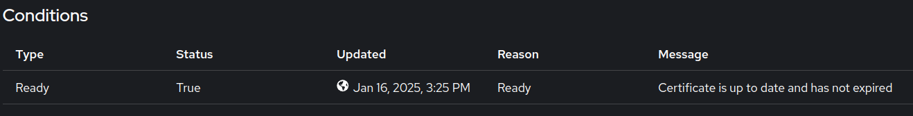

# Configuring Cert Manager's HTTP01 Certificate

This document provides a step-by-step guide to configure Cert Manager's HTTP01 Certificate.

## Step 1: Setup DNS record

Create an entry in your DNS provider for hostname for which you want to create route in Cluster. The goal is to map this hostname to cluster's IP. This can be done via a single A record (directly pointing to cluster's IP) or through CNAME record (pointing to another A record).

## Step 2: Configure Required Resources

Next step is to deploy Certificate and Route. For that we need to deploy following resources at given paths in App GitOps.

`Path: <path to your application helm chart>/templates/`

### Certificate

```yaml
apiVersion: cert-manager.io/v1
kind: Certificate
metadata:
  name: <certificate name>
  namespace: <namespace where you want to deploy this certificate>
spec:
  secretName: <secret name which will host TLS certificate>
  issuerRef:
    name: <ClusterIssuer Name>
    kind: ClusterIssuer
  commonName: <Hostname. It should be same as one that you declared in step 1>
  dnsNames:
    - <Hostname. It should be same as one that you declared in step 1>
```

#### Key Fields

- **`.spec.secretName`**: Name of the secret that cert-manager will create once the certificate request gets approved by Certificate Authority (in present case LetsEncrypt).
- **`.spec.dnsNames`**: List of DNS names that you want this certificate to support.
- **`.spec.issuerRef.name`**: Name of the cluster issuer that you want to use when creating this certificate. You can confirm value for this field with cluster admin.

!!! note
Avoid modifying/deleting existing certificates as this might cause rate limiting at letsencrypt side. You can read more about this [here](https://letsencrypt.org/docs/rate-limits/)

### Route

```yaml
apiVersion: route.openshift.io/v1
kind: Route
metadata:
  name: <route name>
  namespace: <namespace where you want to deploy this route>
  annotations:
    cert-utils-operator.redhat-cop.io/certs-from-secret: <secret name which hosts TLS certificate>
    cert-utils-operator.redhat-cop.io/inject-CA: "false"
spec:
  host: <Hostname. It should be same as one that you declared in step 1>
  path: /
  port:
    targetPort: http
  to:
    kind: Service
    name: <service name>
    weight: 100
  wildcardPolicy: None
  tls:
    termination: edge
    insecureEdgeTerminationPolicy: Redirect
```

!!! note
The way you deploy these resources totally depend on how you want to ship it to cluster. If you want to deploy it with a particular application (which is a common case), then you need to ship it from your `app-gitops` repo as a part of your application's helm chart.

## Step 3: Validation

### Certificate

1. In the cluster console, switch to `Administrator` view and navigate to `Home > Search`.
1. Select the system namespace and search for `Certificate` in the `Resources` dropdown.
1. Inspect the deployed certificate. In the `Condition` section, confirm that the issuer is up-to-date.

    

    

### Route

1. Navigate to the OpenShift cluster console.
1. Go to Networking > Routes and locate the Route resource for your application.
1. Confirm that:
    - The Route resource is listed.
    - Its status is Accepted.
    - The DNS name and TLS configuration are correct.
