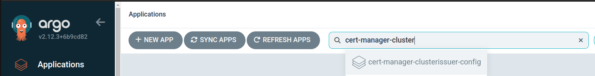
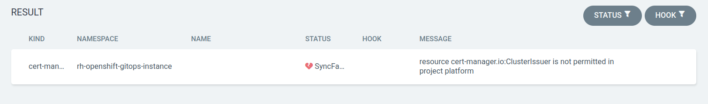

# Configuring Cert Manager ClusterIssuer and External DNS

This document provides a step-by-step guide to configure Cert Manager ClusterIssuer and External DNS for different tenants.

## Step 1: Setup DNS creds in Vault

Go to `common-shared-secret` path in Vault and create a secret `external-dns-creds`. This secret mainly have credentials for authenticating with DNS provider and should contain following fields:

### Cloudflare

| Key | Required/Optional | Explanation |
|----------|----------|----------|
| `api-token`   | required   | API token generated from DNS provider being used. In case of Cloudflare, it should have the following access <br> - `DNS:Edit` <br> - `Zone:Read`   |
| `domain-filter`    | optional   | This field should contain base domain that becomes base for registering further subdomains. For example: `example.com`.   |
| `zone-id-filter`| optional   | In case of Cloudflare, if you want to give more restrictive access of only few zones to this token, then this field should contain these zone ids.

## Step 2: Create ExternalSecret Resource

Create following resources in your Infra GitOps repository at given path:

```plaintext
<cluster>/tenant-operator-config/templates/
```

- [`Template`](https://docs.stakater.com/mto/main/crds-api-reference/template.html)
- [`TemplateGroupInstance`](https://docs.stakater.com/mto/main/crds-api-reference/template-group-instance.html)

### Template

The `Template` resource defines the underlying YAML resources to be deployed to tenant namespaces. Use the following template for setting up an External Secret:

#### Cloudflare

```yaml
apiVersion: tenantoperator.stakater.com/v1alpha1
kind: Template
metadata:
  name: certificate-creds
resources:
  manifests:
    - apiVersion: external-secrets.io/v1beta1
      kind: ExternalSecret
      metadata:
        name: certificate-creds
      spec:
        secretStoreRef:
          kind: ClusterSecretStore
          name: shared-cluster-secret-store
        refreshInterval: "1m0s"
        target:
          name: certificate-creds
          creationPolicy: 'Owner'
        template:
          data:
            api-token: "{{ .api-token | b64enc }}"
        data:
        - secretKey: api-token
          remoteRef:
            key: certificate-creds
            property: api-token
```

#### Explanation of Resources

**`ExternalSecret`**:

- Retrieves the `api-token` from the secret provider (Vault).
- The `api-token` authenticates the DNS provider (e.g., Cloudflare) for certificate validation.

### TemplateGroupInstance

The `TemplateGroupInstance` deploy resources by referencing the created templates and specifying target namespaces:

```yaml
apiVersion: tenantoperator.stakater.com/v1alpha1
kind: TemplateGroupInstance
metadata:
  name: certificate-creds
spec:
  template: certificate-creds
  selector:
    matchExpressions:
      - key: stakater.com/tenant
        operator: In
        values: [ <comma separated tenant names list> ]
  sync: true
```

#### Key Fields

- **`.spec.template`**: References the `Template` resource.
- **`.spec.selector`**: Specifies namespaces to deploy resources based on label expressions.
    - In this example, resources are deployed to tenant with the label `stakater.com/tenant` having values that are defined in `values` field. Ensure this list includes the names of all tenants where this `ExternalSecret` needs to be available. Remember this External secret must be available in all namespace from where you want to expose your application to internet.

## Step 3: Create ClusterIssuer Resource

Next step is to deploy ClusterIssuer. For that we need to deploy following resources at given paths in Infra GitOps.

### ArgoCD application
  
  `Path: <cluster>/argocd-apps/`

  ```yaml
  apiVersion: argoproj.io/v1alpha1
  kind: Application
  metadata:
    name: <resource name. E.g. cluster-issuer-config>
    namespace: rh-openshift-gitops-instance
  spec:
    destination:
      namespace: rh-openshift-gitops-instance
      server: https://kubernetes.default.svc
    project: <project name>
    source:
      path: <cluster>/<path where Cluster Issuer resource exist in Infra GitOps repo>
      repoURL: <infra Gitops repo URL>
      targetRevision: HEAD
    syncPolicy:
      automated:
        prune: true
        selfHeal: true
  ```

  #### Key Fields

  - **`.spec.project`**: Project name that this application should belong to. This can be a name of tenant.
  - **`.spec.source.path`**: Path in Infra GitOps repo that this application should sync. This corresponds to the path of folder where `ClusterIssuer` resource would exist.
  - **`.spec.source.repoURL`**: This is the url of Infra GitOps repo.

### Cluster Issuer

  `Path: <cluster>/<path where Cluster Issuer resource exist in Infra Gitops repo>`

  #### Cloudflare

  ```yaml
  apiVersion: cert-manager.io/v1
  kind: ClusterIssuer
  metadata:
    name: letsencrypt-cloudflare
  spec:
    acme:
      email: <domain-owning-authority's email>
      server: https://acme-v02.api.letsencrypt.org/directory
      privateKeySecretRef:
        name: letsencrypt-account-key
      solvers:
        - dns01:
            cloudflare:
              apiTokenSecretRef:
                name: certificate-creds
                key: api-token
  ```

  #### Key Fields

  - **`.spec.acme.email`**: Email address for certificate lifecycle updates.
  - **`.spec.acme.solvers.dns01.cloudflare.apiTokenSecretRef`**: Reference to the `ExternalSecret` created earlier.

!!! note

To deploy cluster-scoped resource (like ClusterIssuer), there is a need to whitelist deployment of these using [`MTO's Extension resource`](https://docs.stakater.com/mto/main/crds-api-reference/extensions.html). This resource must be created at `<cluster>/tenant-operator-config/extensions/` path in Infra GitOps.

Commit, push, and merge these changes to the `main` branch. ArgoCD will deploy the resources to the specified namespaces within few minutes.

## Step 4: Validation

1. Login to ArgoCD console. You can find link for ArgoCD from Forecastle.
1. Search for ArgoCD application that you created in step 3:

1. Click on a drop-down next to `Refresh` button and click `Hard-Refresh`. ArgoCD might take some seconds to do a hard refresh.

1. Check `App Health` and `Sync Status`. Under normal condition the values for these should be `Healthy` and `Synced` respectively.


!!!note

If you haven't whitelist creation of cluster-scoped resource in step 3 then corresponding ArgoCD application will have `OutofSync` as `Sync Status`.


When you click on `Sync Failed` you get a detailed message saying that current project dont have access to create ClusterIssuer.

