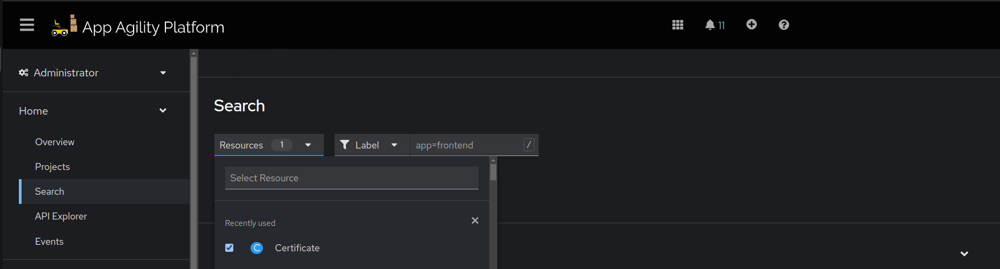
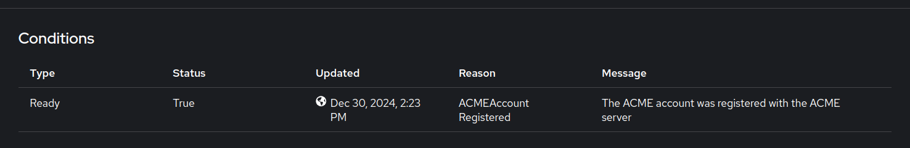

# Configuring Cert Manager Issuer and External DNS

This document provides a step-by-step guide to configure Cert Manager Issuer and External DNS for different tenants.

## Step 1: Setup DNS creds in Vault

Go to `common-shared-secret` path in Vault and create a secret `external-dns-creds`. This secret mainly have credentials for authenticating with DNS provider and should contain following fields:

### Cloudflare

| Key | Required/Optional | Explanation |
|----------|----------|----------|
| `api-token`   | required   | API token generated from DNS provider being used. In case of Cloudflare, it should have the following access <br> - `DNS:Edit` <br> - `Zone:Read` |
| `domain-filter`    | optional   | This field should contain base domain that becomes base for registering further subdomains. For example: `example.com`. |
| `zone-id-filter`| optional   | In case of Cloudflare, if you want to give more restrictive access of only few zones to this token, then this field should contain these zone ids. |

## Step 2: Create Cert Manager Issuer Resource

Create following resources in your Infra GitOps repository at given path:

```plaintext
<cluster>/tenant-operator-config/templates/
```

- [`Template`](https://docs.stakater.com/mto/main/crds-api-reference/template.html)
- [`TemplateGroupInstance`](https://docs.stakater.com/mto/main/crds-api-reference/template-group-instance.html)

### Template

The `Template` resource defines the underlying YAML files to be deployed to tenant namespaces. Use the following template for setting up a TLS certificate:

#### Cloudflare

```yaml
apiVersion: tenantoperator.stakater.com/v1alpha1
kind: Template
metadata:
  name: certificate-creds
resources:
  manifests:
    - apiVersion: external-secrets.io/v1beta1
      kind: ExternalSecret
      metadata:
        name: certificate-creds
      spec:
        secretStoreRef:
          kind: ClusterSecretStore
          name: shared-cluster-secret-store
        refreshInterval: "1m0s"
        target:
          name: certificate-creds
          creationPolicy: 'Owner'
        template:
          data:
            api-token: "{{ .api-token | b64enc }}"
        data:
        - secretKey: api-token
          remoteRef:
            key: certificate-creds
            property: api-token
    - apiVersion: cert-manager.io/v1
      kind: Issuer
      metadata:
        name: letsencrypt-cloudflare
      spec:
        acme:
          email: <domain-owning-authority's email>
          server: https://acme-v02.api.letsencrypt.org/directory
          privateKeySecretRef:
            name: letsencrypt-account-key
          solvers:
            - dns01:
                cloudflare:
                  apiTokenSecretRef:
                    name: certificate-creds
                    key: api-token
```

#### Explanation of Resources

**`ExternalSecret`**:

- Retrieves the `api-token` from the secret provider (Vault).
- The `api-token` authenticates the DNS provider (e.g., Cloudflare) for certificate validation.

**`Issuer`**:

- Configures Cert-Manager to generate TLS certificates using [Let’s Encrypt](https://letsencrypt.org/).
- Requires:
    - `.spec.acme.email`: Email address for certificate lifecycle updates.
    - `.spec.acme.solvers.dns01.cloudflare.apiTokenSecretRef`: Reference to the `ExternalSecret` created earlier.

### TemplateGroupInstance

The `TemplateGroupInstance` deploys resources by referencing the created templates and specifying target namespaces:

```yaml
apiVersion: tenantoperator.stakater.com/v1alpha1
kind: TemplateGroupInstance
metadata:
  name: certificate-creds
spec:
  template: certificate-creds
  selector:
    matchExpressions:
      - key: stakater.com/tenant
        operator: In
        values: [ <comma separated tenant names list> ]
  sync: true
```

#### Key Fields

- **`.spec.template`**: References the `Template` resource.
- **`.spec.selector`**: Specifies namespaces to deploy resources based on label expressions.
    - In this example, resources are deployed to tenant with the label `stakater.com/tenant` having values `tenant1` or `tenant2`. Ensure this list includes the names of all tenants where the `Issuer` needs to be available. Whenever you add a new tenant requiring an `Issuer`, update this field to include its name.

Commit, push, and merge these changes to the `main` branch. ArgoCD will deploy the resources to the specified namespaces within a few minutes.

## Step 3: Validation

1. In the cluster console, switch to `Administrator` view and navigate to `Home > Search`.
1. Select the namespace and search for `Issuer` in the `Resources` dropdown.
1. Inspect the deployed issuer. In the `Condition` section, confirm that the issuer is up-to-date.




