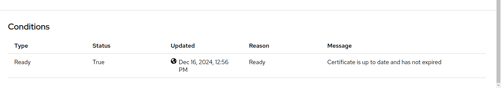

# Configuring TLS Certificates Using Infra GitOps

This document provides a step-by-step guide to configure TLS certificates for different tenants using Infra GitOps.

## Step 1: Navigate to the Target Path

Navigate to the appropriate path in your Infra GitOps repository. For this example, the path is:

```plaintext
<environment>/tenant-operator-config/templates/
```

Here, `<environment>` corresponds to the cluster where the deployment will occur.

## Step 2: Create Required Resources

In this directory, create the following resources:

- [`Template`](https://docs.stakater.com/mto/main/crds-api-reference/template.html)
- [`TemplateGroupInstance`](https://docs.stakater.com/mto/main/crds-api-reference/template-group-instance.html)

### Template

The `Template` resource defines the underlying YAML files to be deployed to tenant namespaces. Below is an example template for setting up a TLS certificate:

```yaml
apiVersion: tenantoperator.stakater.com/v1alpha1
kind: Template
metadata:
  name: certificate-creds
resources:
  manifests:
    - apiVersion: external-secrets.io/v1beta1
      kind: ExternalSecret
      metadata:
        name: certificate-creds
      spec:
        secretStoreRef:
          kind: ClusterSecretStore
          name: shared-cluster-secret-store
        refreshInterval: "1m0s"
        target:
          name: certificate-creds
          creationPolicy: 'Owner'
        template:
          data:
            api-token: "{{ .api-token | b64enc }}"
        data:
        - secretKey: api-token
          remoteRef:
            key: certificate-creds
            property: api-token
    - apiVersion: cert-manager.io/v1
      kind: Issuer
      metadata:
        name: letsencrypt-cloudflare
      spec:
        acme:
          email: <domain-owning-authority's email>
          server: https://acme-v02.api.letsencrypt.org/directory
          privateKeySecretRef:
            name: letsencrypt-account-key
          solvers:
            - dns01:
                cloudflare:
                  apiTokenSecretRef:
                    name: certificate-creds
                    key: api-token
```

#### Explanation of Resources

1. **`ExternalSecret`**:
   - Retrieves the `api-token` from the secret provider (Vault).
   - The `api-token` authenticates the DNS provider (e.g., Cloudflare) for certificate validation.

1. **`Issuer`**:
   - Configures Cert-Manager to generate TLS certificates using [Let’s Encrypt](https://letsencrypt.org/).
   - Requires:
     - `.spec.acme.email`: Email address for certificate lifecycle updates.
     - `.spec.acme.solvers.dns01.cloudflare.apiTokenSecretRef`: Reference to the `ExternalSecret` created earlier.

### TemplateGroupInstance

The `TemplateGroupInstance` deploys resources by referencing the created templates and specifying target namespaces. Example:

```yaml
apiVersion: tenantoperator.stakater.com/v1alpha1
kind: TemplateGroupInstance
metadata:
  name: certificate-creds
spec:
  template: certificate-creds
  selector:
    matchExpressions:
      - key: stakater.com/kind
        operator: In
        values: [sandbox, dev]
  sync: true
```

#### Key Fields

- **`.spec.template`**: References the `Template` resource.
- **`.spec.selector`**: Specifies namespaces to deploy resources based on label expressions.
  - In this example, resources are deployed to tenant namespaces with the label `stakater.com/kind` having values `sandbox` or `dev`.

Commit, push, and merge these changes to the `main` branch. ArgoCD will deploy the resources to the specified namespaces within a few minutes.

## Step 3: Deploy Ingress

With the initial configuration in place, deploy an [`Ingress`](https://kubernetes.io/docs/concepts/services-networking/ingress/#the-ingress-resource) resource to expose your application to the internet over a specific hostname name.

### Update `values.yaml`

Update the `values.yaml` file of your application’s Helm chart with the following snippet:

```yaml
application:
  applicationName: <application name>
  ingress:
    enabled: true
    annotations:
      cert-manager.io/issuer: "letsencrypt-cloudflare"  # Reference the Issuer or ClusterIssuer
      cert-manager.io/acme-challenge-type: http01  # Use HTTP-01 challenge
      external-dns.alpha.kubernetes.io/hostname: <DNS name>
    hosts:
      - host: <DNS name>
        paths:
          - path: /
            pathType: Prefix
            serviceName: <application service name>
            servicePort: "http"
    tls:
      - secretName: <TLS secret name>
        hosts:
          - <DNS name>
```

#### Important Details

- **Annotations**:
  - `cert-manager.io/issuer`: Specifies the Issuer to generate TLS certificates.
  - `cert-manager.io/acme-challenge-type`: Configures Cert-Manager to solve the ACME challenge. [Learn more](https://cert-manager.io/docs/configuration/acme/#solving-challenges).
  - `external-dns.alpha.kubernetes.io/hostname`: Registers the DNS record with the configured provider.

- **TLS Configuration**:
  - `secretName`: Name of the secret where the TLS certificate will be stored.

### Verify Deployment

1. Check the `Networking > Ingresses` tab in the cluster console to ensure the ingress resource is available.
1. In the cluster console, switch to `Administrator` view and navigate to `Home > Search`.
1. Select the namespace and search for `Certificate` in the `Resources` dropdown.
1. Inspect the deployed certificate. In the `Condition` section, confirm that the certificate is up-to-date.




> **Note**
> If the certificate status is not updated, wait a few minutes as Cert-Manager may take time to generate the certificate.

By following these steps, you can effectively configure TLS certificates using Infra GitOps.

