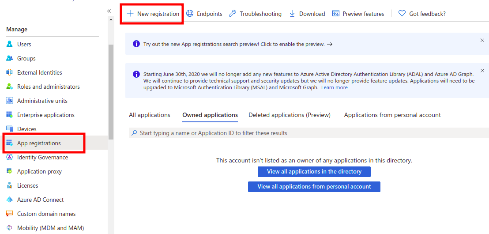
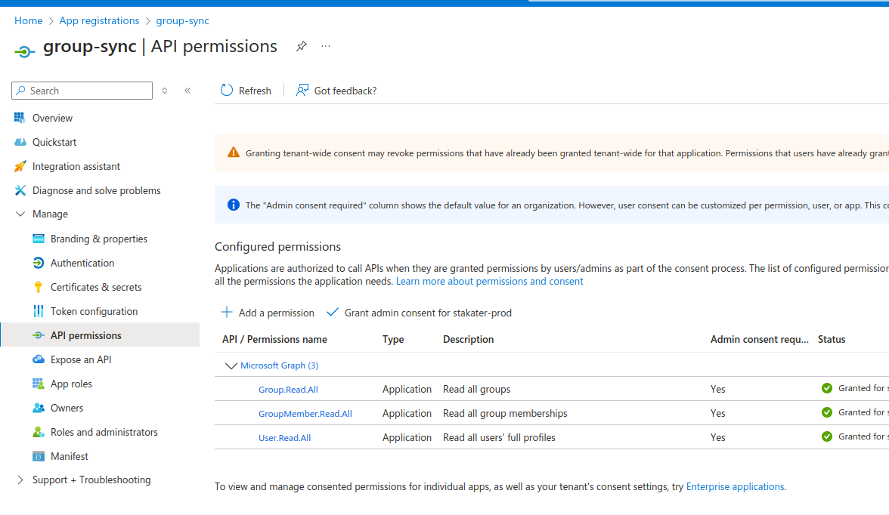
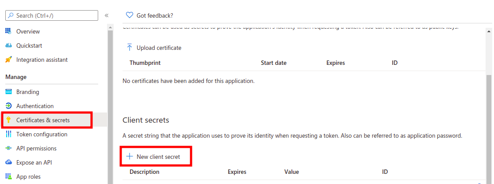
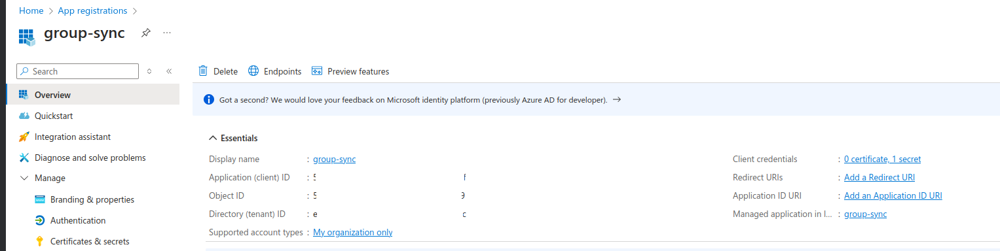

# Configuring Azure AD Group Sync Application

For Azure AD, two applications are needed, one for group synchronization, and one for the identity provider. Only users in target groups are synchronized. These are the steps to enable group sync:

1. To enable sync groups from the Microsoft Azure AD account to Stakater Cloud you first have to register an application on Azure. Go to the [Azure Portal](https://portal.azure.com).
1. Open the `Azure Active Directory` service
1. On the left tab under the Manage section, click `App registrations`
1. Click on `New registration`. Enter `group-sync` as name and click `Register`:

    

1. The `GroupSync` job requires additional permissions on the Azure AD tenant. To set these up, add these permissions under `API permissions` > `Configured permissions`:
    * `Group.Read.All`
    * `GroupMember.Read.All`
    * `User.Read.All`

    

1. Click on the newly created app `group-sync`. Click `Certificates & secrets` from the left tab. Click `New client secret`. Under `Expires` pick any option. Under `Description` enter `saap-group-sync`, and click `Add`:

    

1. Copy the value of the newly created client secret and note the  `Application (client) ID` and `Directory (tenant) ID` of the `group-sync` app registration from the `Overview` tab, and **send them to Stakater Support**:

    

## Items to be provided to Stakater Support

Please provide the secrets via password manager:

- `Application (client) ID`
- `Directory (tenant) ID`
- `Client Secret`
