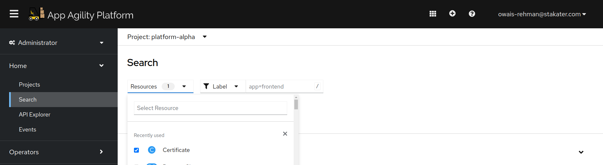
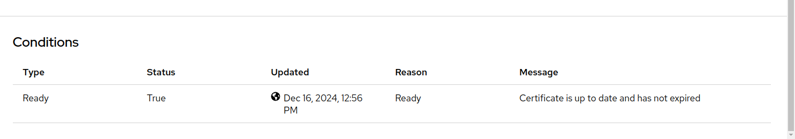

# Configuring TLS certificates using Infra GitOps

This document will explain a step by step approach of configuring TLS certificates for different tenants using Infra GitOps.

1. First step is to navigate to correct path inside your infra gitops repository. For this example we are using following path:
`<environment>/tenant-operator-config/templates/`
Here `<environment>` correspond to the cluster where you want to deploy this.
1. In this directory we need to create 2 resources [`Template`](https://docs.stakater.com/mto/main/crds-api-reference/template.html) and [`TemplateGroupInstance`](https://docs.stakater.com/mto/main/crds-api-reference/template-group-instance.html). A detailed explanation about why each resource is needed and what are the contents of each resource is given below:

    ## Template
    This resource is reponsible for keeping a record (template) or underlying resources (YAML files) that needs to be deployed to tenant namespaces.
    Given below is an example of template with underlying resources that is required for setting up TLS certificate:
    ```YAML
    apiVersion: tenantoperator.stakater.com/v1alpha1
    kind: Template
    metadata:
      name: certificate-creds
    resources:
      manifests:
        - apiVersion: external-secrets.io/v1beta1
          kind: ExternalSecret
          metadata:
            name: certificate-creds
          spec:
            secretStoreRef:
              kind: ClusterSecretStore
              name: shared-cluster-secret-store
            refreshInterval: "1m0s"
            target:
              name: certificate-creds
              creationPolicy: 'Owner'
            template:
              data:
                api-token: "{{ .api-token | b64enc }}"
            data:
            - secretKey: api-token
              remoteRef:
                key: certificate-creds
                property: api-token
        - apiVersion: cert-manager.io/v1
          kind: Issuer
          metadata:
            name: letsencrypt-cloudflare
          spec:
            acme:
              email: <domain-owning-authority's email>
              server: https://acme-v02.api.letsencrypt.org/directory
              privateKeySecretRef:
                name: letsencrypt-account-key
              solvers:
                - dns01:
                    cloudflare:
                      apiTokenSecretRef:
                        name: certificate-creds
                        key: api-token
        - apiVersion: cert-manager.io/v1
          kind: Certificate
          metadata:
            name: tls-certificate
          spec:
            secretName: tls-secret  
            dnsNames:
              - example.com
            issuerRef:
              name: letsencrypt-cloudflare
              kind: Issuer
    ```
    There are 3 resources `ExternalSecret`, `Issuer` and `Certificate` that are getting deployed from this template. Brief explanation about why we need these resources are needed is given below:

    `ExternalSecret`: This is needed to pull `api-token` key from secret provider which in this case is vault. This is an API-Token from DNS provider (which in present case is Cloudflare). This API-Token will be used by Certificate Authority to validate the authenticity of domains being registered. This secret will be referenced when creating issuer.

    `Issuer`: This is a cert-manager related resource and is responsible for setting up initial configuration against which TLS certificate will get generated. This issuer uses [`LetsEncrypt`](https://letsencrypt.org/) as certificate authority by setting one of its server's URL as value for `.spec.acme.server`. There is also a need for setting a value for `.spec.acme.email` which contains a valid email. This email will be a point of reference for `LetsEncrypt` to share any updates about certificate's lifecycle. This resource make a reference to secret in `.spec.acme.solvers.dns01.cloudflare.apiTokenSecretRef` that we created using `ExternalSecret`. In present case we are setting up for cloudflare so there is a reference to that in Issuer resource.

    `Certificate`: This is the actual resource that will create TLS certificate for a particular domain referenced in `.spec.dnsNames`. This resource makes a reference to `Issuer` that is created earlier in `.spec.issuerRef`.

    ## Template Group Instance
    This YAML file deploys resources in cluster by making a reference to different templates similar to one that we discussed above. Apart from this we can also specify different namespaces where these resources should be deployed. Given below is an example in this regard:
    ```YAML
    apiVersion: tenantoperator.stakater.com/v1alpha1
    kind: TemplateGroupInstance
    metadata:
      name: certificate-creds
    spec:
      template: certificate-creds
      selector:
        matchExpressions:
          - key: stakater.com/kind
            operator: In
            values: [ alpha, dev ]
      sync: true
    ```
    In `.spec.template`, we are specifying the name of the template that we created previously. In `.spec.selector` we need to specify namespaces where these resources needs to be deployed based on labels that are assigned to these namespaces. In present case, this will be deployed to all the namespaces which has `stakater.com/kind` as label key and `alpha` or `dev` as its value.
1. Commit, push and then merge to `main` branch. In few minutes ArgoCD will deploy these resources to relevant namespaces.
1. To verify whether resources are deployed correctly and working fine in cluster, you can go cluster console and select `Administrator` view and click `Home > Search`. Select a particular namespace and then search for `Certificate` in `Resources` dropdown as show below:

1. Select the certificate that is deployed in this namespace and scroll to bottom to `Condition` section. There you'll see a message that certificate is upto to date as shown below:

