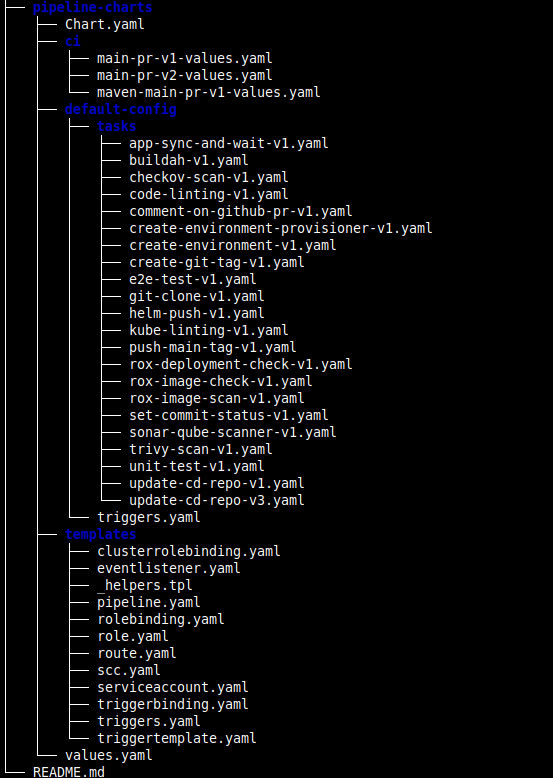

# Stakater Tekton Chart

## Overview

Tekton pipelines need a lot of components that need to be deployed to configure a working pipeline. This makes Tekton hard to manage.
To overcome this problem, we at Stakater have create the Stakater Tekton Chart.
Stakater Tekton Chart is a Helm chart that wraps all components needed by a Tekton pipeline.

## Tekton Chart Components

The chart contains templates for all required Tekton resources such as pipeline, task, `eventlistener`, triggers, etc.

Most of the complexity abstracted away using our Tekton pipeline chart.

Some key things to note above are:

* `eventlistener` -  listens to incoming events like a push to a branch.
* `trigger` - the `eventlistener` specifies a trigger which in turn specifies:
    * `interceptor` - it receives data from the event
    * `triggerbinding` - extracts values from the event interceptor
    * `triggertemplate` - defines `pipeline` run resource template in its definition which in turn references the pipeline

  > **Note**: We do not need to define interceptor and trigger templates in every trigger while using stakater Tekton pipeline chart.

* `pipeline` -  this is the pipeline definition, it wires together all the items above (workspaces, tasks & secrets etc) into a useful & reusable set of activities.
* `tasks` - these are the building blocks of Tekton. They are the custom resources that take parameters and run steps on the shell of a provided image. They can produce results and share workspaces with other tasks.

To learn more about Stakater Tekton Chart, please visit [Stakater Tekton Chart repository](https://github.com/stakater/stakater-tekton-chart)
