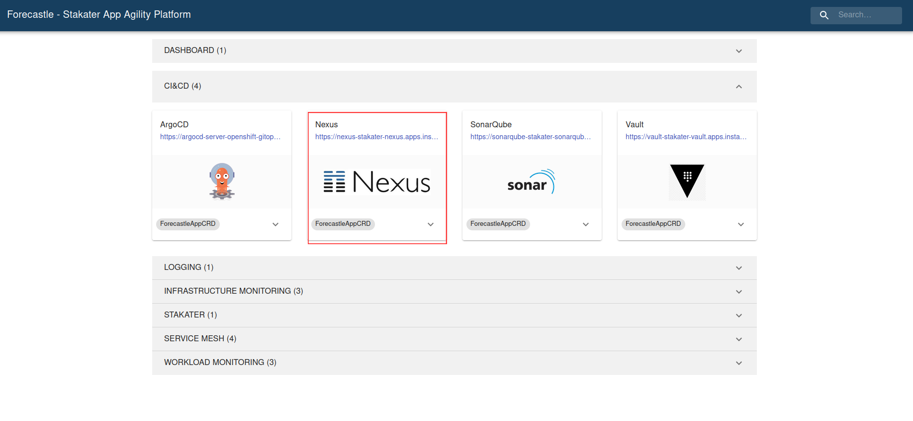
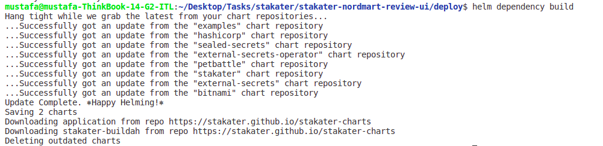
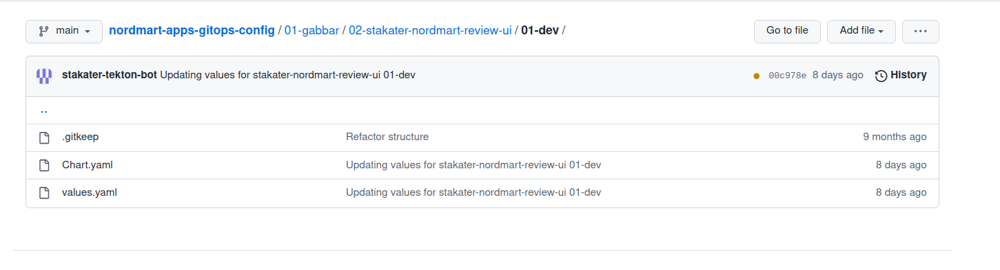
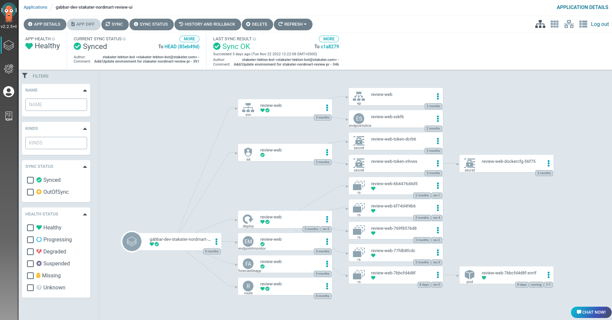
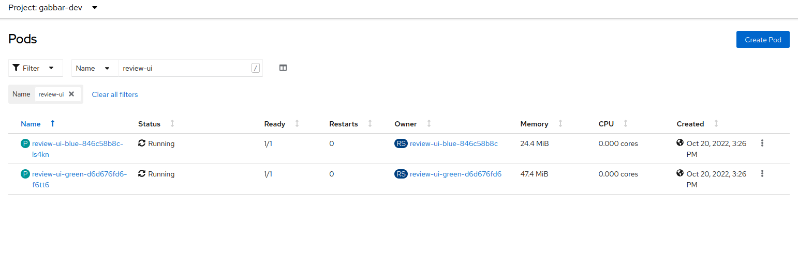
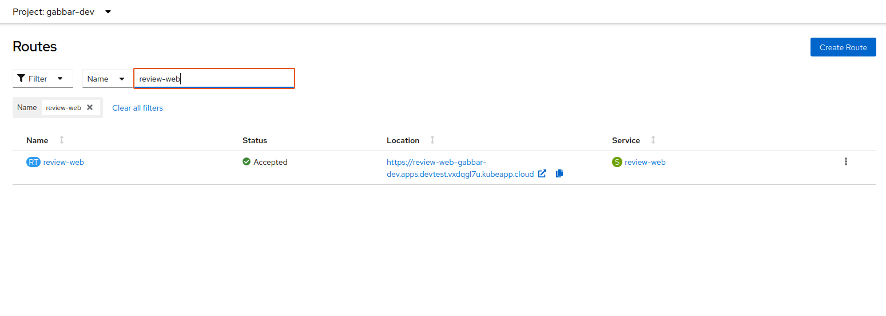
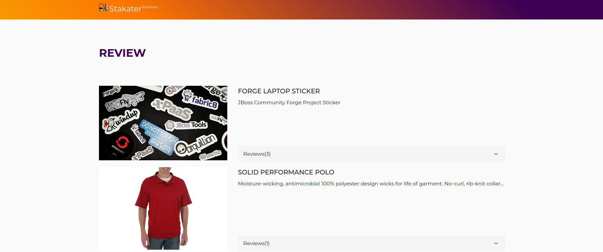

# Deploy demo app

Objective
Deploy your first app using GitOps

Key Results:

- Push artifacts to nexus
- Deploy app using helm charts via ArgoCD

This guide covers the step-by-step guide to onboard a new project/application/microservice on SAAP.

Changes required in application repository:

1. Add Dockerfile to application repository.
1. Push Docker Image to Nexus Docker Repository.
1. Add Helm Chart to application repository.
1. Push Helm Chart to Nexus Helm Repository.

In this section, we will use [`stakater-nordmart-review-web`](https://github.com/stakater-lab/stakater-nordmart-review-web) application as an example and add it to our GitOps structure we made in the previous section.

## Prerequisites

- [`tenant` for application must be defined via `infra-gitops-config`](../01-configure-infra-gitops-config/configure-infra-gitops-repo.md).
- [`tenant` for application should be onboarded onto `apps-gitops-config`](../02-configure-apps-gitops-config/configure-apps-gitops-repo.md).
- Docker Image and Helm Chart Repository hosted by Nexus must be available.
- [helm](https://helm.sh/docs/intro/install/)
- [git](https://git-scm.com/downloads)
- [oc](https://docs.openshift.com/container-platform/4.11/cli_reference/openshift_cli/getting-started-cli.html)
- [buildah](https://github.com/containers/buildah/blob/main/install.md)

## Docker Image and Helm Chart Repository hosted by Nexus

> Ask admin for Docker and Helm Registry Credentials for pushing container images and helm chart respectively.

Find Nexus Docker registry URL and Helm Registry URL [here](../../../managed-addons/nexus/routes.md).

Alternatively, Navigate to the cluster Forecastle, search `nexus` using the search bar on top menu and copy the nexus url.

- `nexus-docker-reg-url`: Remove `https://` from the start and add `-docker` in URL after `nexus`. This URL points to Docker Registry referred as `nexus-docker-reg-url` in this tutorial for example `nexus-docker-stakater-nexus.apps.clustername.random123string.kubeapp.cloud` (Note: Remove '/' at the end of the URL to avoid errors while login).

- `nexus-helm-reg-url` : Remove `https://` from the start, add `-helm` in URL after `nexus` and append `/repository/helm-charts/`. This URL points to Helm Registry referred as `nexus-helm-reg-url` in this tutorial for example `nexus-helm-stakater-nexus.apps.clustername.random123string.kubeapp.cloud/repository/helm-charts/`

  

### Login to Docker Registry

Run following command to log into the registry.

```sh
buildah login <nexus-docker-reg-url>
```

Specify admin provided username and password to login.

## 1. Add **Dockerfile** to application repository

We need a **Dockerfile** for our application present at the root of our code repo to build a container image.  Navigate to [`RedHat image registry`](https://catalog.redhat.com/software/containers/search) and find a suitable base image for the application.

Below is a Dockerfile for a ReactJS application for product reviews. Visit for more info: <https://github.com/stakater-lab/stakater-nordmart-review-web>

```Dockerfile
FROM node:14 as builder
LABEL name="Nordmart review"

# set workdir
RUN mkdir -p $HOME/application
WORKDIR $HOME/application

# copy the entire application
COPY . .

# install dependencies
RUN npm ci
ARG VERSION

# build the application
RUN npm run build -- --env VERSION=$VERSION

EXPOSE 4200

CMD ["node", "server.js"]
```

> Create [multi-stage builds](https://docs.docker.com/build/building/multi-stage/), use multiple `FROM` statements. Each `FROM` instruction can use a different base, and each of them begins a new stage of the build. You can selectively copy artifacts from one stage to another, leaving behind everything you don't want in the final image. The end result is the same tiny production image as before, with a significant reduction in complexity. You don't need to create any intermediate images, and you don't need to extract any artifacts to your local system at all.

Look into the following dockerizing guides for a start.

| Framework/Language | Reference                                                   |
|--------------------|-------------------------------------------------------------|
| NodeJS             | <https://nodejs.org/en/docs/guides/nodejs-docker-webapp/>     |
| Django             | <https://blog.logrocket.com/dockerizing-django-app/>          |
| General            | <https://www.redhat.com/sysadmin/containerizing-applications> |

## 2. Push Docker Image to Nexus

Lets clone the [`stakater-nordmart-review-web`](https://github.com/stakater-lab/stakater-nordmart-review-web) application.

```bash
git clone https://github.com/stakater-lab/stakater-nordmart-review-web
cd stakater-nordmart-review-web
```

Replace the placeholders and Run the following command inside application folder.

```sh
# Buldah Bud Info : https://manpages.ubuntu.com/manpages/impish/man1/buildah-bud.1.html
# buildah bud --format=docker --tls-verify=false --no-cache -f ./Dockerfile -t <nexus-docker-reg-url>/<app-name>:<tag> .
buildah bud --format=docker --tls-verify=false --no-cache -f ./Dockerfile -t <nexus-docker-reg-url>/stakater-nordmart-review-web:1.0.0 .
```

Lets push the image to nexus docker repo. Make sure to get credentials from Stakater Admin.

```sh
# Buildah push Info https://manpages.ubuntu.com/manpages/impish/man1/buildah-push.1.html
# buildah push <nexus-docker-reg-url>/<app-name>:<tag> docker://<nexus-docker-reg-url>/<app-name>:<tag>
buildah push <nexus-docker-reg-url>/stakater-nordmart-review-web:1.0.0 docker://<nexus-docker-reg-url>/stakater-nordmart-review-web:1.0.0
```

> **Note: Nexus docker registry URL is the one we extract in the above section. Make sure you are logged in to the Nexus docker registry before building and pushing the application image.**

## 3. Add Helm Chart to application repository

In application repo add Helm Chart in ***deploy*** folder at the root of your repository. To configure Helm chart add following 2 files in ***deploy*** folder.

1. A Chart.yaml is YAML file containing information about the chart. We will be using an external helm dependency chart called [Stakater Application Chart](https://github.com/stakater/application). The Helm chart is present in a remote Helm Chart repository

    > More Info : Stakater Application Chart <https://github.com/stakater/application>

    ```yaml
      apiVersion: v2
      # Replace Chart Name with AppName.
      # name: <app-name>
      name: stakater-nordmart-review-web
      description: A Helm chart for Kubernetes
      dependencies:
      - name: application
        version: 2.1.13
        repository: https://stakater.github.io/stakater-charts
      type: application
      version: 1.0.0
    ```

2. The values.yaml contains all the application specific **kubernetes resources** (deployments, configmaps, namespaces, secrets, services, route, podautoscalers, RBAC) for the particular environment. Configure Helm values as per application needs.

    Here is a minimal values file defined for an application with deployment,route,service.

    ```yaml
    # Name of the dependency chart
    application:
      # application name should be short so limit of 63 characters in route can be fulfilled.
      # Default route name formed is <application-name>-<namespace>.<base-domain> .
      # Config Maps have <application> prefixed

      # Replace applicationName with <app-name>
      applicationName: stakater-nordmart-review-web

      deployment:
        # nexus-docker-config-forked is deployed in all tenant namespaces for pulling images
        imagePullSecrets: nexus-docker-config-forked
        image:
          # <app-name>
          # you can leave repository and tag emtpy as they are overrided in gitops
          repository: stakater-nordmart-review-web
          tag: 1.0.0
      route:
        enabled: true
        port:
          targetPort: http
    ```

3. Make sure to validate the helm chart before doing a commit to the repository.
If your application contains dependency charts run the following command in deploy/ folder to download helm dependencies using **helm dependency build**.

    ```sh
    # Download helm dependencies in Chart.yaml
    cd deploy/
    # command info : helm dependency --help 
    helm dependency build
    ```

    

4. Run the following command to see the Kubernetes manifests are being generated successfully and validate whether they match your required configuration. This simple helm chart generates deployment, service and route resources.

    > View Application Chart Usage [here](https://github.com/stakater/application)

    ```sh
    # Generates the chart against values file provided
    # and write the output to application-output.yaml
    # command info : helm template --help 
    helm template . > application-output.yaml
    ```

    Open the file to view raw Kubernetes manifests separated by '---' that ll be deployed for your application.

References to Explore:

- [`stakater-nordmart-review`](https://github.com/stakater-lab/stakater-nordmart-review/deploy)
- [`stakater-nordmart-review-web`](https://github.com/stakater-lab/stakater-nordmart-review-web/deploy)
- [All configurations available via Application Chart Values](https://github.com/stakater/application/blob/master/application/values.yaml)

## 4. Push Helm Chart to Nexus

> Ask admin for Docker and Helm Registry Credentials for pushing container images and helm chart respectively.

After successfully pushing the image to Nexus. We need to package our helm chart and push to Nexus Helm Repo.
Run the following command to package the helm chart into compressed file.

```sh
# helm package [CHART_PATH]
helm package .
# output : successfully packaged chart and saved it to: /Desktop/stakater-nordmart-review-web/deploy/stakater-nordmart-review-web-1.0.0.tgz
```

This command packages a chart into a versioned chart archive file.

```sh
# helm
# curl -u "<helm_user>":"<helm_password>" <nexus-helm-reg-url>/<tenant-name> --upload-file "<app-name>-1.0.0.tgz"
curl -u "helm-user":"password123" https://nexus-helm-stakater-nexus.{CLUSTER_DOMAIN}/repository/helm-charts/gabbar --upload-file "stakater-nordmart-review-web-1.0.0.tgz"
```

## 5. Add application chart to `apps-gitops-config`

Navigate to `apps-gitops-config` repository and add a helm chart in path `gabbar/stakater-nordmart-review/dev` i.e. `<tenant-name>/<app-name>/dev`.



```yaml
# <tenant-name>/<app-name>/dev/Chart.yaml
apiVersion: v2
# name: <app-name>
name: stakater-nordmart-review-web
description: A Helm chart for Kubernetes
dependencies:
  # name: <chart-name-in-deploy-folder>
  - name: stakater-nordmart-review-web
    version: "1.0.0"
    # repository: <nexus-helm-reg-url>/repository/helm-charts/
    repository: https://nexus-helm-stakater-nexus.{CLUSTER_DOMAIN}/repository/helm-charts/gabbar/
version: 1.0.0
-----------------------------------------
# <tenant-name>/<app-name>/dev/values.yaml
# Name of dependency in Chart.yaml
<dependency-name>:
  application:
    deployment:
      image:
        # repository: <nexus-docker-reg-url>/<tenant-name>/<app-name>
        repository: nexus-docker-stakater-nexus.{CLUSTER_DOMAIN}/gabbar/stakater-nordmart-review-web
        tag: 1.0.0
```

## 6. View Application in Cluster

Login into ArgoCD UI using Forecastle console. Visit the application against dev environment inside your tenant. Usual naming convention is **tenantName-envName-appName**. Make sure that there aren't any error while deploying during ArgoCD.



Visit the OpenShift console to verify the application deployment.





Visit the application url using routes to check if application is working as expected.


