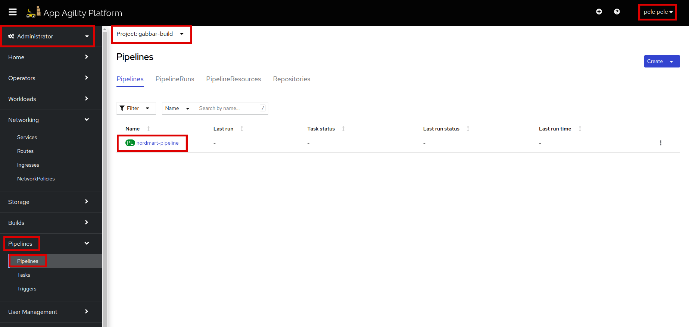
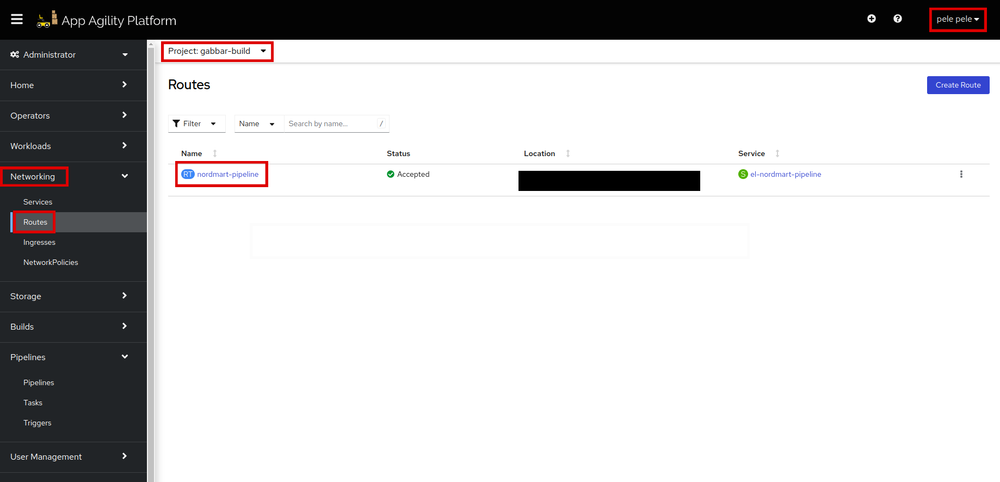

# Add Tekton pipeline

Objective
Configure basic CI&CD pipeline

Key Result

- Push artifacts to nexus
- Update the GitOps repository via pipeline
- Release new version

## Add Pipeline to Your Application

Now that we have added our first application using Stakater Opinionated GitOps Structure, we can continue by adding pipeline to our application.
SAAP is shipped with all the tools that you need to add a Tekton pipeline to your application.

**Prerequisites:**
An application deployed through GitOps structure

## Tekton Pipeline

> Tekton (OpenShift Pipelines) is the new kid on the block in the CI/CD space. It's grown rapidly in popularity as it's Kubernetes Native way of running CI/CD. To learn more about Tekton visit [`tekton.dev`](https://tekton.dev/)

Tekton is deployed as an operator in our cluster and allows users to define in YAML Pipeline and Task definitions. <span style="color:blue;">[Tekton Hub](https://hub.tekton.dev/)</span> is a repository for sharing these YAML resources among the community, giving great reusability to standard workflows.
Similar to Tekton Hub, we at stakater have created our own reusable tasks at [Tekton Catalog](https://github.com/stakater/tekton-catalog/)

## Deploying the Tekton Objects

> The Tekton pipeline definitions are not stored with the application codebase because we centralize and share a dynamic Pipeline to avoid duplicated code and effort.

### Tekton Pipeline Chart

We will use stakater's `pipeline-charts` Helm chart to deploy the Tekton resources. The chart contains templates for all required Tekton resources such as `pipeline`, `task`, `eventlistener`, `triggers`, etc.

We will fill in the values for these resources and deploy a functioning pipeline with most of the complexity abstracted away using our Tekton pipeline chart.

### SAAP pre-configured cluster tasks

> SAAP is shipped with many ready-to-use Tekton cluster tasks. Let's take a look at some of the tasks that we will be using to construct a basic pipeline.

#### 1. Navigate to the OpenShift Console

  Navigate to the `OpenShift Console` using `Forecastle`. Select `Pipelines` > `Tasks` in sidebar. Select the `ClusterTasks` tab and search `stakater`. Here you will see all the tasks shipped with SAAP.

### Deploying a working pipeline

> Let's use the `tekton-pipeline-chart` and the above tasks to create a working pipeline. We will be using [this example GitOps repository](https://github.com/stakater/nordmart-apps-gitops-config) and [application](https://github.com/stakater-lab/stakater-nordmart-review) in this section.

Open your Apps GitOps repository.
  > We will be using [Stakater opinionated GitOps structure](https://docs.stakater.com/saap/for-delivery-engineers/gitops/structure.html) to deploy our pipelines through it. We will be deploying our pipeline resources in 'build' environment. We assume here that the environment has already been created for every tenant.

#### 1. Create Chart.yaml

  Navigate to Tenant > Application > env (build). In our case 01-gabbar (Tenant) > 02-stakater-`nordmart`-review-web > 00-build.

- Add a Chart.yaml file and a values.yaml file at this location.
- Populate the Chart.yaml file with the following content:

```yaml
# <tenant-folder>/<app-folder>/<build-folder>/Chart.yaml
  apiVersion: v2
  dependencies:
    - name: stakater-tekton-chart
      repository: https://stakater.github.io/stakater-charts
      version: 3.6.7
  description: Helm chart for Tekton Pipelines
  name: stakater-main-pr-v1
  version: 3.6.7
```

As mentioned earlier, we will use the `stakater-tekton-chart` to deploy our Tekton pipeline resources.

#### 1. Create values.yaml

  Now we will be populating the values file for the Tekton pipeline Chart to create our pipeline.

```yaml
# <tenant-folder>/<app-folder>/<build-folder>/values.yaml
stakater-tekton-chart:
  name: <pipeline-name>
  workspaces:
    - name: source
      volumeClaimTemplate:
        accessModes: ReadWriteOnce
        resourcesRequestsStorage: 1Gi
    - name: ssh-directory
      secret:
        secretName: <ssh-secret-name>
    - name: repo-token
      secret:
        secretName: <token-secret-name>
  pipelines:
    tasks:
      - defaultTaskName: <set-commit-status-task>
        params:
          - name: STATE
            value: pending
          - name: GIT_SECRET_NAME
            value: <token-secret-name>
      - defaultTaskName: git-clone
        params:
          - name: url
            value: "git@github.com:<repository-url>"
        workspaces:
          - name: ssh-directory
            workspace: ssh-directory
      - defaultTaskName: <create-git-tag-task>
      - defaultTaskName: <build-image-flag-task>
      - defaultTaskName: <buildah-task>
        name: build-and-push
        params:
          - name: IMAGE
            value: $(params.image_registry_url):$(tasks.<create-git-tag-task>.results.GIT_TAG)
          - name: CURRENT_GIT_TAG
            value: $(tasks.<create-git-tag-task>.results.CURRENT_GIT_TAG)
          - name: BUILD_IMAGE
            value: $(tasks.<build-image-flag-task>.results.BUILD_IMAGE)
      - defaultTaskName: <comment-on-pr-task>
        params:
          - name: image
            value: >-
              $(params.image_registry_url):$(tasks.<create-git-tag-task>.results.GIT_TAG)
        runAfter:
          - build-and-push
      - defaultTaskName: <helm-push-task>
        params:
          - name: semVer
            value: $(tasks.<create-git-tag-task>.results.GIT_TAG)
      - defaultTaskName: <push-main-tag-task>
        params:
          - name: IMAGE_TAG
            value: $(tasks.<create-git-tag-task>.results.GIT_TAG)
          - name: GITHUB_TOKEN_SECRET
            value: <ssh-secret-name>
  triggerbinding:
    enabled: create
    bindings:
      - name: stakater-main-v1
        bodyParams:
          - name: gitrevision
            value: $(body.repository.master_branch)
          - name: gitorganization
            value: NA
          - name: gitcdrepo
            value: NA
          - name: team
            value: NA
          - name: clusterName
            value: NA
          - name: environment
            value: NA
          - name: repoName
            value: $(body.repository.name)
          - name: repoPath
            value: $(body.repository.full_name)
          - name: namespace
            value: '${namespace}'
          - name: prnumberBranch
            value: main
          - name: prnumber
            value: NA
          - name: gitrepositoryurl
            value: 'https://github.com/$(body.repository.full_name)'
          - name: image_registry_url
            value: >-
              <nexus-docker-reg-url>$(body.repository.name) # remove https:// from the docker registry URL
          - name: author
            value: $(body.head_commit.author.name)
          - name: helm_registry
            value: >-
              https://<nexus-helm-reg-url>/repository/helm-charts/
          - name: nexus_url
            value: NA
          - name: tekton-base-url
            value: NA
          - name: webhook-payload
            value: $(extensions.marshalled-body)
          - name: action
            value: NA
      - name: stakater-pr-v1
        bodyParams:
          - name: gitrevision
            value: $(body.pull_request.head.sha)
          - name: gitbranch
            value: $(body.pull_request.head.ref)
          - name: namespace
            value: '${namespace}'
          - name: gitorganization
            value: NA
          - name: gitcdrepo
            value: NA
          - name: team
            value: NA
          - name: clusterName
            value: NA
          - name: environment
            value: NA
          - name: repoName
            value: $(body.repository.name)
          - name: repoPath
            value: $(body.repository.full_name)
          - name: prnumberBranch
            value: pr-$(body.pull_request.number)
          - name: prnumber
            value: $(body.pull_request.number)
          - name: gitrepositoryurl
            value: 'https://github.com/$(body.repository.full_name)'
          - name: image_registry_url
            value: >-
              <nexus-docker-reg-url>$(body.repository.name) # remove https:// from the docker registry URL
          - name: author
            value: $(body.pull_request.user.login)
          - name: helm_registry
            value: >-
              https://<nexus-helm-reg-url>/repository/helm-charts/
          - name: nexus_url
            value: NA
          - name: tekton-base-url
            value: NA
          - name: webhook-payload
            value: $(extensions.marshalled-body)
          - name: action
            value: $(body.action)
          - name: pull_request_commits_api
            value: $(body.pull_request._links.commits.href)
  triggertemplate:
    serviceAccountName: <service-account-name>
    pipelineRunNamePrefix: <pipeline-run-prefix>
    pipelineRunPodTemplate:
      tolerations:
        - key: "pipeline"
          operator: "Exists"
          effect: "NoExecute"
  eventlistener:
    serviceAccountName: <service-account-name>
    triggers:
      - name: stakater-pr-cleaner-v2-pullrequest-merge
        create: false
      - name: github-pullrequest-create
        bindings:
          - ref: stakater-pr-v1
          - name: oldcommit
            value: $(body.pull_request.base.sha)
          - name: newcommit
            value: $(body.pull_request.head.sha)
      - name: github-pullrequest-synchronize
        bindings:
          - ref: stakater-pr-v1
          - name: oldcommit
            value: $(body.before)
          - name: newcommit
            value: $(body.after)
      - name: github-push
        bindings:
          - ref: stakater-main-v1
          - name: oldcommit
            value: $(body.before)
          - name: newcommit
            value: $(body.after)
  rbac:
    enabled: true
  serviceAccount:
    name: <service-account-name>
    create: true
```

Here, we are using the [default triggers](https://github.com/stakater/stakater-tekton-chart/blob/main/stakater-tekton-chart/default-config/triggers.yaml). You will need to [deploy your own trigger bindings](https://github.com/stakater/stakater-tekton-chart/blob/085d1ba52175294a21255a27561ac0ebe8621e85/stakater-tekton-chart/values.yaml#L96) and add them as ref to the triggers in the above **values.yaml** file.

> Note: So, the reference to the trigger binding will need to be added in; (pipeline-charts.eventListener.trigger.bindings.ref).

Let's see our pipeline definition in the SAAP console now.

#### 1. Pipeline creation on the console

  Select `<TENANT_NAME>-build` namespace in the console. Now in the `Pipelines` section, click `pipelines`. You should be able to see the pipeline that you just created using the chart.



With our pipelines definitions synchronized to the cluster, we can now add the webhook to GitHub `nordmart-review-ui` project.

#### 1. Extract the URL for the webhook

  Grab the URL we're going to invoke to trigger the pipeline by checking the event listener route in `<TENANT_NAME>-build` project



  1. Once you have the URL, over on GitHub go to the application repo > `Settings` > `Webhook` to add the webhook:

    * Add the URL we obtained through the last step in the URL box
    * select `Push Events`, leave the branch empty for now.
    * Select `Merge request events`
    * select `SSL Verification`
    * Click `Add webhook` button.

With all these components in place - now it's time to trigger pipeline via webhook by checking in some code for Nordmart review `ui`.

#### 1. Run the pipeline

Let's make a simple change to `stakater-nordmart-review-ui`.

  1. Edit `ReadMe.md` by adding some new lines in the file. Create a Pull request.

  1. Navigate to the OpenShift Console. Open up 'Pipelines'. Change the project to the namespace in which you have deployed your pipeline. You will see a pipeline running.
