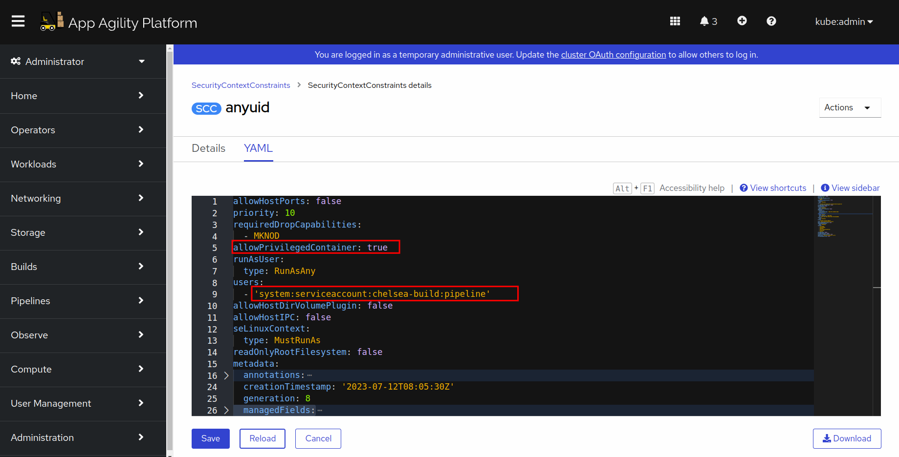

# Setting Up Service Account, SCC, Role, and RoleBinding for Tekton Pipelines

In this tutorial, we will guide you through the process of setting up a service account, a Security Context Constraint (SCC), a role, and a role binding for Tekton Pipelines. These steps are essential for managing your pipeline's security and access within your Kubernetes/OpenShift cluster.

## Prerequisites

- Access to a Kubernetes or OpenShift cluster.

## Create a Service Account with a Secret

1. Create a service account named `pipeline-service-account.yaml` in the namespace in which your pipelines will run.

```yaml
   kind: ServiceAccount
   apiVersion: v1
   metadata:
   name: pipeline
   namespace: <tenant>-build
   secrets:
     - name: nexus-docker-config
```

1. Replace `<tenant>` with your actual namespace.

Apply the file to the cluster. You can do this directly through the OpenShift console or you can run oc apply.

## Create a Security Context Constraint (SCC)

1. Create a new SCC named `tekton-pipelines-scc.yaml`.

```yaml
   apiVersion: security.openshift.io/v1
   kind: SecurityContextConstraints
   allowHostPorts: false
   priority: 10
   requiredDropCapabilities:
     - MKNOD
   allowPrivilegedContainer: true
   runAsUser:
     type: RunAsAny
   users: []
   allowHostDirVolumePlugin: false
   allowHostIPC: false
   seLinuxContext:
     type: MustRunAs
   readOnlyRootFilesystem: false
   metadata:
     name: tekton-pipelines-scc
   fsGroup:
     type: MustRunAs
   groups: []
   defaultAddCapabilities: null
   supplementalGroups:
     type: RunAsAny
   volumes:
     - configMap
     - downwardAPI
     - emptyDir
     - persistentVolumeClaim
     - projected
     - secret
   allowHostPID: false
   allowHostNetwork: false
   allowPrivilegeEscalation: true
   allowedCapabilities: null
```

Apply it to the cluster. You can do this directly through the OpenShift console.


## Create Role and RoleBinding

1. Create a ClusterRole named *pipelines-scc-role*

```yaml

kind: ClusterRole
apiVersion: rbac.authorization.k8s.io/v1
metadata:
  name: pipelines-scc-role
rules:
  - verbs:
      - use
    apiGroups:
      - security.openshift.io
    resources:
      - securitycontextconstraints
    resourceNames:
      - tekton-pipelines-scc

```

Now let's create a RoleBinding for this:

```yaml

kind: RoleBinding
apiVersion: rbac.authorization.k8s.io/v1
metadata:
  name: pipeline-rolbinding-for-nordmart
  namespace: <tenant>-build

subjects:
  - kind: ServiceAccount
    name: pipeline
    namespace: <tenant>-build
roleRef:
  apiGroup: rbac.authorization.k8s.io
  kind: ClusterRole
  name: pipelines-scc-role-for-nordmart

```

Replace the `<tenant>` in the namespace name with your actual tenant name.
