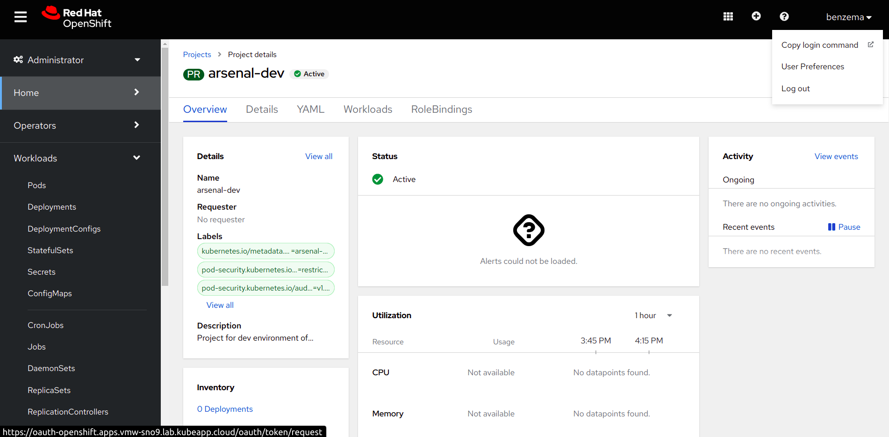

# Deploy your Application

1. To initiate the deployment process for your application, please proceed to the preferred SNO and access the login interface, and select `htpasswd`.


2. Enter the credentials and login to the cluster. Once logged in, you should see the following screen. Select `<tenant>-dev` namespace.




3. In the upper-right corner of the screen, locate the "Copy login command" button and click on it. Afterward, kindly provide your credentials once again. Next, click on the "Display login token" option, and make sure to copy the generated login token.

4. Now, use the login token you obtained to log in. 


5. Now, we configure tilt-settings.json to run the application via tilt.

To configure tilt-settings.json for running your application with Tilt, follow these steps:

1. Locate the `tilt-settings.json.template` file in your project directory and remove the `.template` suffix.

2. Fill in the values for the following three defined fields:

    a. **namespace**: Specify the name of the namespace where you want to deploy your application. For this tutorial, the namespace is arsenal-dev.

    b. **default_registry**: Set the route to the OpenShift Image Registry. The format should be like `image-registry-openshift-image-registry.apps.[CLUSTER-NAME].[CLUSTER-ID].kubeapp.cloud`.
    
    Note: Please consult your cluster administrator to obtain the OpenShift internal registry route.

    c. **allow_k8s_contexts**: Ensure that you are logged into the cluster. Run the command oc context current-context to retrieve the current context information. Copy and paste the output of this command as the value for allow_k8s_context.

    Your updated tilt-settings.json should resemble the following example:

    ```
    {
        "namespace": "arsenal-dev",
        "default_registry": "image-registry-openshift-image-registry.apps.vmw-sno9.lab.kubeapp.cloud",
        "allow_k8s_contexts": "arsenal-dev/api-vmw-sno9-lab-kubeapp-cloud:6443/benzema"
    }
    ```
**Note: To ensure successful deployment, it is essential to log in to the Docker registry on your local machine.** 

Use the following steps:

1. Retrieve the OpenShift internal docker registry URL and assign it to the `HOST` variable:

```
HOST=image-registry-openshift-image-registry.apps.[CLUSTER-NAME].[CLUSTER-ID].kubeapp.cloud
```

2. Log in to the Docker registry using the following command:

```
docker login -u $(oc whoami) -p $(oc whoami -t) $HOST
```

If you encounter the error "x509: certificate signed by unknown authority," you need to update the /etc/docker/daemon.json file and add the insecure registry configuration:

    {
        "insecure-registries" : [ "HOST" ]
    }

Please ensure you follow these steps to configure tilt-settings.json accurately for seamless deployment.

6. Open `tilt/values-local.yaml` and set `imagePullSecrets` to `default-dockercfg-2bf84`

7. Run `tilt up`.
