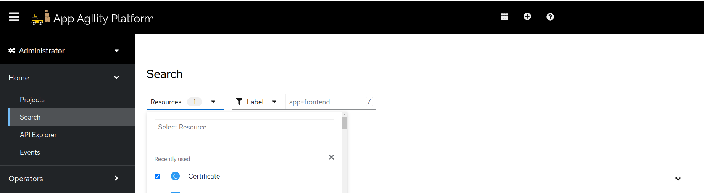

# Exposing Your Application to Internet over HTTPS and custom hostname

This guide provides a step-by-step process to configure an OpenShift `Route` resource to expose your application to the internet.

## Prerequisites

Before proceeding, ensure the following prerequisites are met:

- **Cert Manager Issuer**: Verify with your cluster administrator that cert manager `Issuer` is properly configured.
- **External DNS**: Confirm that External DNS is set up and operational for managing DNS records.

## Step 1: Setup Cert Manager Certificate

A [`Certificate`](https://cert-manager.io/docs/usage/certificate/#creating-certificate-resources) resource is used to automatically manage TLS certificates for your application by integrating with a certificate authority (e.g., Let’s Encrypt). It handles the issuance, renewal, and revocation of certificates, ensuring secure communication over HTTPS. Follow the steps below to configure the Certificate resource

### Update `values.yaml`

In your application's Helm chart, add the following snippet in `values.yaml`.

```yaml
application:
  ...
  certificate:
    enabled: true
    secretName: <secret name where tls creds will be stored>
    dnsNames:
      - <DNS for which we need to generate certificate for example:example.com>
    issuerRef:
      name: <cert manager's Issuer name. You can ask cluster admin for this>
      kind: Issuer
```

#### Important Details

- **Certificate**:
   - Instruct Cert-Manager to generate TLS certificates for specific DNS entries.
   - Requires:
     - `.certificate.secretName`: This is the name of secret that `Certificate` will create. It will contain TLS credentials that will find its utilization in next steps.
     - `.certificate.dnsNames`: DNS name for which this certificate will be valid. It can contain wildcard names like `*.example.com` or specific names like `api.example.com`.
     - `.certificate.issuerRef.name`: Name of the issuer that this certificate will reference. We have created this issuer in previous steps.

## Step 2: Deploy the Route

A [`Route`](https://docs.openshift.com/container-platform/4.17/networking/routes/route-configuration.html) resource is used to expose your application to the internet using a specific DNS name. Follow the steps below to configure the Route.

### Update `values.yaml`

Update the `values.yaml` file in your application’s Helm chart with the following configuration:

```yaml
application:
  ...
  route:
    enabled: true
    annotations:
      cert-utils-operator.redhat-cop.io/certs-from-secret: <name-of-certificate-secret>
      external-dns.alpha.kubernetes.io/hostname: <desired-dns-name>
      cert-utils-operator.redhat-cop.io/inject-CA: "false"
    host: <desired-dns-name>
    path: <desired-path>
```

#### Important Details

- **Annotations**:
    - `cert-utils-operator.redhat-cop.io/certs-from-secret`: Specifies the name of the secret that stores the TLS certificate created by the Certificate resource.
    - `external-dns.alpha.kubernetes.io/hostname`: Registers the DNS record with the configured provider (e.g., Cloudflare).
    - `cert-utils-operator.redhat-cop.io/inject-CA`: Indicates whether to inject the Certificate Authority (CA) into the Route. Set to "false" if not required.

- **Additional Configuration**:
    - `route.host`: Specifies the host name that you want to use for this route. This value must match the `external-dns.alpha.kubernetes.io/hostname` annotation.
    - `route.path`:  Specifies the URL path where your application will be exposed (e.g., `/api`).

### Verify Deployment

After updating the `values.yaml` file and applying the Helm chart, verify the deployment:

#### Certificate

1. In the cluster console, switch to `Administrator` view and navigate to `Home > Search`.
1. Select the namespace and search for `Certificate` in the `Resources` dropdown.
1. Inspect the deployed certificate. In the `Condition` section, confirm that the certificate is up-to-date.




!!! note
    If the certificate status is not updated, wait a few minutes as Cert-Manager may take time to generate the certificate.

#### Route

1. Navigate to the OpenShift cluster console.
1. Go to Networking > Routes and locate the Route resource for your application.
1. Confirm that:
   - The Route resource is listed.
   - Its status is Accepted.
   - The DNS name and TLS configuration are correct.
