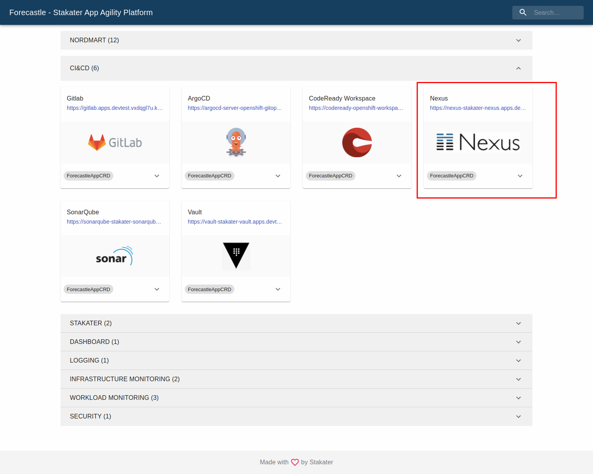

# Package and push your chart to Nexus

## Objectives

- Push artifacts to Nexus Registry hosted on Stakater App Agility Platform (SAAP).

## Key Results

- Helm chart package and pushed to Nexus.

## Guide

### Get Nexus Helm Registry URL

## Docker Image and Helm Chart Repository hosted by Nexus

> Ask admin Helm Registry Credentials for helm chart repository.

Find Nexus Helm Registry URL [here](../../../managed-addons/nexus/routes.md).

Alternatively, Navigate to the cluster Forecastle, search `nexus` using the search bar on top menu and copy the nexus url.

- `nexus-helm-reg-url` : Add `-helm` in URL after `nexus` and append `/repository/helm-charts/`. This URL points to Helm Registry referred as `nexus-helm-reg-url` in this tutorial for example `https://nexus-helm-stakater-nexus.apps.clustername.random123string.kubeapp.cloud/repository/helm-charts/`

  

### Package and Upload the chart to Nexus

1. Run the following command to package the helm chart into compressed file.

   ```sh
   # helm package [CHART_PATH]
   helm package .
   ```

   This command packages a chart into a versioned chart archive file.

1. Upload packaged chart to Nexus Helm Registry.

   ```sh
   curl -u "<helm_user>":"<helm_password>" `nexus-helm-reg-url` --upload-file "CHART_NAME-CHART_VERSION.tgz"
   ```

   > Make sure to get credentials from Stakater Admin.

1. Open Nexus UI from Forecastle. Upon opening the link, you'll be redirected to Nexus home page.

   
   

1. Select `Browse` from the left sidebar, Click on `Helm Charts` to view your Helm Registry Charts.

   

1. Verify that the chart you uploaded is present in the list.

    
