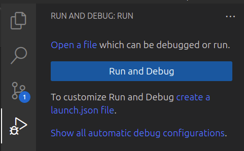
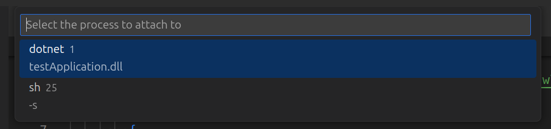

# Configure Remote Debugging for .NET applications

This guide provides step-by-step instructions for setting up remote debugging for .NET applications in VSCode using the inner loop.

## Objectives

- Configure VSCode to attach its debugger to a .NET application running inside a pod on OpenShift.

## Key Results

- Enable developers to remotely debug applications running inside a cluster from their local environment.

## Guide

### Prerequisite

Before setting up the debugging environment, ensure you have a .NET application with Docker and Tilt configuration files. This guide assumes that these are already in place. If you need help setting them up, refer to the [Inner Loop Documentation](https://docs.stakater.com/saap/for-developers/tutorials/inner-loop/prepare-environment/prepare-env.html) for detailed instructions.

### Modifying Dockerfile to Install vsdbg for Remote Debugging

To enable remote debugging for your .NET application in a container, you need to install vsdbg (Visual Studio Debugger) inside the container. Below is a step-by-step guide to updating your Dockerfile to include vsdbg.


#### Step 1: Identify Your Base Image

Ensure that your Dockerfile is based on a .NET runtime or SDK image. You will typically have one of the following:

- SDK Image (for development and debugging): mcr.microsoft.com/dotnet/sdk:<version>
- Runtime Image (for running the app): mcr.microsoft.com/dotnet/aspnet:<version>

If you're using a runtime-only image, debugging support might be limited, and you may need to switch to an SDK image for development.

#### Step 2: Add vsdbg to the Dockerfile

Modify your Dockerfile to download and install vsdbg. The installation process involves:

1. Creating a directory for vsdbg.
1. Downloading the latest vsdbg package from Microsoft’s official source.
1. Extracting and setting correct permissions.

Here’s how to do it:

```Dockerfile
# Use the official .NET SDK image for .NET 8 as the build stage
FROM mcr.microsoft.com/dotnet/sdk:8.0 AS build

# Set the working directory inside the container
WORKDIR /app

# Copy the project and solution files
COPY *.sln ./
COPY <application name>/ ./<application name>/

# Restore dependencies
RUN dotnet restore "<application name>/<application name>.csproj"

# Build the application in Release mode
RUN dotnet build "<application name>/<application name>.csproj" --no-restore -c Debug

# Publish the application for deployment
RUN dotnet publish "<application name>/<application name>.csproj" --no-build -c Debug -o /app/out

RUN apt-get update && \
apt-get install -y --no-install-recommends curl unzip && \
curl -sSL https://aka.ms/getvsdbgsh | \
bash /dev/stdin -v latest -l /vsdbg && \
chmod -R 755 /vsdbg && \
chmod +x /vsdbg/vsdbg

# Use the .NET 8 runtime image for the final stage
FROM mcr.microsoft.com/dotnet/aspnet:8.0 AS runtime

# Set the working directory inside the runtime container
WORKDIR /app

# Create a non-root user and group
RUN groupadd -g 1000 nonroot && \
    useradd -u 1000 -g nonroot -d /app -s /bin/sh nonroot

# Copy the published files from the build stage
COPY --from=build --chown=nonroot:nonroot /app/out ./
COPY --from=build --chown=nonroot:nonroot /vsdbg /vsdbg

# Set permissions for the non-root user
RUN chown -R nonroot:nonroot /app && \
    chown -R nonroot:nonroot /vsdbg

# Expose Application port
EXPOSE 5045

# Set environment variables for debugging and hot reload
ENV ASPNETCORE_ENVIRONMENT=Development \
    DOTNET_DEBUG=1

# Switch to the non-root user
USER 1000

# Entry point to run the application in normal or debug mode
CMD ["dotnet", "<application name>.dll", "--urls", "http://0.0.0.0:5045", "--wait-for-debugger"]

```

##### Explanation of Key Changes

- Downloading vsdbg:
The command downloads and installs the latest version of vsdbg into /vsdbg.

  ```bash
  curl -sSL https://aka.ms/getvsdbg | bash /dev/stdin -v latest -l /vsdbg
  ```

- Creating a directory (/vsdbg) to store the debugger.
- Ensuring the correct permissions so that vsdbg can execute properly.
- Changes the user context to the non-root user (ID 1000) to run the application securely.


### Configure Helm Chart

In addition to the standard configurations required for deploying this application to OpenShift, you need to apply one extra setting in the application's Helm chart to enable remote debugging.

#### Mounting a Temporary Volume for Debugging

To ensure compatibility with the remote debugger, mount a temporary volume (preferably an emptyDir volume) at the `/tmp` path inside the container.

#### For Applications Using Stakater's Leader Chart
If your application is already using the [Stakater Leader Chart](https://github.com/stakater/application), you can achieve this by adding the following lines to your `values.yaml`:

```YAML
application:
...
  deployment:
    volumes:
      - name: tmp-volume
        emptyDir: {}
    volumeMounts:
      - mountPath: /tmp
        name: tmp-volume
```

Next step is to deploy the application to cluster via inner loop. Make sure application pods are in running state. Copy the name of running pod this will be used in next steps

### Configure VSCode

1. Open VSCode and navigate to Run & Debug (Ctrl+Shift+D).
1. Click on "Create a launch.json file" if you don’t have one.
1. Add the following configuration in .vscode/launch.json:

    ```JSON
      {
          "version": "0.2.0",
          "configurations": [
            {
              "name": ".NET Core Remote Debug (OpenShift)",
              "type": "coreclr",
              "request": "attach",
              "processId": "${command:pickProcess}",
              "pipeTransport": {
                "pipeProgram": "oc",
                "pipeArgs": [
                  "exec",
                  "-i",
                  "<Application Pod Name running in Openshift that we copied in last step>",
                  "--"
                ],
                "pipeCwd": "${workspaceFolder}",
                "debuggerPath": "/vsdbg/vsdbg",
                "quoteArgs": false
              },
              "sourceFileMap": {
                "/app": "${workspaceFolder}",
                "/src": "${workspaceFolder}"
              },
              "logging": {
                "trace": true,
                "programOutput": true,
                "diagnosticsLog": {
                    "protocolMessages": true
                },
                "traceResponse": true
              }
            }
          ]
      }
    ```

1. Ensure your pod is running and the application is in debug mode (--wait-for-debugger).
1. Ensure your application code has atleast 1 debug point.
1. In VSCode, open the Run & Debug panel.
1. Select ".NET Core Remote Debug (OpenShift)" from the dropdown and click Start Debugging (F5).
1. Choose the correct .NET process when prompted.
1. Wait for few seconds for debugger to setup and then interact with you application API to hit the debug point.