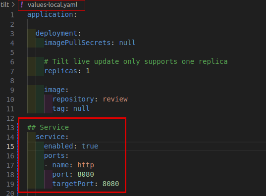
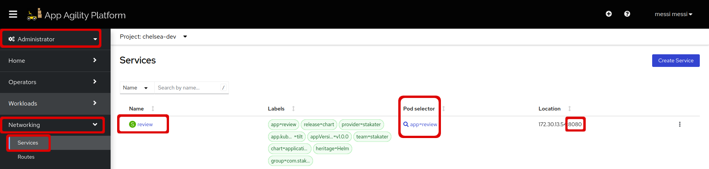
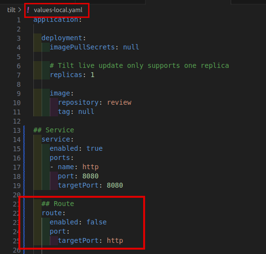
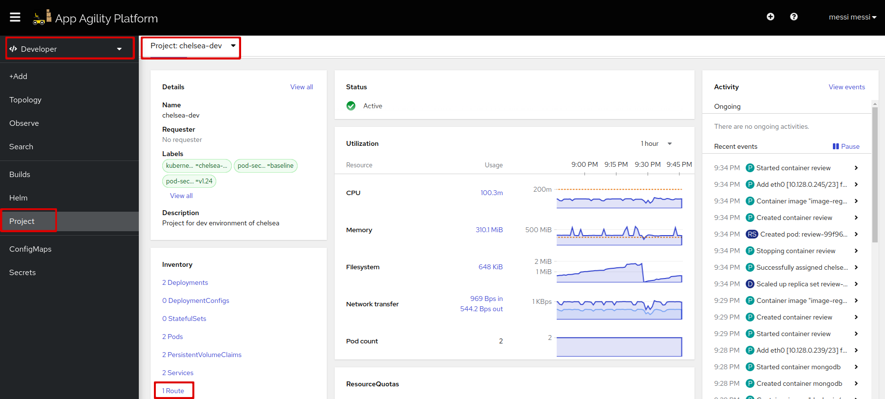
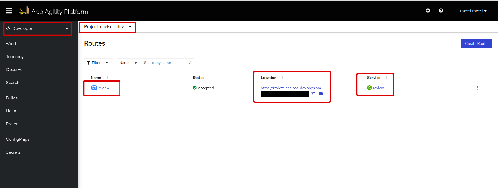
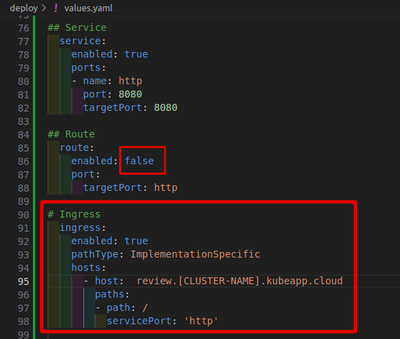
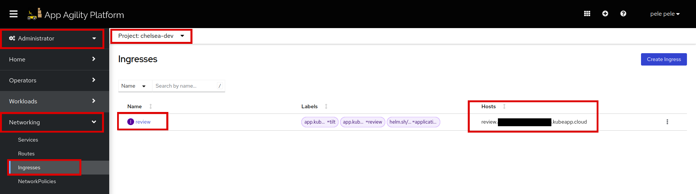
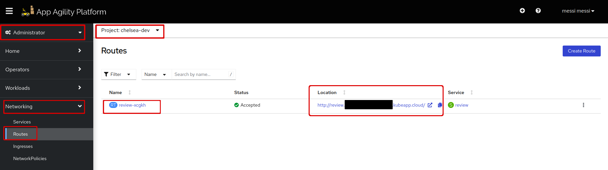
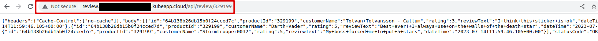

# Expose your Application

Once you have successfully deployed your application on the SAAP (Stakater App Agility Platform), the next step is to make it accessible to users and resources over the network. In this tutorial, you will learn how to expose your application and enable external traffic to reach it, whether for internal use within the cluster or external access from outside the cluster. By following these steps, you will ensure that your application is reachable and can serve its intended purpose.

## Objective

- Expose your application internally using the service
- Expose your application externally using route or ingress

## Key Results

- Application is exposed for traffic in/out of the cluster

## Tutorial #1

### Exposing Your Application Within the Cluster

Create a service:

1. In your `deploy/values.yaml` file, define a service:

    ```yaml
    ## Service
    service:
      enabled: true  # Enables the creation of a Service resource on SAAP
      ports:
        - name: http  # Specifies the name of the service
          port: 8080  # Specifies the port on which the service will listen
          targetPort: 8080  # Specifies the port on the container/application to which the traffic will be forwarded

    ```

    It should look like this:

    

    > You n change or add any configuration for the service. To see more configurations [click](https://github.com/stakater/applition.git).

1. Run `tilt up` at the root of your directory. Hit the space bar and the browser with `TILT` logs will be shown. If everything is green then the changes will be deployed on the cluster.

1. Let's go to the services under the networking section in your namespace

    The service has exposed our review pod on port `8080`.

    

## Tutorial #2

### Exposing Your Application to External Traffic via Route

OpenShift provides a routing mechanism called "routes" that allows you to expose applications using hostnames and paths. Routes are created using the Route resource and can provide additional features such as SSL termination and path-based routing.

To create a route:

1. In your `deploy/values.yaml` file, define a route:

    ```yaml
    ## Route
    route:
      enabled: true # Enables the creation of a Route resource on SAAP
      port:
        targetPort: http  # Specifies the target service port name
    ```

    It should look like this:

    

    `targetPort: http` represents the port on which the backend service is listening to handle incoming traffic.

    > You can change or add any configuration for the route. To see more configurations [click](https://github.com/stakater/application.git).

1. Run `tilt up` at the root of your directory. Hit the space bar and the browser with `TILT` logs will be shown. If everything is green then the changes will be deployed on the cluster.

1. Let's go to the routes resource in your namespace:

    

1. Click on the "review" route

    Here you can see the route and the service that is associated with it.

    

1. At the end of the route add `/api/review/329199`

    Now you can access the application externally with this route.

    

## Tutorial #3

### Exposing Your Application to External Traffic via Ingress

1. To expose the application via `Ingress`, we need a service. Create a service from [this](#exposing-your-application-within-the-cluster) section.

1. In your `deploy/values.yaml` file, define ingress:

    ```yaml
    ## Ingress
    ingress:
      enabled: true  # Enables the creation of an Ingress resource on SAAP
      servicePort: http  # Specifies the service port to use for routing traffic
      hosts:    # Defines the list of hosts to route traffic to
        - host:  review.<CLUSTER-NAME>.kubeapp.cloud  # define a list of hosts
          paths:
          - path: /   # Specifies the path for incoming traffic
            servicePort: 'http'  # Specifies the service name to forward traffic to
      tls:
      - {}   # Configures TLS settings for the Ingress resource, using the default ingress-controller certificate
    ```

    > Note: If you prefer not to use your cluster domain, you have the option to create a TLS secret for your own domain. This TLS secret should contain the trusted certificates signed by well-known certificate authorities `(CAs)`. To add this secret to your configuration, you can specify the secret name under `application.ingress.tls.secretName` in your values.yaml file.

    It should look like this:

    

1. Make sure the **route** field is `enabled: false`. It's because Ingress will create its own route.

> Note: In order to use a different host, you must have a DNS record pointing to the cluster's external IP or load balancer. You can change or add any configuration for the ingress. To see more configurations [click](https://docs.openshift.com/container-platform/4.11/networking/routes/route-configuration.html#nw-ingress-creating-a-route-via-an-ingress_route-configuration).

1. Run `tilt up` at the root of your directory. Hit the space bar and the browser with `TILT` logs will be shown. If everything is green then the changes will be deployed on the cluster.

1. Let's go to the cluster and see your ingress resource and the route associated with it in your namespace:

    We can see there is an `Ingress` resource created with our mentioned `Host`.

    

1. Now let's see if `Ingress` has created the route. Go to the routes under the networking section:

    

1. Copy the route with the copy icon and add `/api/review/329199` at the end of the route.

    The lock sign shows that the connection of this route is secure. Now you can access the application externally exposed via `Ingress`.

    

By following the tutorials above, you can successfully expose your application deployed on SAAP, using the example application "`stakater-nordmart-review-api`".

> Please note that any modifications and configurations specific to your cluster should be made in the `deploy/values.yaml` file, while changes and configurations related to your local environment should be made in the `tilt/values-local.yaml` file.

## Whitelisting application routes

See [Additional route configurations](../../../../for-administrators/secure-your-cluster/secure-routes.md#additional-route-configuration) section on how to allow only whitelisted IPs for your application routes.
