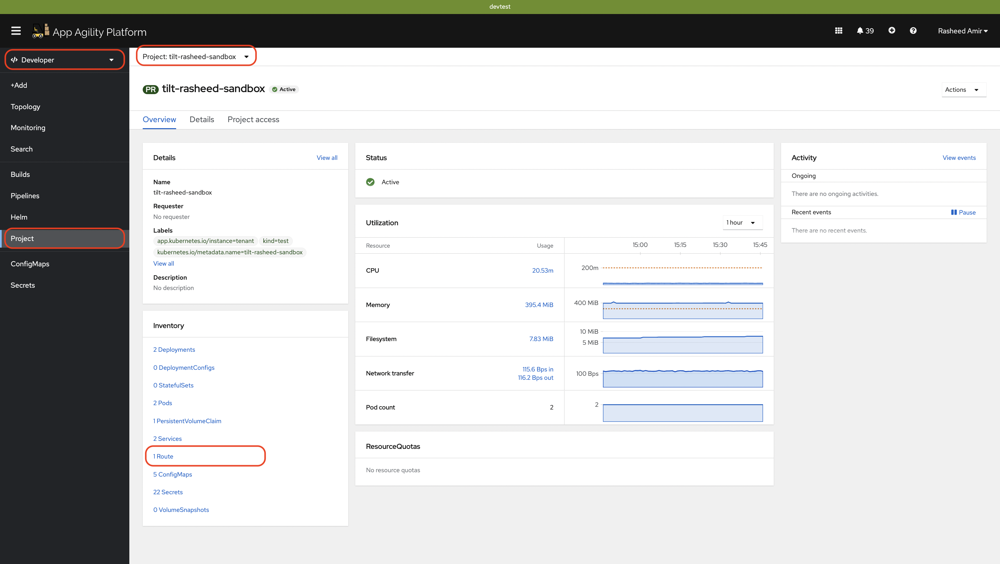
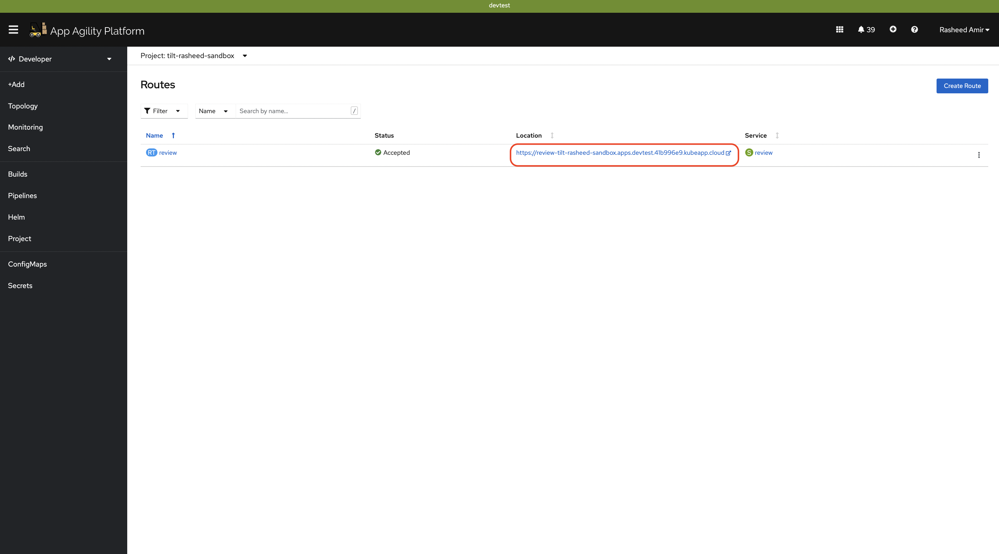

# Expose your Application

After successfully deploying your application on Red Hat OpenShift, you need to expose it to external traffic so that users can access your application over the network. This tutorial will guide you through the process of exposing your application and making it accessible from outside the OpenShift cluster.

## Objective

Learn how to expose your application to external traffic.

## Key Results

- Create route

- Create service based on the application requirements

## Tutorial

Assuming that you already have deployed the application using the previous tutorial.

OpenShift provides a routing mechanism called "routes" that allows you to expose applications using hostnames and paths. Routes are created using the Route resource and can provide additional features such as SSL termination and path-based routing. To create a route:

1. In your `tilt/values-local` file, define a route:

    ```yaml
    ## Route
    route:
      enabled: true
      port:
        targetPort: http
    ```

    a) Route is `enabled: true`, which means the route resource will be created when you tilt up.

    b) `port:` This section defines the port configuration for the Route resource.

    c) `targetPort: http`: This specifies the target port for the Route. In this case, the value is set to `http`, which is a named port defined in the associated Service configuration. It represents the port on which the backend service is listening to handle incoming traffic.
To create a service:

1. In your `tilt/values-local` file, define a service:

    ```yaml
    ## Service
      service:
        enabled: true
        ports:
        - name: http
          port: 8080
          targetPort: 8080
    ```

    a) Service is `enabled: true`, which means the service resource will be created on the OpenShift cluster when you tilt up your application.

    b) `port:` This section defines the port configuration for the service resource.

    c) `name: http`: We have seen in the route `targetPort: http` was given which was pointing to this service port named `http`. `port: 8080` is the port of the service itself. `targetPort: 8080` is the pod/container port of the application.

1. Run `tilt up` in your directory containing updated `tilt/values-local`.

1. Let's go to the routes resource in your namespace

    

1. Click on the review route

    

1. At the end of the route add `/api/review/329199`

    Now you can access the application externally with this route.

    

By following the steps outlined above, you can successfully expose your application deployed on Red Hat OpenShift, using the example application "`stakater-nordmart-review-api`". Using the NodePort, LoadBalancer, or Route approach, you can make your application accessible from outside the OpenShift cluster, allowing users to access and interact with your application over the network.

## Whitelisting application routes

See [Additional route configurations](../../../../for-administrators/secure-your-cluster/secure-routes.md#additional-route-configuration) section on how to allow only whitelisted IPs for your application routes
