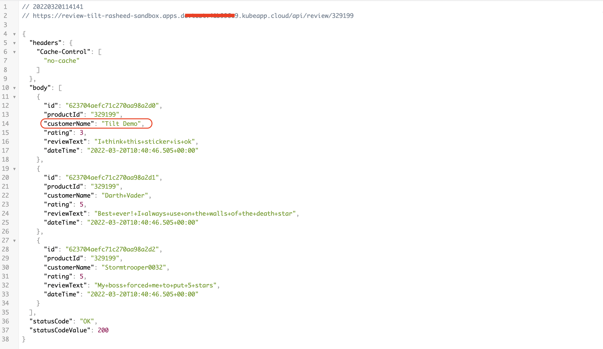

# Expose your Application

After successfully deploying your application on Red Hat OpenShift, you need to expose it to internal or external traffic so that users and other resources can access your application over the network. This tutorial will guide you through the process of exposing your application and making it accessible from outside the OpenShift cluster.

## Objective

- Expose your application internally within the cluster.
- Expose your application to external traffic via route.
- Expose your application to external traffic via ingress.

## Key Results

- Create route
- Create service based on the application requirements

## Tutorial

### Expose Application Within the Cluster

To expose an application internally within the cluster via a Service.

To create a service:

1. In your `tilt/values-local` file, define a service:

    ```yaml
    ## Service
      service:
        enabled: true
        ports:
        - name: http
          port: 8080
          targetPort: 8080
    ```

    It should look like this:

    

    a) Service is `enabled: true`, which means the service resource will be created on the OpenShift cluster when you tilt up your application.

    b) `port:` This section defines the port configuration for the service resource.

    c) `name: http`: We have seen in the route `targetPort: http` was given which was pointing to this service port named `http`. `port: 8080` is the port of the service itself. `targetPort: 8080` is the pod/container port of the application.

    > You can change or add any configuration for the service. To see more configurations [click](https://docs.openshift.com/container-platform/3.11/architecture/core_concepts/pods_and_services.html#services)

2. Run `tilt up` in your directory containing updated `tilt/values-local`.

3. Let's go to the services under networking section in your namespace

      

Here we can see that the service named by review is created. Take a look at the pod selector and location, the service has exposed our review pod on the port `8080`.

## Expose your application to external traffic via route

OpenShift provides a routing mechanism called "routes" that allows you to expose applications using hostnames and paths. Routes are created using the Route resource and can provide additional features such as SSL termination and path-based routing. To create a route:

1. In your `tilt/values-local` file, define a route:

    ```yaml
    ## Route
    route:
      enabled: true
      port:
        targetPort: http
    ```

    It should look like this:

    

    a) Route is `enabled: true`, which means the route resource will be created when you tilt up.

    b) `port:` This section defines the port configuration for the Route resource.

    c) `targetPort: http`: This specifies the target port for the Route. In this case, the value is set to `http`, which is a named port defined in the associated Service configuration. It represents the port on which the backend service is listening to handle incoming traffic.

> You can change or add any configuration for the route. To see more configurations [click](https://docs.openshift.com/container-platform/4.11/networking/routes/route-configuration.html)

1. Run `tilt up` in your directory containing updated `tilt/values-local`.

1. Let's go to the routes resource in your namespace

    

1. Click on the "review" route

    

Here you can see the route and the service that is accociated to it.

1. At the end of the route add `/api/review/329199`

    Now you can access the application externally with this route.

    

## Expose your application to external traffic via ingress

By following the steps outlined above, you can successfully expose your application deployed on Red Hat OpenShift, using the example application "`stakater-nordmart-review-api`". Using the NodePort, LoadBalancer, or Route approach, you can make your application accessible from outside the OpenShift cluster, allowing users to access and interact with your application over the network.

## Whitelisting application routes

See [Additional route configurations](../../../../for-administrators/secure-your-cluster/secure-routes.md#additional-route-configuration) section on how to allow only whitelisted IPs for your application routes
