# Nordmart Review 101

Welcome to the Nordmart Review 101 guide! In this section, we'll explore the architecture of the Nordmart Review, a pivotal sub-module within the Stakater Nordmart fictitious online e-commerce store.

## Architecture

The Nordmart Review is designed with a modular architecture that consists of three crucial components, each playing a unique role in delivering an exceptional user experience:

<div style="text-align:center"></div>

### Review UI

The frontend of the Nordmart Review is built using React, a popular JavaScript library for building user interfaces. This component is responsible for creating an engaging and interactive user interface that customers can use to browse and submit reviews for various products.

### Review API

At the heart of the Nordmart Review is the Review API, a RESTful web service developed using Spring Boot. This component acts as the bridge between the frontend and the MongoDB database, handling incoming requests from the UI, processing them, and fetching or storing data in the database accordingly.

### MongoDB

Serving as the NoSQL database for storing reviews, MongoDB is a powerful and flexible choice for handling unstructured or semi-structured data. It seamlessly stores and manages the reviews submitted by customers, ensuring that the Nordmart Review can efficiently retrieve and display reviews to potential buyers.

## How It Works

Customers visiting the Stakater Nordmart online store can interact with the Nordmart Review to express their opinions about products. Here's how the components collaborate to make this happen:

### Review Submission

When a customer submits a review through the Review UI, the Review API receives the request. The API processes the review details and stores it in the MongoDB database, associating the review with the relevant product.

### Review Retrieval

As customers browse different products, the Review UI sends requests to the Review API to retrieve reviews for specific items. The API communicates with MongoDB to fetch the reviews, which are then displayed to customers on the UI.

### Seamless Interaction

The seamless interaction between the Review UI, Review API, and MongoDB ensures that customers can easily browse, submit, and access reviews. This architecture enables a dynamic and responsive user experience, enhancing customer engagement and decision-making.

The Nordmart Review architecture is designed for scalability, flexibility, and performance, ensuring that as the online store's popularity grows, it can effectively handle a large number of reviews and serve customers without compromising on speed or responsiveness.

For the rest of the tutorials, we'll be using ReviewAPI and MongoDB. Let's continue exploring and enhancing the Nordmart Review together!

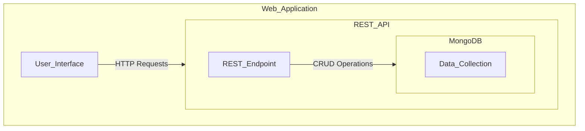

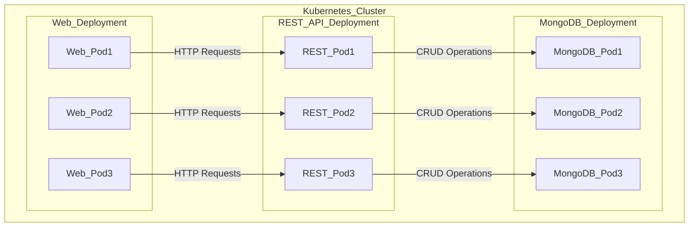

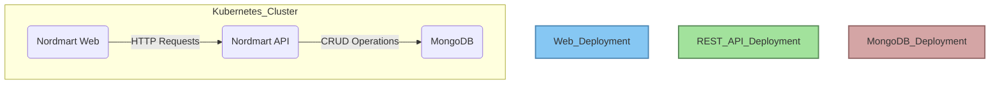


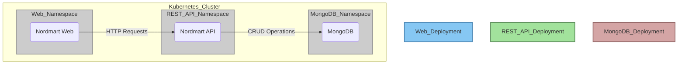

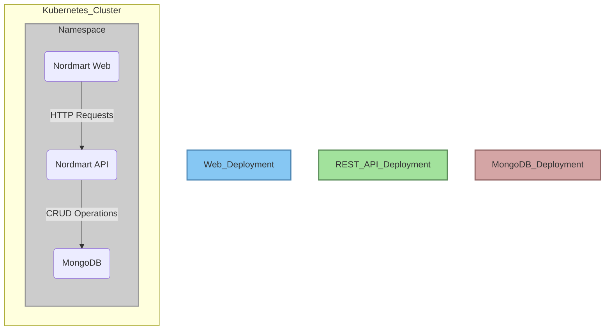


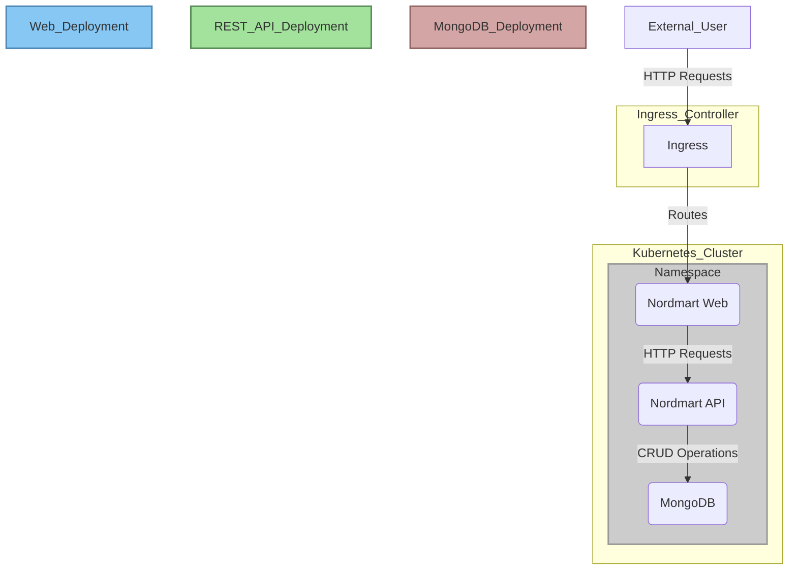

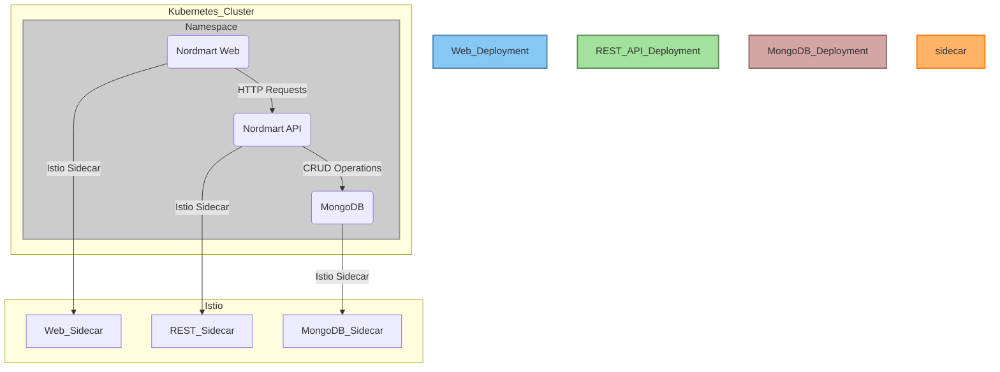

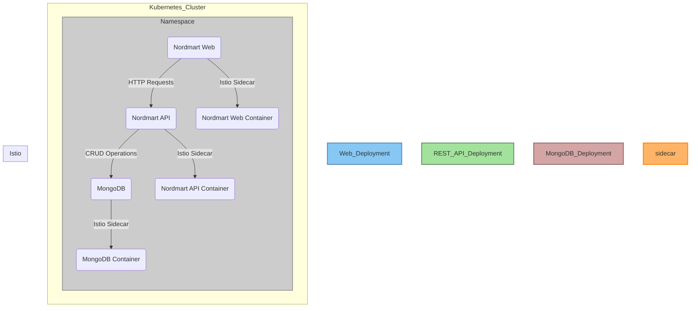

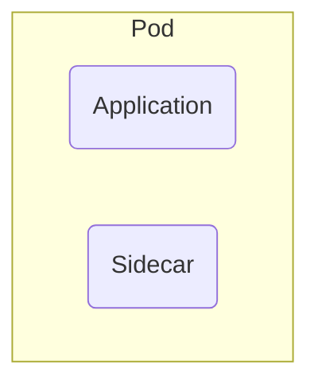

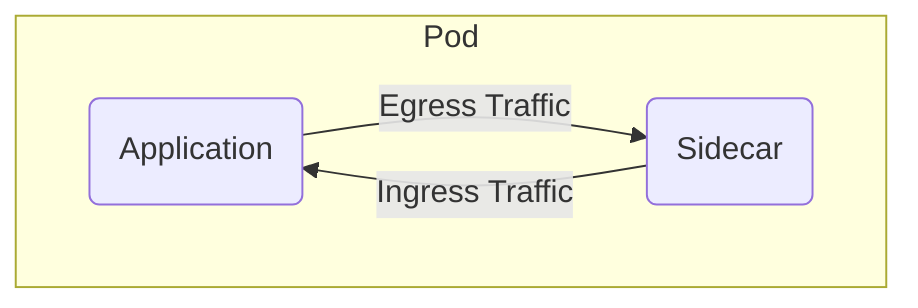

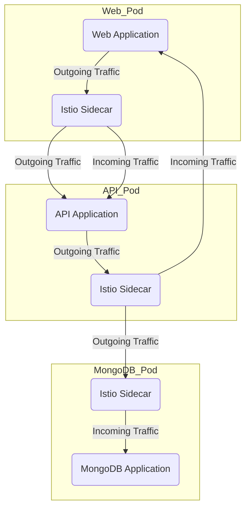

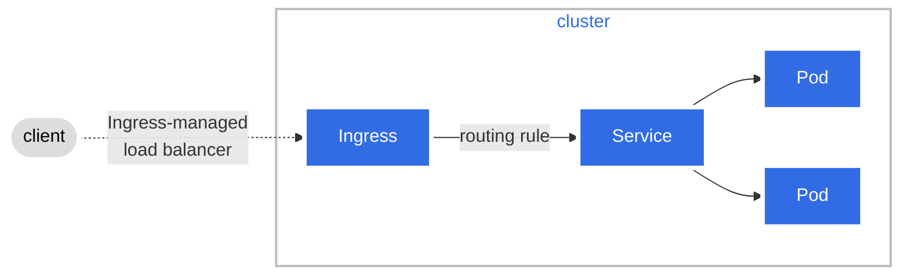

```mermaid

```

```mermaid

```

