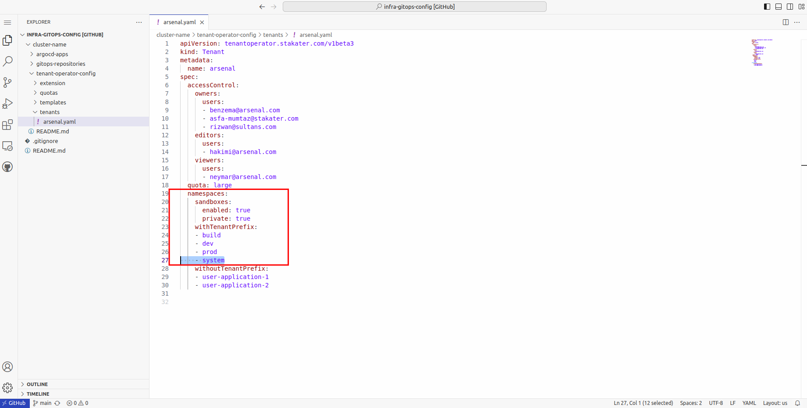
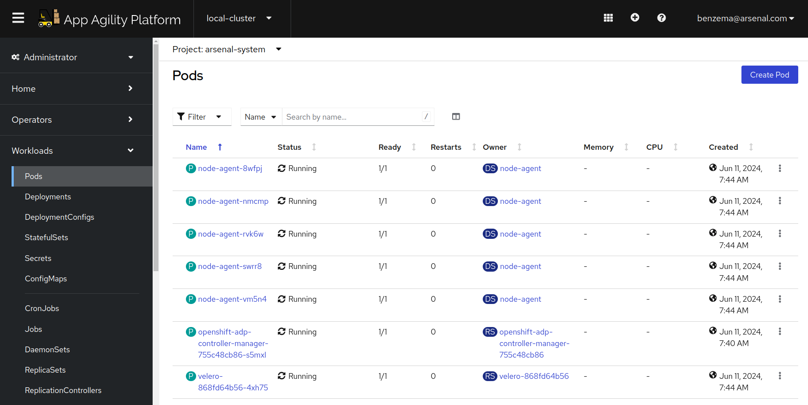
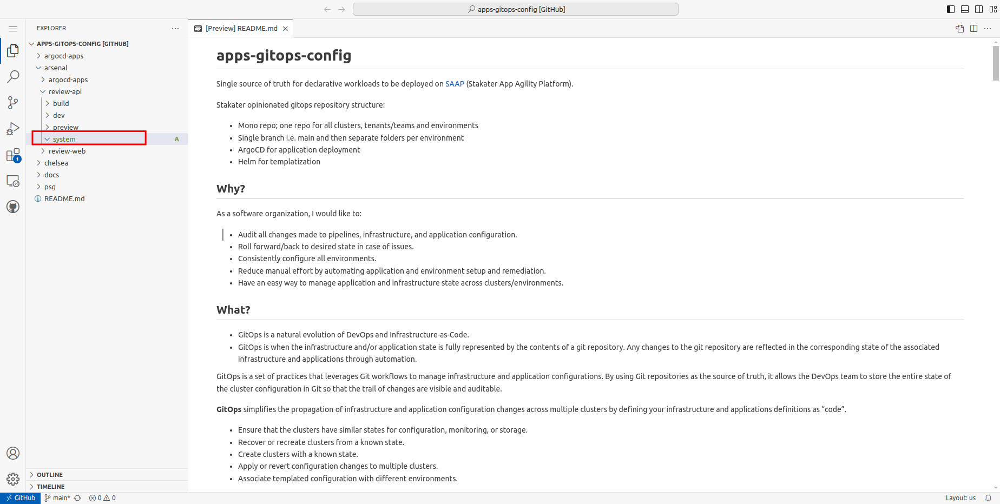
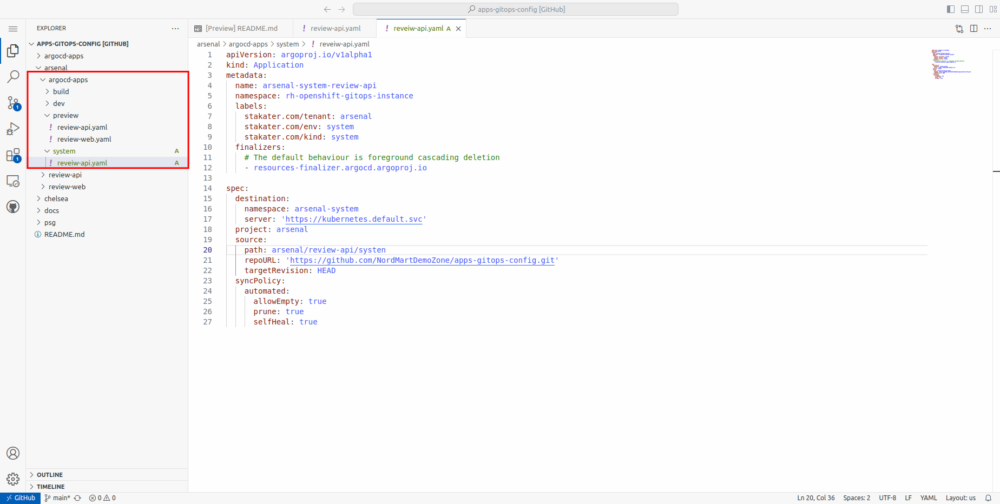
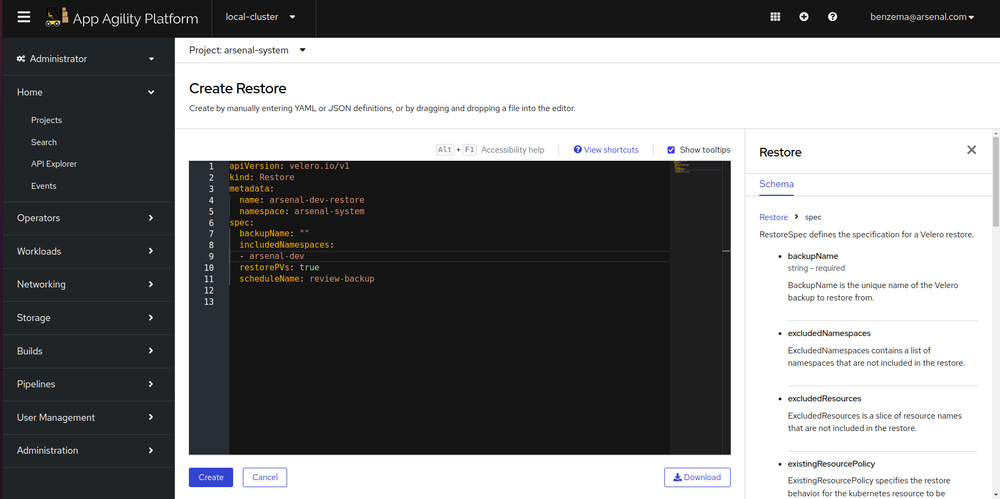
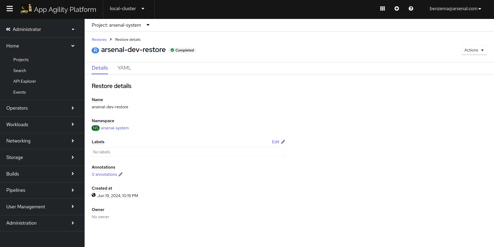

# Creating a backup schedule

Creating a backup schedule for an application using the OpenShift ADP (Application Data Protection) Operator involves several steps. This guide will walk you through the process, from installing the ADP Operator to configuring backup schedules.

## Objectives

- Create a backup schedule for your application
- Restore application

## Key Results

- Application successfully restored using the OADP operator

## Tutorial

### Add Namespace to Tenant

You will need create a TENANT-system namespace for Back and Restore functionality to work.
When the system namespace is added, MTO deploys the OADP operator to the TENANT-system namespace.
Let's see how you can create this namespace.

1. Open up the `infra-gitops-config` repository.

1. Navigate to the folder containing the Tenant definitions.

1. Now open the Tenant to which your application belongs.

1. Under the namespaces, add the 'system' namespace. Commit the change

   

1. After a few, the system namespace should start showing in SAAP. You will also see some pods running in the namespace

   

### Create a Backup Schedule

For creating a backup schedule, you will need to deploy the Schedule CR to the TENANT-system namespace
Let us deploy a Backup Schedule for our application

1. Navigate to the application GitOps repository. In your application's environments, add a 'system' environment folder.

   

1. Next, add the ArgoCD application that points to the above folder.

   

1. Now add the Backup Schedule in the system environment folder. Remember to replace the placeholder values.

```yaml
apiVersion: velero.io/v1
kind: Schedule
metadata:
  name: [APPNAME]-backup
  namespace: [TENANT]-system
spec:
  schedule: * 11 * * *
  template:
    defaultVolumesToRestic: true
    excludedResources:
      - daemonsets
      - statefulsets
      - nodes
      - apiservices
      - events
      - resourcequotas
      - controllerrevisions.apps
    includedNamespaces:
      - [TENANT]-dev
    includedResources:
      - deployments
      - services
      - persistentvolumeclaims
      - secrets
      - configmaps
    labelSelector:
      matchLabels:
        app.kubernetes.io/part-of: [APP-NAME] #Replace this with a label present on your application
    snapshotVolumes: true
    storageLocation: dpa-1
    ttl: 1h0m0s

```

   !!! note
       In the labelSelector field, add a common label that is present on all the resources of your application

1. Once ArgoCD syncs the changes, you should be able to see Schedule CR on the cluster. It should show as 'Enabled'.

   

1. When the scheduled time arrives, a backup will be automatically created and stored in the designated storage location configured by the SAAP Admin. For the purpose of this tutorial, we are using AWS S3 buckets to store the backups.

### Restore Application from Backup

1. To restore the application, you will simply need to deploy the Restore CR to `tenant-system` namespace.
   Here's a sample configuration:

```yaml
apiVersion: velero.io/v1
kind: Restore
metadata:
  name: arsenal-dev-restore
  namespace: arsenal-system
spec:
  backupName: ""
  includedNamespaces:
    - [TENANT]-dev
  itemOperationTimeout: 4h0m0s
  restorePVs: true
  scheduleName: [SCHEDULE-NAME]
```

   Remember to replace the placeholder values.

   

  !!! note
      When restoring using a schedule, the `backupName` should be empty. OADP will automatically replace it with the latest backup.

1. Once the Restore CR is created, you will see the Restore showing 'InProgress'. After the Backup is complete, the status will show as complete.

   
