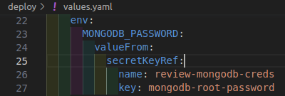
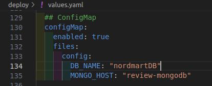
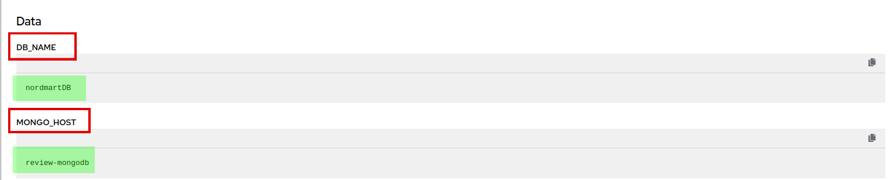
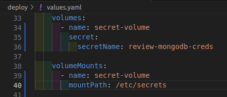
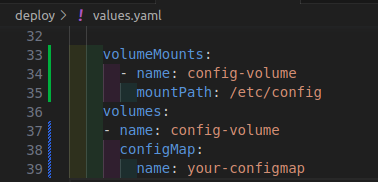

# Configuring your Application with Secrets and ConfigMaps

This comprehensive tutorial will walk you through the process of effectively utilizing `secrets` and `configmaps` within your application deployment. By the end of this tutorial, you will be equipped with the knowledge and skills to securely store sensitive information, set `environment variables` using `secrets`, and manage application configuration data using `configmaps`. Let's get started on enhancing the security and configuration aspects of your applications in SAAP!

## Objective

- Define secrets and configMaps in the values.yaml file for your application.
- Set environment variables using secrets defined in the values.yaml file.
- Configure volumes and mounts to access secrets and configmaps as files within your application.

## Key Results

- Validate the functionality of secrets and configmaps in the deployed applications, ensuring sensitive information is accessed securely.

## Tutorial

### Set Environment Variables Using Secrets

1. To set environment variables using secrets, define them in the `deploy/values.yaml` file. Environment variables allow you to pass sensitive information as configuration parameters to your application containers.

    ```yaml
    # Define environment variables for the application container.
        env:
      # Set the environment variable 'MONGODB_PASSWORD'.
          MONGODB_PASSWORD:
      # Obtain the value for 'MONGODB_PASSWORD' from a secret key reference.
            valueFrom:
      # Specify that the value is retrieved from a secret.
              secretKeyRef:
      # Name of the secret that contains the 'mongodb-root-password' key.
                name: review-mongodb-creds
      # Key within the secret to fetch the value for 'MONGODB_PASSWORD'.
                key: mongodb-root-password
    ```

    It should look like this:

    

    Look at the different colors that indicates indentation.

    !!! note
        The indentation for `env` in `deploy/values.yaml` is **application.deployment.env**. You can also refer configmap in env, to see more [click](https://kubernetes.io/docs/tasks/configure-pod-container/configure-pod-configmap/#define-container-environment-variables-with-data-from-multiple-configmaps).

### Utilize envFrom to Access ConfigMaps

1. To utilize environment variables from a resource, such as ConfigMap, we can mention the `envFrom` field and specify the configmap name. Add this yaml to `deploy/values.yaml`. `envFrom` allows you to fetch all the environment variables define in this configmap.

    ```yaml
    # Example of using envFrom to load environment variables from a ConfigMap
    # We create a new named context 'review-config' to refer to this ConfigMap
        envFrom:
      # Create a context named 'review-config' to refer to a ConfigMap
          review-config:
     # Indicate that the source of the environment variables is a ConfigMap
            type: configmap
      # Specify the suffix 'config' to identify the relevant ConfigMap named 'review-config'
            nameSuffix: config
    ```

    >Note: **review-config** is referring the configmap defined in step #3.

    It should look like this:

    

    Look at the different colors that indicates indentation.

    !!! note
        The indentation for `envFrom` in `deploy/values.yaml` is **application.deployment.envFrom**. You can also reference secret in envFrom, to see more [click](https://kubernetes.io/docs/tasks/inject-data-application/distribute-credentials-secure/#configure-all-key-value-pairs-in-a-secret-as-container-environment-variables).

### Define ConfigMap Data in values.yaml

1. To extract the environment variables from a configmap via `envFrom` we must create a configmap. Add this to your `deploy/values.yaml`.

    ```yaml
    ## ConfigMap defines the configuration for the ConfigMap that will be used in your application deployment.
      configMap:
        # Set this to true to enable the ConfigMap for your application.
        enabled: true
        # files will allows you to define multiple ConfigMap files.
        files:
          config:
        # Define the 'DB_NAME' key and set its value to "nordmartDB".
            DB_NAME: "nordmartDB"
        # Define the 'MONGO_HOST' key and set its value to "review-mongodb".
            MONGO_HOST: "review-mongodb"
    ```

    It should look like this:

    

    Look at the different colors that indicates indentation.

    !!! note
        The indentation follows for `configmap` is **application.configMap**.

1. Save the file and run `tilt up` at the root of your directory. Hit the space bar and the browser with `TILT` logs will be shown. If everything is green then the changes will be deployed on the cluster.

1. login to SAAP, there should be a Configmap created in your project/namespace.

    

    Let's see the data in this configMap.

    

    The environment variables that we have set for the **review-config** in values.yaml file are here.

### Mount Secrets within the Container

You can also mount secrets as files in your application containers, enabling direct file access within your application code.

1. To mount a secret as a file, add this yaml to your `deploy/values.yaml` file.

    ```yaml
    ## Define volumes
        volumes:
      # Define the name of the volume, which will be used to reference it in the pod specification.
          - name: secret-volume
      # Mount a secret named 'review-mongodb-creds' into this volume.
            secret:
              secretName: review-mongodb-creds
    ## Define volumeMounts
        volumeMounts:
      # Mount the volume with the name 'secret-volume' to the container.
          - name: secret-volume
      # Mount the volume at the path '/etc/secrets' within the container.
            mountPath: /etc/secrets
    ```

    It should look like this:

    

    Look at the different colors that indicates indentation.

    !!! note
        The indentation should be: **application.deployment.volumes** and **application.deployment.volumeMounts**.

    In the above example, the `review-mongodb-creds` secret is mounted as a volume named `secret-volume` at the path `/etc/secrets` within the container.

### Using Secrets in Configuration Files

If your application requires a configuration file with sensitive information, you can use a ConfigMap to store the file and mount it as a volume. The ConfigMap can be populated with the contents of the secret. To use secrets in configuration files:

1. Create a ConfigMap that includes the secret's data:

    `oc create configmap your-configmap --from-file=config.yml=secret_file.yml`

1. Mount the ConfigMap as a volume in your deployment within your `deploy/values.yaml`.

    ```yaml
    ## Define volumes
        volumes:
      # Define the volume named "config-volume"
          - name: config-volume
      # Populate the volume with data from a ConfigMap named "your-configmap"
            configMap:
              name: your-configmap
    ## Define volumeMounts
        volumeMounts:
      # Define the volume mount named "config-volume"
          - name: config-volume
      # Mount the content of the volume at path "/etc/config" in the container
            mountPath: /etc/config
    ```

    It should look like this:

    

    Look at the different colors that indicates indentation.

    !!! note
        The indentation should be: **application.deployment.volumes** and **application.deployment.volumeMounts**.

    In the above example, the `your-configmap` ConfigMap is mounted as a volume named `config-volume` at the path `/etc/config` within the container.
