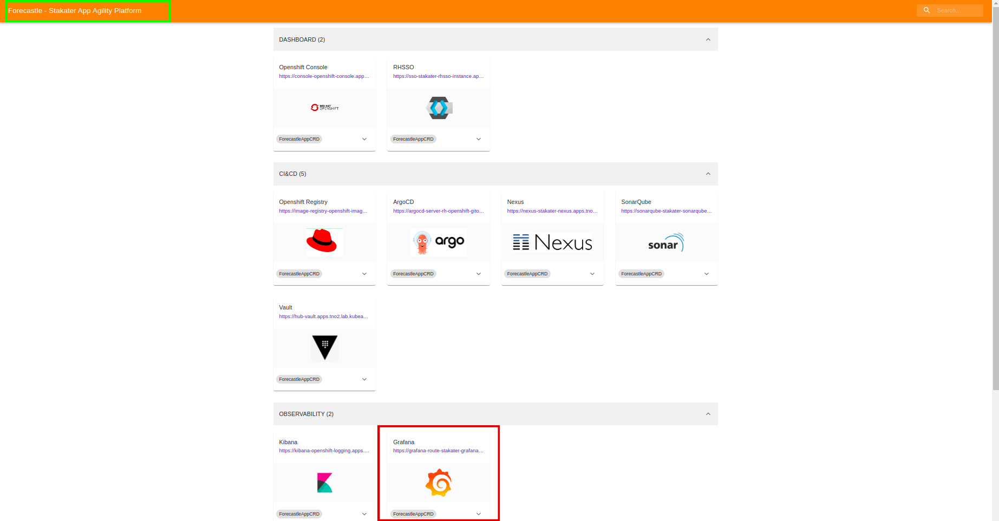
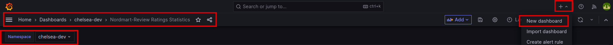
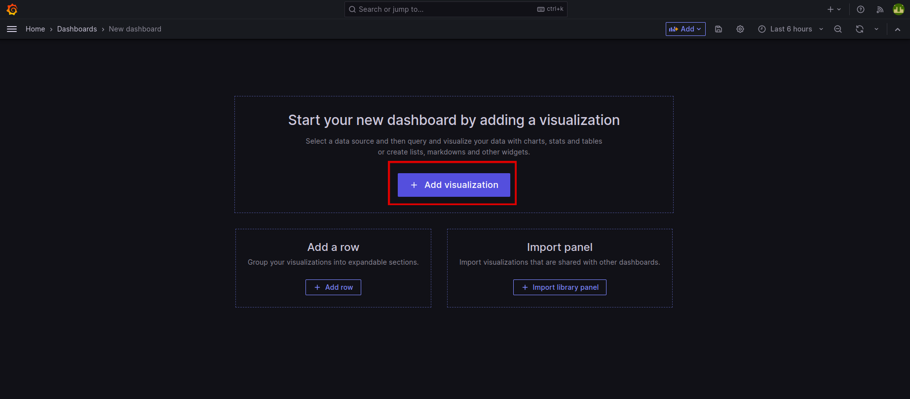
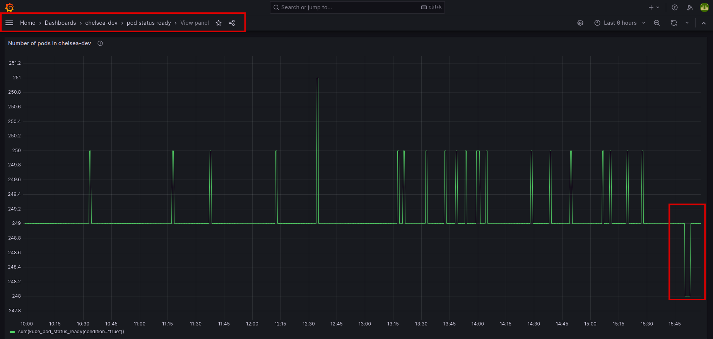

# Add Grafana Dashboard to your Application

Welcome to the world of data visualization and real-time monitoring with Grafana on SAAP! If you want to enhance your application's capabilities, you're in the right place. In this tutorial, we'll explore how to add a customized Grafana dashboard to your application in SAAP, allowing you to display live data for various operational use cases, efficiency analysis, and A/B test results.

The good news is that Grafana is already a part of the SAAP (Stakater's App Agility Platform) monitoring stack, so you don't need to install it separately. Everything is set up for you!

## Objectives

- Explore and view the predefined dashboards for `stakater-nordmart-review-api`.
- Extend the Nordmart Review Dashboard with a new panel to visualize metrics.
- Learn how to configure dashboards using the Grafana UI.

## Key Results

- Successfully log in to Grafana and view the predefined dashboards for `stakater-nordmart-review` API.
- Execute API requests to generate data, observing real-time updates in Grafana dashboards.

## Tutorial

### Explore Predefined Dashboards

To get started, head to the `stakater-nordmart-review-api/deploy/templates/grafana-dashboard.yaml` folder, where you'll find the pre-configured dashboard ready to be utilized.

1. Open up `stakater-nordmart-review-api/deploy/values.yaml` file. Add this YAML in your `values.yaml` file.

    ```yaml
    # Grafana Dashboard
    grafanaDashboard:
      enabled: true
    ```

1. Run `tilt up` at the root of your directory. Hit the space bar and the browser with `TILT` logs will be shown. If everything is green then the changes will be deployed on the cluster.

1. Go to your `Forecastle` and let's log in to Grafana and view the predefined dashboards for `stakater-nordmart-review` API;

    

    If you use `Login with OpenShift` to login and display dashboards - your user will only have the `view` role which is read-only. This is alright in most cases, but we want to be able to edit and admin the boards.

    > In order to complete the next steps you will need the OpenShift CLI installed locally, credentials can be retrieved from the OpenShift UI

1. The Dashboards should be showing some basic information and we can generate more data by firing some requests to the `stakater-nordmart-review-api`. In your IDE, run on your terminal:

    ```bash
    # Get the reviews for a specific Product (i.e. 329199)
    curl -L $(oc get route/review -n <your-namespace> --template='{{.spec.host}}')/api/review/329199
    # Add a review for a specific Product (i.e. 329199)
    curl -L -X POST $(oc get route/review -n <your-namespace> --template='{{.spec.host}}')/api/review/329199/John/5/Great
    # Delete a review for a specific review (First get the review id from Get request)
    curl -L -X DELETE $(oc get route/review -n <your-namespace> --template='{{.spec.host}}')/api/review/6323904100aeb66032db19dc
    ```

1. Back in Grafana, we should see some data populated into the boards... Go to `Manage` and then click on your `<your-namespace>`.

    
    
    

### Create a Dashboard

> Let's extend the Nordmart Review Dashboard with a new `panel` to capture some metrics in a visual way for us. Configuring dashboards is easy through the Grafana UI. Then Dashboards are easily shared as they can be exported as a `JSON` document.

1. Login back on Grafana

1. Once you've signed in, go to (**+**) sign and click on "New dashboard" in your namespace.

    

    Click on "Add visualization":

    

    On the new panel, let's configure it to query for some information about our projects. We're going to use a very simple query to count the number of pods running in the namespace (feel free to use any other query).

1. On the Panel settings, set the title to something sensible and add the query, first select `kube_pod_status_ready`. Next select the label filter `condition = true`. Below it you'll see the operator option, select `sum` operator. Underneath, you will see there is a query generated for you.  Hit `Run queries`. The data will be shown on the panel. Hit `Apply` to save this new dashboard in your namespace.

    

1. With the new panel on our dashboard, let's see it in action by killing off some pods in our namespace

    ```bash
    oc delete pods -l app.kubernetes.io/name=review -n <your-namespace>
    ```

    Go to the newly created dashboard, click on view:

    

    Here, we can see the live data demonstration of pods on our newly created dashboard.

You did great! Let's move on to next tutorial.
