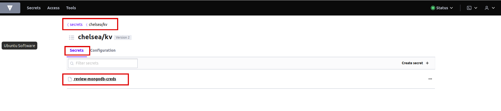
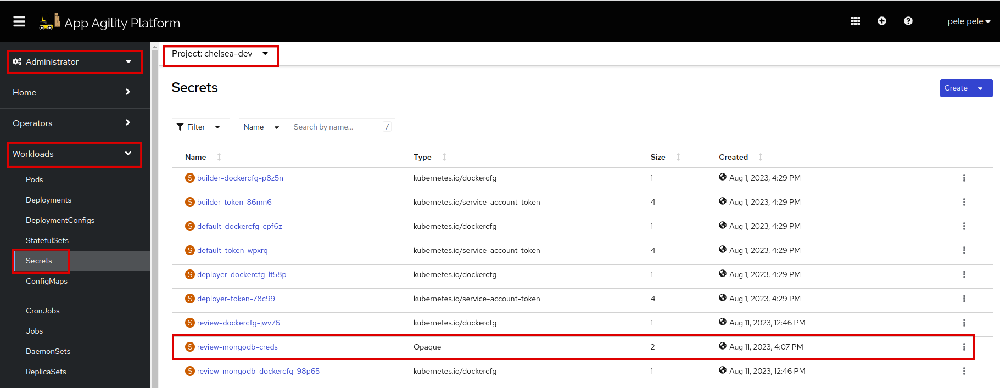

# Adding External Secrets for your Application

Securing sensitive information, such as API keys, passwords, and tokens, is crucial for any application. In this tutorial, we will explore how to leverage ExternalSecrets to securely manage and consume secrets stored in Vault for your Stakater Nordmart Review application. Now, we will set up applications to consume secrets from Vault, using ExternalSecrets.

## Objectives

- Successfully integrate External Secrets within the Stakater Application Chart, allowing your application to consume secrets from Vault.

- Create a secret using ExternalSecrets for the Stakater Nordmart Review API application.

- Observe the dynamic retrieval of secrets from Vault and their seamless integration into your application, ensuring enhanced security and simplified secret management.

## Key Results

- Discover how to configure the External Secrets Operator to fetch secret data from Vault and create Kubernetes secrets within the cluster.

- Explore how to integrate External Secrets into your Stakater Application Chart, enabling seamless consumption of Vault secrets by your applications.

## Tutorial

### Create Secret in Vault

Login to Vault to view your tenant path.

1. Access Vault from `Forecastle` console, search `Vault` and open the `Vault` tile.

    

1. From the drop-down menu under `Method`, select `OIDC` and click on `Sign in with OIDC Provider` and select `workshop` identity Provider.

    

1. You will be brought to the `Vault` console. You should see the key/value path for your tenant.

    

1. Click on `<your-tenant>/kv/`.

1. You will now be brought to the `secrets` and the `configurations` in Vault for your tenant. Click on `create secret`.

    

1. Let's create a MongoDB secret. Write the name of the secret in `path` which is `review-mongodb-creds`. Add `secret data` `mongodb-password` and `mongodb-root-password` and assign any password you like. Hit save.

    

1. Secret is created in Vault.

    

### Access and Create a Secret on SAAP from Vault

- External Secrets Operator is used to fetch secret data from Vault and create Kubernetes secret in the SAAP.
- External Secrets Operator uses SecretStore to make a connection to the Vault.
- SecretStore uses ServiceAccount with Vault label to access Vault.
- SecretStore and ServiceAccount are created in each tenant namespace.
- Each ExternalSecret CR contains a reference to SecretStore to be used.
- Stakater Application Chart contains support for ExternalSecret.

1. In `deploy/values.yaml` file, add the following YAML for external secret:

    ```yaml
    # Enable the usage of ExternalSecrets for this application
    externalSecret:
      enabled: true
      # The name of the SecretStore to be used for fetching secret data from Vault, this name is constant
      secretStore:
        name: tenant-vault-secret-store
        kind: SecretStore
      # Define the interval at which ExternalSecrets should refresh and update the secrets
      refreshInterval: "1m"
      # Define a named secret entry within ExternalSecrets
      files:
      # Name of the secret only suffix
        mongodb-creds:
      # Fetch secret data from Vault using a specific key in the specified tenant's KV engine
          dataFrom:
            key: <your-tenant>/kv/review-mongodb-creds
    ```

    !!! note
        Replace <your-tenant> with the actual name of your tenant or the appropriate path in your Vault instance. The indentation should be **application.externalSecret**.

1. Save the `values.yaml` and run `tilt up` at the root of your directory. Press the space key to view the progress in Tilt web UI. The application should be running in the namespace used in `tilt_options.json` file.

1. Log in to SAAP and find `secrets` in your namespace.

    

1. Click on the `review-mongodb-creds` secret. Scroll down to see the data of your secret. So the secret is created accurately.

    

1. Scroll up to see the owner, which manages your secret.

    

1. Click on `review-mongodb-creds`, to see the `External Secret` CR. Click on resources to verify what `External Secret` is managing.

    

Once the updated secret is created, the application pod will be recreated. Refresh to see if the pods are running.


For more information on ExternalSecrets, see [External Secrets documentation](https://external-secrets.io/v0.8.1/introduction/overview/)

You are doing great!! Let's see how to configure probes for your application in the next tutorial.
