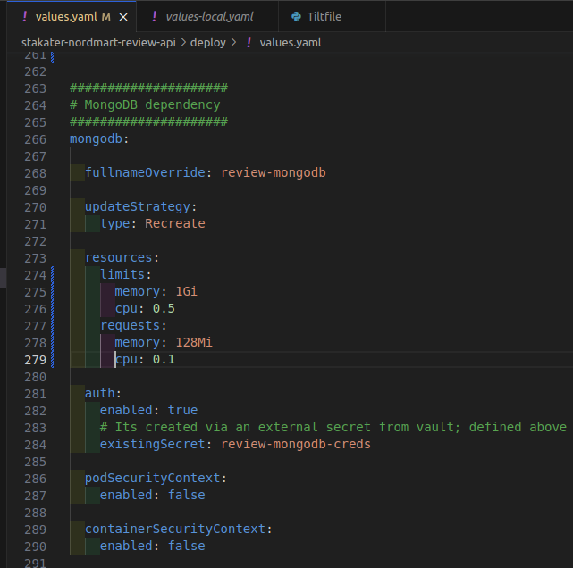
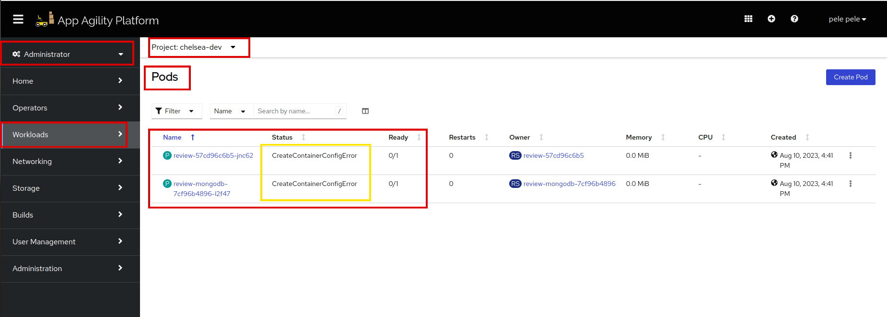
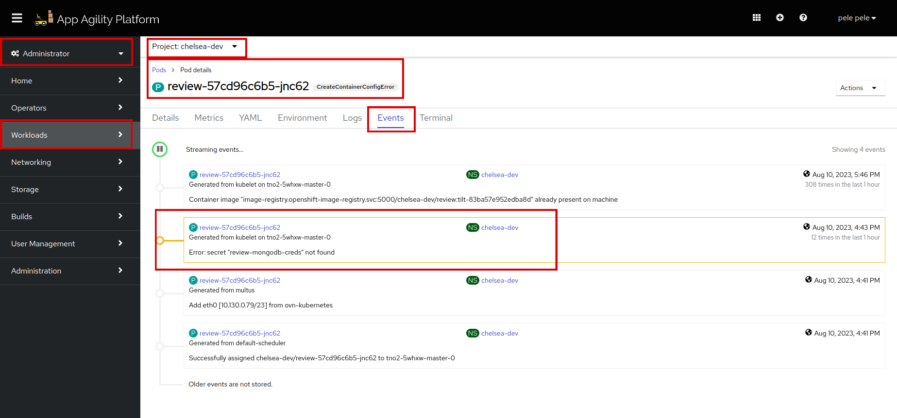
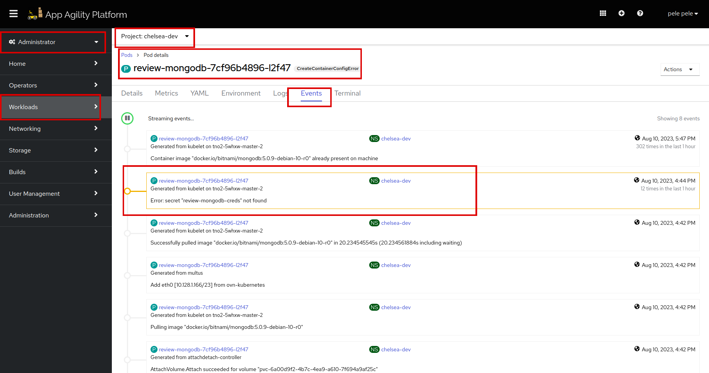

# Deploy your Application

There are multiple ways to deploy your Application on the Cluster.

- For development with tilt follow the below tutorial. Use tilt for deploying the application on test clusters.

    > This is the recommended local development workflow

- For Deployment via GitOps, follow [this](../../../../for-delivery-engineers/tutorials/03-deploy-demo-app/deploy-demo-app.md) guide for Deploying the Application with GitOps

    > This is the recommended production workflow

## Objective

- Learn local development for testing and developing applications on local/lab clusters.

## Key Results

- Deploy the application with tilt.
- Deploy the dependency of the application.

## Tutorial

In this guide, we will deploy an application with tilt and namespace in the remote OpenShift cluster

1. Clone this sample repo [Nordmart-review](https://github.com/stakater-lab/stakater-nordmart-review)

1. You should have a namespace in remote/local cluster; If you are in SAAP then enable sandbox namespace/project/environment for your tenant; you can read more [here](https://docs.stakater.com/mto/main/customresources.html)

1. Log in to the cluster via `OpenShift CLI`, and copy the login command from your `username` tab as discussed in the previous tutorial.

1. Switch project to sandbox namespace/project/environment

    ```bash
    oc project <MY-SANDBOX>
    ```

1. Log in to OpenShift internal docker registry

    First, get the OpenShift internal docker registry URL and set in the HOST variable name

    ```bash
    HOST=image-registry-openshift-image-registry.apps.[CLUSTER-NAME].[CLUSTER-ID].kubeapp.cloud
    ```

    NOTE: Ask Customer Admin or Cluster Admin to provide you with the OpenShift internal registry route

    Then login into the docker registry with the following command:

    ```bash
    docker login -u $(oc whoami) -p $(oc whoami -t) $HOST
    ```

    If you get this error `x509: certificate signed by unknown authority` then you need to update your `/etc/docker/daemon.json` file and add the insecure registry

    ```bash
    {
        "insecure-registries" : [ "HOST" ]
    }
    ```

1. (Optional) Add Helm chart repos

    If you reference Helm charts from the private registry then you first need to add it

    ```sh
    cd deploy

    # Helm credentials can be found in Vault or in secret in the build namespace
    helm repo add stakater-nexus <private repo URL> --username helm-user-name --password ********

    cd ..
    ```

1. Update Helm dependencies.

    ```sh
    cd deploy

    helm dependency update

    cd ..
    ```

1. Go through the [Tiltfile](https://github.com/stakater-lab/stakater-nordmart-review/blob/main/Tiltfile) of the application

1. Check the `local_resource` section in the Tiltfile

1. Create `tilt_options.json` file

    Remove `.template` from the file named `tilt_options.json.template`

    

    And then fill up all three things

      1. `namespace`: your sandbox environment name
      1. `default_registry`: the OpenShift internal registry route (you have set in step # 6 in HOST above) and then add your namespace name after `/`
      1. `allow_k8s_contexts`: given you are logged in the cluster; then run `oc config current-context` to get the value for `allow_k8s_contexts`

          e.g.

          ```json
          {
              "namespace": "tilt-username-sandbox",
              "default_registry": "image-registry-openshift-image-registry.apps.[CLUSTER-NAME].[CLUSTER-ID].kubeapp.cloud/tilt-username-sandbox",
              "allow_k8s_contexts": "tilt-username-sandbox/api-[CLUSTER-NAME]-[CLUSTER-ID]-kubeapp-cloud:6443/user@email.com"
          }
          ```

1. Go through the `.gitigore` and check tilt and Helm specific ignores

    ```sh
    # ignore tilt files
    tilt_options.json
    tilt_modules/

    # ignores helm files
    /deploy/charts
    ```

1. Go through `.tiltignore`.

    ```sh
    **/charts
    **/tmpcharts
    ```

1. Go through `values-local.yaml` in a `tilt` folder in the base application directory.

    `values-local.yaml` should contain the following content. Make sure that the replica count should always be 1.

    ```yaml
    application:

      deployment:
        imagePullSecrets: null

        # Tilt live update only supports one replica
        replicas: 1

        image:
          tag: null
    ```

    In our application setup, we have a dependency on MongoDB for storing and managing data. As part of our deployment process, we will ensure that both the application `API` named `review` and `MongoDB` named `review-mongodb` are deployed together to confirm proper functioning. This dependency ensures that the application can seamlessly interact with the database and access the necessary data. To understand more about application architecture, visit [here](../about-application/about-application.md).

1. To add `mongodb` dependency, add this YAML to your `deploy/values.yaml` file.

    ```yaml
    mongodb:
      fullnameOverride: review-mongodb  # Name for the MongoDB deployment
      updateStrategy:  # Specify the update strategy for MongoDB pods
        type: Recreate
      resources:  # Define resource limits and requests for MongoDB
        limits:
          memory: 1Gi
          cpu: 0.5
        requests:
          memory: 128Mi
          cpu: 0.1
      auth:  # Enable authentication for MongoDB
        enabled: true
        existingSecret: review-mongodb-creds  # Reference an external secret for MongoDB credentials (created via Vault)
      podSecurityContext:  # Disable or enable if you require pod-level security context settings for MongoDB
        enabled: false
      containerSecurityContext:  # Disable or enable if you require container-level security context settings for MongoDB
        enabled: false
    ```

    It should look like this:

    

    !!! note
        The indentation should be followed as `mongodb`. So you can define `MongoDB values` as a separate entity, because we are going to deploy a separate pod named, `review-mongodb`.

1. Validate that the `review` application is not running already

    

1. Save the `values.yaml` file and run `tilt up` at the base directory of your repository.

    

    Open the tilt browser; just hit the space

    

    If everything is green then the application will be deployed in the cluster. By this we mean two pods will and 2 deployments will be created.

    

    Let's view your application pods

    

    We can see there is an error on both API and MongoDB pods. Let's see the events of both pods to find the actual error:

    
    

    There is a secret missing named, `review-mongodb-creds`.

Let's create this secret in the next chapter and deploy the app.
