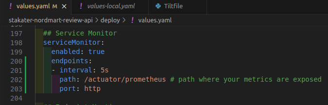
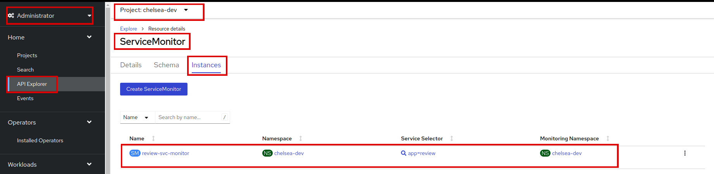

# Add Service Monitor

SAAP gathers the base metrics to see how our pods are doing. In order to get application-specific metrics (like response time or the number of reviews or active users etc) alongside the base ones, we need another object `ServiceMonitor`. It will let Prometheus know which endpoint the metrics are exposed to so that Prometheus can scrape them. And once Prometheus has the metrics, we can run queries on them (just like we did before!) and create shiny dashboards!

## Objectives

- Configure ServiceMonitor objects to gather application-specific metrics, such as response time and number of reviews, alongside the base metrics for better performance analysis.

## Key Results

- Enhance observability by implementing robust monitoring and metrics collection for applications within SAAP.
- Enable developers to analyze and interpret the performance and behavior of their applications through metrics visualization.

## Tutorial

Now, let's add the `ServiceMonitor` for our `stakater-nordmart-review-api` application.

1. Open up `stakater-nordmart-review-api/deploy/values.yaml` file. Add this yaml in your `values.yaml` file.

    ```yaml
    ## Service Monitor
    serviceMonitor:
      enabled: true
      endpoints:
      - interval: 5s
        path: /actuator/prometheus # path where your metrics are exposed
        port: http
    ```

    It should look like this:

    

    !!! note
        The indentation should be **application.serviceMonitor**.

1. Save and run `tilt up` at the root of your directory. Hit the space bar and the browser with `TILT` logs will be shown. If everything is green then the changes will be deployed on the cluster.

1. To find `serviceMonitor` in SAAP, first login with your credentials, go to `API Explorer`, filter by service, and find `ServiceMonitor`:

    

    Click on `ServiceMonitor` and go to `instances`:

    

   You can run queries across the namespace easily with `promql`, a query language for Prometheus. Run a `promql` query to get some info about the memory consumed by the pods in your `<your-namespace>` namespace/project.

1. Go to Developer > Observe > Metrics. Select `Custom query` and paste the below query. Make sure to replace `your-namespace` before running it. Press Enter, and see the metrics for your application specifically.

    ```bash
    sum(container_memory_working_set_bytes{container!='',namespace='<your-namespace'}) by (pod)
    ```

    

Voila, you successfully exposed metrics for your application!

Move on to the next tutorial to see how to trigger alerts for your application.

## Troubleshooting

If something doesn't work here are some commonly useful things to check:

- Start by doing curl on localhost from within the pod with the metrics path to make sure that metrics are exposed.

```sh
oc get pods -n namespace
oc debug pod/podname-from-above
curl localhost:port/path
```

- Make sure that the Selector labels in Service monitor and Labels in Service matches.

- Make sure that the service monitor selector and service monitor namespace selector labels have been applied to the service monitor and the namespace respectively where the service monitor is present. You can check these selectors in Search -> Resources -> Prometheus and then check the yaml manifest of prometheus CR.

- If nothing else works then start with port-forwarding the prometheus pod to port: 9090 and navigate to prometheus UI with http. Check in the service discovery that service monitor is picked up, also check the targets that Prometheus is able to scrape the metrics. If the target is visible but metrics are not scraped then the error should be visible in targets.

```sh
oc port-forward pod/prometheus-user-workload-0 9090:9090 -n openshift-user-workload-monitoring
```

