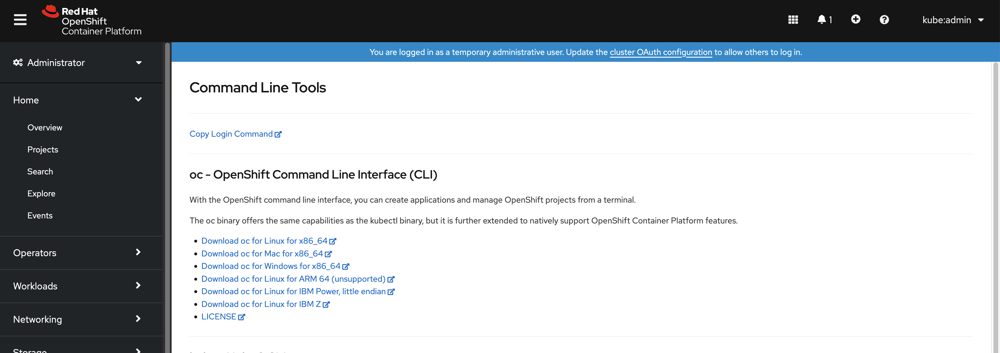

# Prepare the Local Environment

## Objectives

Enable developers to start developing and testing applications on test clusters.

## Key Results

- Install the CLIs required for interacting with the cluster

## PreRequisites

- Working laptop or desktop computer with a functional Operating System.

## Tutorial

### Setting up CLI

The following CLI tools are required for working with the Stakater App Agility Platform.

- [OpenShift CLI (oc)](https://docs.openshift.com/container-platform/4.16/cli_reference/openshift_cli/getting-started-cli.html#cli-installing-cli-web-console_cli-developer-commands) With the OpenShift command-line interface (CLI), the oc command, you can create applications and manage OpenShift Container Platform projects from a terminal.

    You can install the OpenShift CLI (oc) binary on Linux by using the following procedure.

    **Procedure**

    1. From the web console, click ?.
        
    1. Click Command Line Tools.
        
    1. Select appropriate oc binary for your Linux platform, and then click **Download oc for Linux**.

    1. Save the file.
    1. Unpack the archive.

        ```shell
        tar xvf <file>
        ```

    1. Move the **oc** binary to a directory that is on your **PATH**.
    1. To check your **PATH**, execute the following command:

        ```shell
        echo $PATH
        ```

    1. After you install the OpenShift CLI, it is available using the **oc** command:

        ```shell
        oc <command>
        ```

- [helm](https://helm.sh/docs/intro/install/) helm helps you manage Kubernetes applications — Helm Charts help you define, install, and upgrade even the most complex Kubernetes application.

- [docker](https://docs.docker.com/get-docker/) Docker is an open platform for developing, shipping and running applications. Docker enables you to separate your applications from your infrastructure, so you can deliver software quickly. With Docker, you can manage your infrastructure in the same ways you manage your applications.

- [tilt](https://docs.tilt.dev/install.html) Tilt powers microservice development and ensures they behave! Run tilt up to work in a complete dev environment configured for your team. Tilt automates all the steps from a code change to a new process: watching files, building container images, and bringing your environment up-to-date. Think docker build && kubectl apply or docker-compose up.
