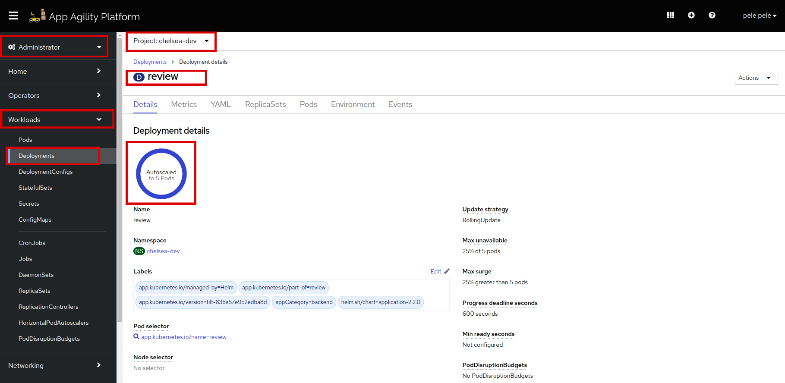
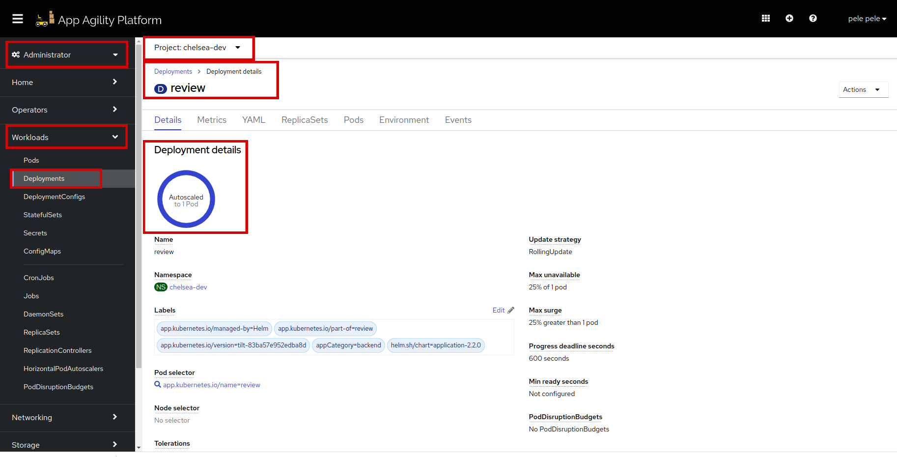

# Autoscaling your Application

Welcome to this tutorial on utilizing Horizontal Pod Autoscaler (HPA) in SAAP to automatically manage the scaling of your application pods. Horizontal pod autoscaler (HPA) helps us to specify how SAAP should automatically increase or decrease the number of pod replicas of an application, based on metrics collected from the pods. When we define an HPA (based on CPU and/or memory usage metrics), the platform calculates the current usage and compares it with the utilization threshold and scales pods up or down accordingly.

## Objectives

- Add HPA configuration to `values.yaml` to enable autoscaling with specific parameters.
- Load-test the application to trigger autoscaling and observe the increase in pod replicas.
- Monitor the HPA as it scales down the replicas after the load test.

## Key Results

- Enable and configure Horizontal Pod Autoscaler for the `stakater-nordmart-review` application to automatically adjust the number of pod replicas based on CPU utilization.

## Tutorial

1. The `stakater-nordmart-review` uses stakater's [application chart](https://github.com/stakater-charts/application/tree/master/application) as a dependency. This chart already contains a template for Horizontal Pod Autoscaler.

   By default, the horizontal pod autoscaler is disabled in our `stakater-nordmart-review` chart.

    > Often we only enable the HPA in the stage or prod environments, so being able to configure it on / off when testing is useful. To turn it on in a given environment, we can simply supply new values to our application config. Now let's do it for `stakater-nordmart-review`

1. Head over to your `stakater-nordmart-review-api` repository and navigate to `deploy > values.yaml`. Under the `application:`, add the following YAML block. It should have the same indent as `applicationName: review`

    ```yaml
      autoscaling:
        enabled: true
        minReplicas: 1
        maxReplicas: 5
        metrics:
        - type: Resource
          resource:
            name: cpu
            target:
              type: Utilization
              averageUtilization: 60
    ```

    It should look like this:

   

1. Save and run `tilt up` at the root of your directory. Hit the space bar and the browser with `TILT` logs will be shown. If everything is green then the changes will be deployed on the cluster.

    Let's now test our pod autoscaler, to do this we want to fire lots of load on the API of the `review` microservice. This should trigger an autoscaling event due to the increased load on the pods. [hey](https://github.com/rakyll/hey) is a simple load testing tool that can be run from the command line that will fire lots of load at our endpoint:

1. Run the following command in your terminal.

    ```bash
    hey -t 30 -c 10 -n 10000 -H "Content-Type: application/json" -m GET https://$(oc get route/review -n <your-namespace> --template='{{.spec.host}}')/api/review/329199
    ```

    Where:

      - -c: Number of workers to run concurrently (10)
      - -n: Number of requests to run (10,000)
      - -t: Timeout for each request in seconds (30)

1. While this is running, we should see in SAAP, the autoscaler is kicking in and spinning up additional pods.  Open the `Workloads` tab. At the very bottom, you will see HorizontalPodAutoScalar. Open the review HPA. You will see the below screen
    Notice the CPU utilization and desired replica count. It has jumped!

   

1. If you navigate to the review deployment, you should see the replica count has jumped and so have the number of pods.

   

   

1. Now let's wait for a couple of minutes for the load to ease. Navigate back to the `review` HorizontalPodAutoscaler. You will see that the CPU utilization and desired replicas have started going down.

   

1. Go to the review deployment, you will see that it has brought the pods down (Or is trying to decrease the number of pods)

   

WELL DONE!! YOU NOW HAVE AUTO SCALING WITH YOUR APPLICATION!!
