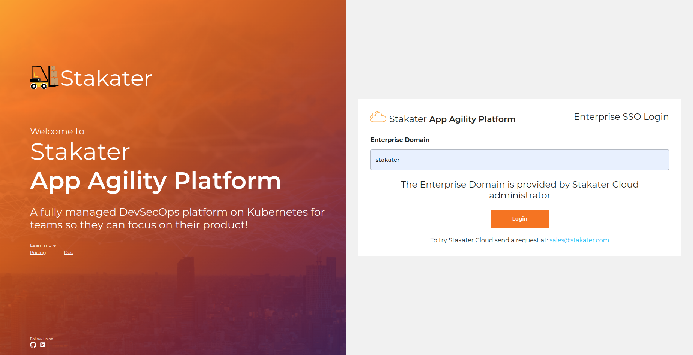
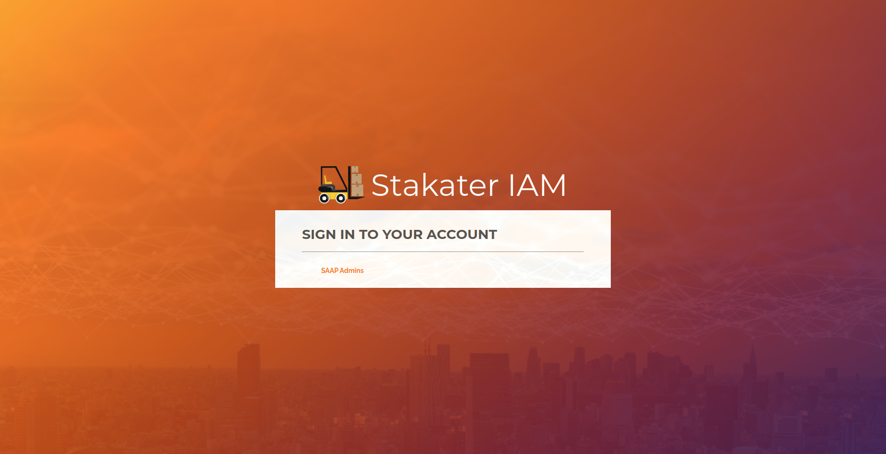
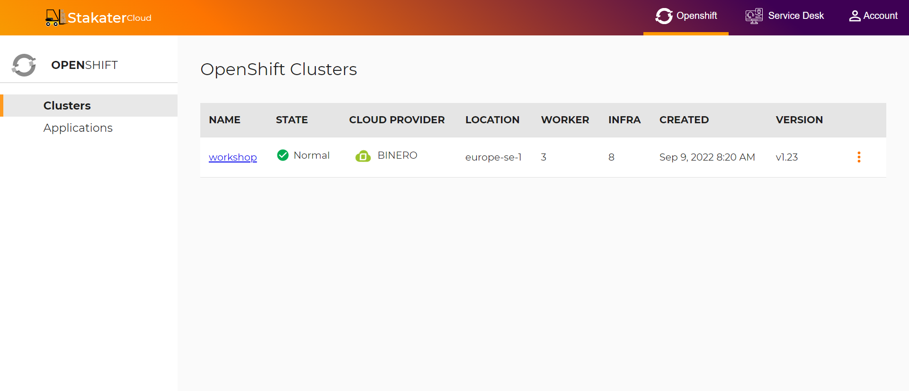
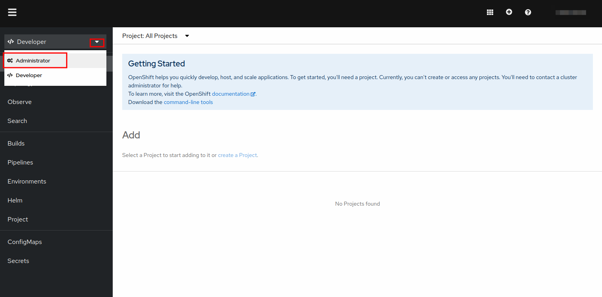
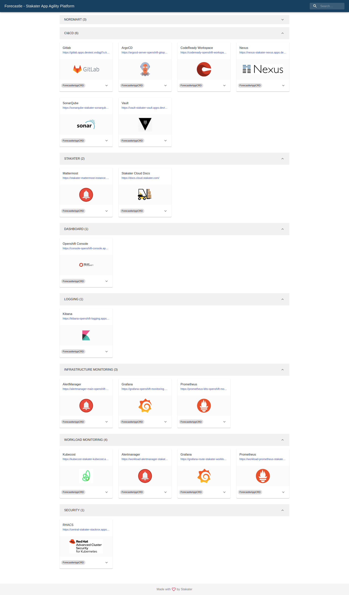
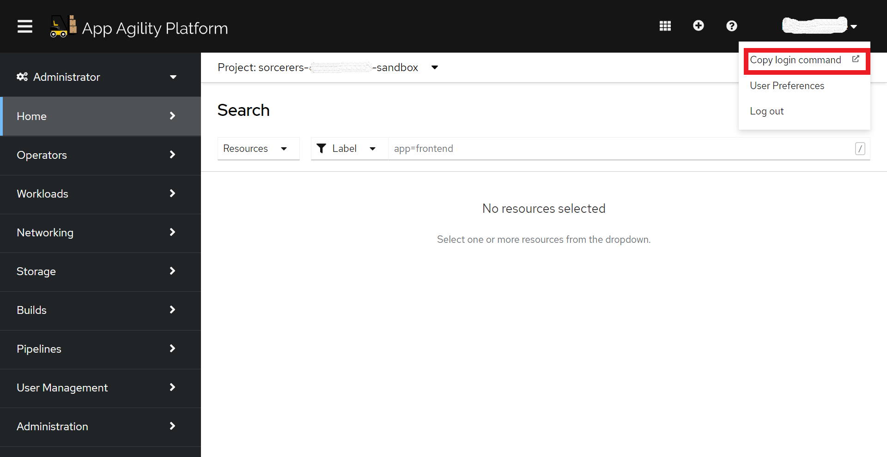
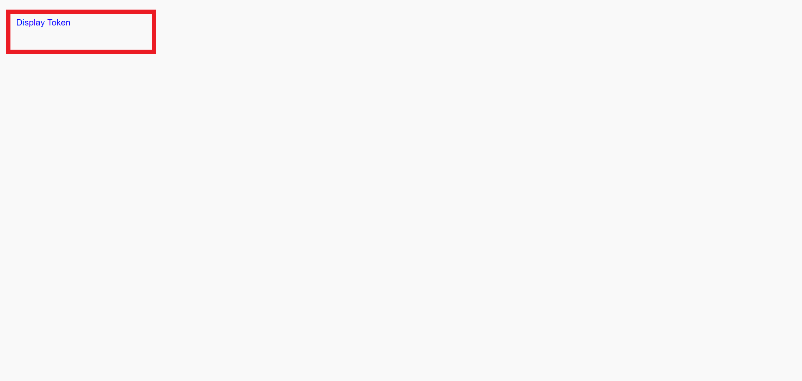
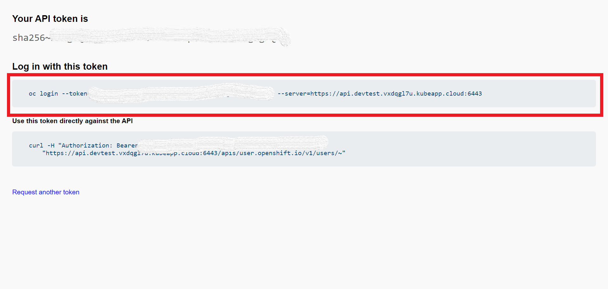

# Access Your Cluster

## Objectives

Access the Stakater App Agility Platform (SAAP) cluster on UI and CLI.

## Key Results

- Access Stakater App Agility Platform (SAAP) Console
- View Forecastle Page and view different tools/services.

## PreRequisites

- Working laptop or desktop computer.

## Guide

### Access OpenShift UI
Lets see how will you access your cluster.

1. Access your cluster by going to [Stakater App Agility Platform](https://cloud.stakater.com/). Enter your enterprise domain provide by Stakater Cloud administrator.

    

1. Log In with the method configured for your Organization.

    

1. Once you've logged in, you ll be directed to similar cluster overview page.

    

1. Click on drop down toggle for the relevant cluster:

    1. Select `OpenShift Web Console` to open the OpenShift Web Console.

        

        > You should belong to a Tenant

    1. Select Forecastle for view services available on the cluster.

        

### Login with CLI

1. From your `OpenShift Console` at the top right corner, click on your username and select `Copy login command`

    

2. Click on `Display token` to view your token and login command.

    

3. Copy your Log in command.

    

4. From your workspaces command line, paste your login command and hit the `Enter` button. Your Workspaces Devlopement environment will now be able to interact safely with the SAAP cluster.

    ```bash
    oc login --token=<TOKEN> --server=<SERVER>
    ```
