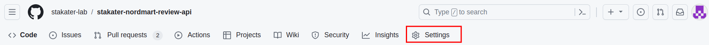
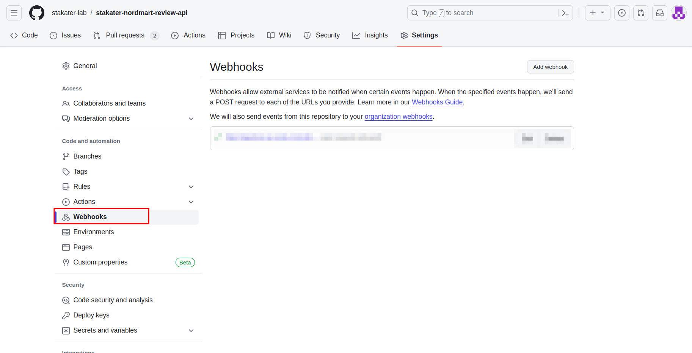
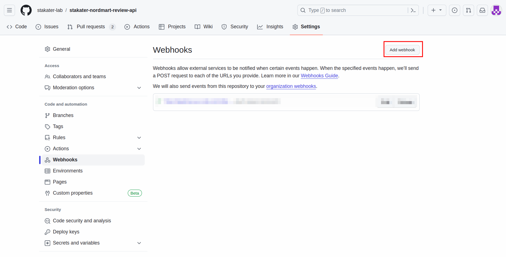
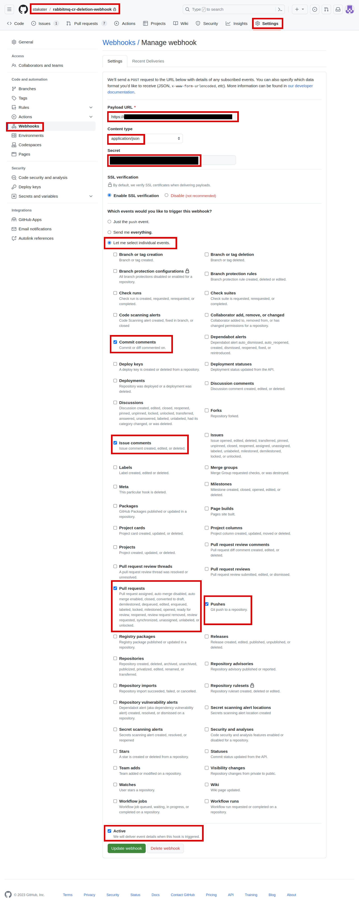
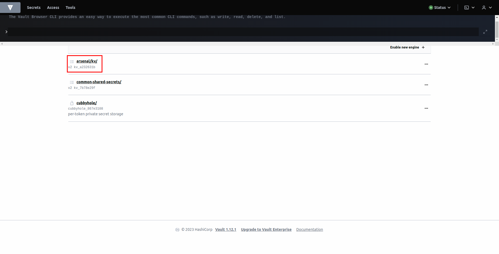
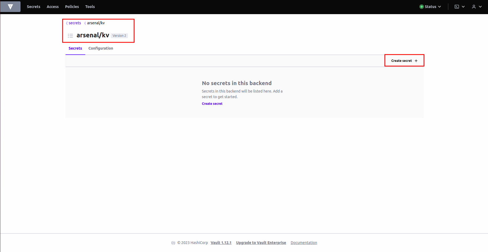
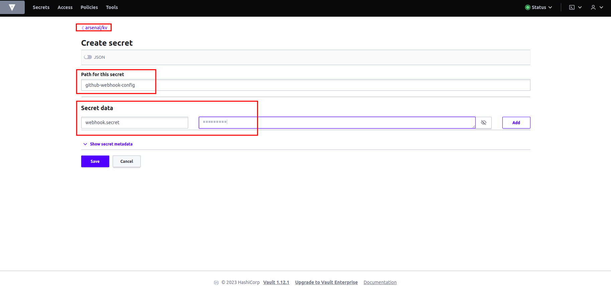
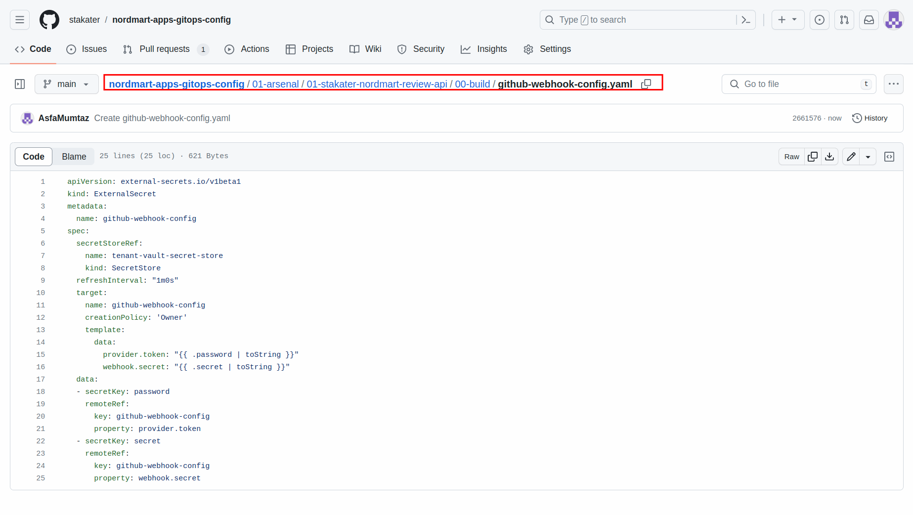
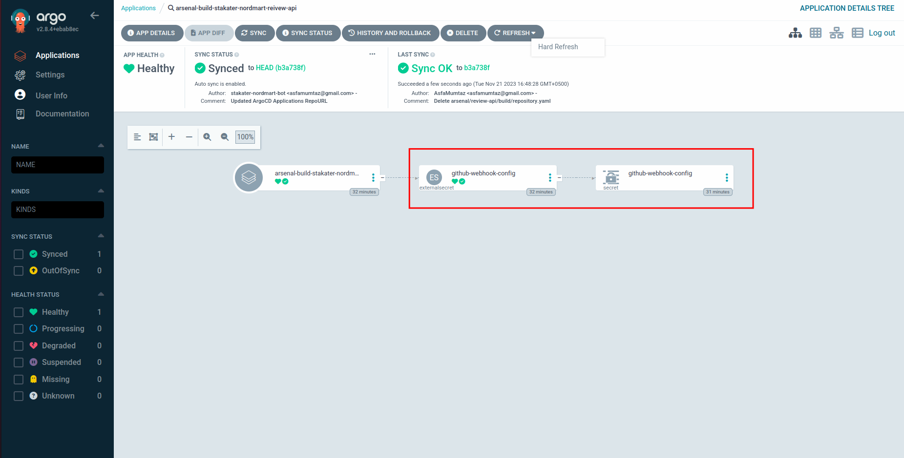
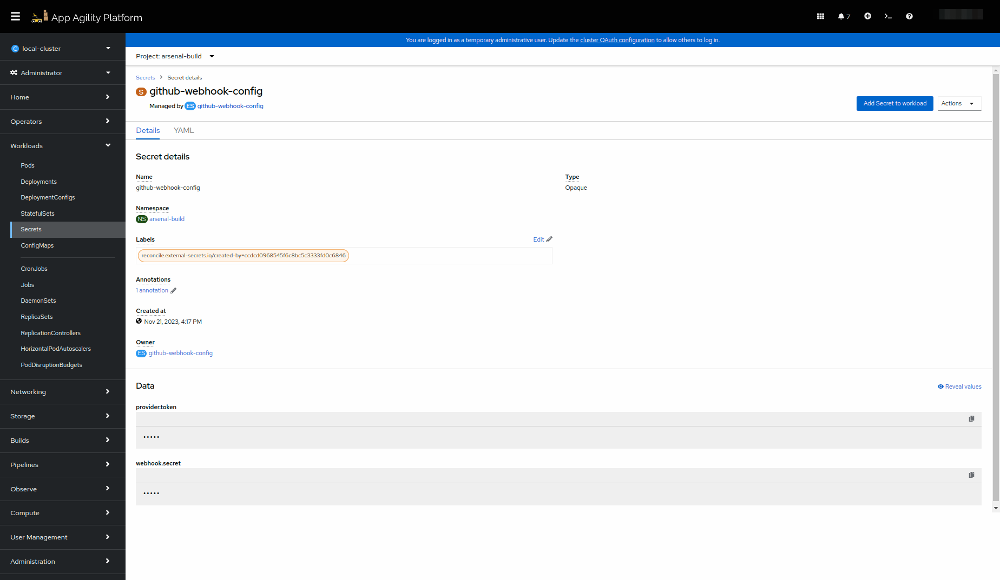

# Setting Up Webhook

The webhook setup acts as a bridge between your code repository and the CI/CD pipeline. It allows your pipeline to be triggered automatically whenever specific events occur in your repository, such as code pushes or pull requests. The webhook secret further ensures that these interactions are secured and authenticated.

## Objectives

- Obtain Interceptor URL from SAAP admin.
- Create Webhook Secret for your webhook security.
- Add webhook in your source code repository.

## Key Results

- Established a webhook connection between GitHub and your pipeline.
- Created a webhook secret for secure communication.

## Tutorial

### Creating Webhook in GitHub

1. Begin by accessing the repository where you plan to set up the webhook. In your source code GitHub repository, locate and click on the `Settings` tab.

     

1. Within the repository settings, navigate to the `Webhooks` section. This is where you can manage and configure webhooks for your repository.

     

1. Click on the option to `Add a new webhook` to initiate the process of creating a new webhook for your repository.

     

1. To set up the webhook, you'll need the `URL of the pipeline-as-code interceptor`. This URL is used to connect GitHub with your SAAP's pipeline system.

1. Ask the SAAP admin to provide you with the `Interceptor URL` "route" from the project or namespace where the pipeline-as-code is installed.

1. Back in the GitHub repository's webhook settings, enter the `pipeline-as-code interceptor URL` you obtained in the previous step in the `Payload URL`.

1. Choose `Content type` as `application/json`.

1. Let's create a secret for our webhook to make it secure. Open up a terminal and generate a random secret with this command.

    ```sh
    openssl rand -hex 20
    ```

    Now copy it and paste it under `Secret` section in Webhook.

    !!! note
        Save the secret because we will need it later when we add it in to Vault.

1. Choose the specific events that should trigger the webhook. Click “Let me select individual events” and select the following events to trigger the webhook:

    - Commit status
    - Issue comments
    - Pushes
    - pull requests

1. Click on `Add webhook`/`Update webhook`.

    

    Once you've entered the interceptor URL and chosen the triggering events, proceed to add the webhook. This will establish the connection between your GitHub repository and SAAP pipeline.

    !!! note
        For GitLab Webhook configuration follow [this](https://pipelinesascode.com/docs/install/gitlab/), for Bitbucket webhook configuration follow [this](https://pipelinesascode.com/docs/install/bitbucket_cloud/).

### Adding Webhook Secret to Vault

1. Access Vault from `Forecastle` console, search `Vault` and open the `Vault` tile.

     <div style="text-align:center"></div>

1. From the drop-down menu under `Method`, select `OIDC` and click on `Sign in with OIDC Provider`.

     <div style="text-align:center"></div>

1. You will be brought to the `Vault` console. You should see the key/value path for <your-tenant>.

     <div style="text-align:center"></div>
  
1. Click on `<your-tenant>/kv/`.

1. You will now be brought to the `secrets` and the `configurations` in Vault for <your-tenant>. Click on `create secret`.

     <div style="text-align:center"></div>

1. Let's create a `github-webhook-config` secret for our webhook secret. Write the name of the secret in `path` which is `github-webhook-config`. Add `secret data`, key: `webhook.secret`, value: (your webhook secret). Hit save.

     <div style="text-align:center"></div>

### Add External Secret

1. Head over to the `apps-gitops-config` repository.

1. If you have followed the tutorial on configuring `apps-gitops-config` repository correctly, you should already have your tenant folder at the root of this repository. Open the tenant folder.

1. Navigate to the application folder. In our case it will be `stakater-nordmart-review-api`

1. Now open up the `build` folder.

1. Create a file named `github-webhook-config.yaml` and add in the below content. Replace the Url with your application repository's Url.

    ```yaml
       apiVersion: external-secrets.io/v1beta1
       kind: ExternalSecret
       metadata:
         name: github-webhook-config
       spec:
         secretStoreRef:
           name: tenant-vault-secret-store
           kind: SecretStore
         refreshInterval: "1m0s"
         target:
           name: github-webhook-config
           creationPolicy: 'Owner'
           template:
             data:
               provider.token: "{{ .password | toString }}"
               webhook.secret: "{{ .secret | toString }}"
         data:
           - secretKey: password
             remoteRef:
               key: github-webhook-config
               property: provider.token
           - secretKey: secret
             remoteRef:
               key: github-webhook-config
               property: webhook.secret
    ```

     <div style="text-align:center"></div>

1. Now open up ArgoCD and look for this External Secret. If everything was added correctly, you will see a secret created from this External Secret.

     <div style="text-align:center"></div>

1. You can also check this secret by navigation to `<tenant>-build` namespace and searching for the secret.

     <div style="text-align:center"></div>

Great! We have everything set up for creating the Repository CR.
