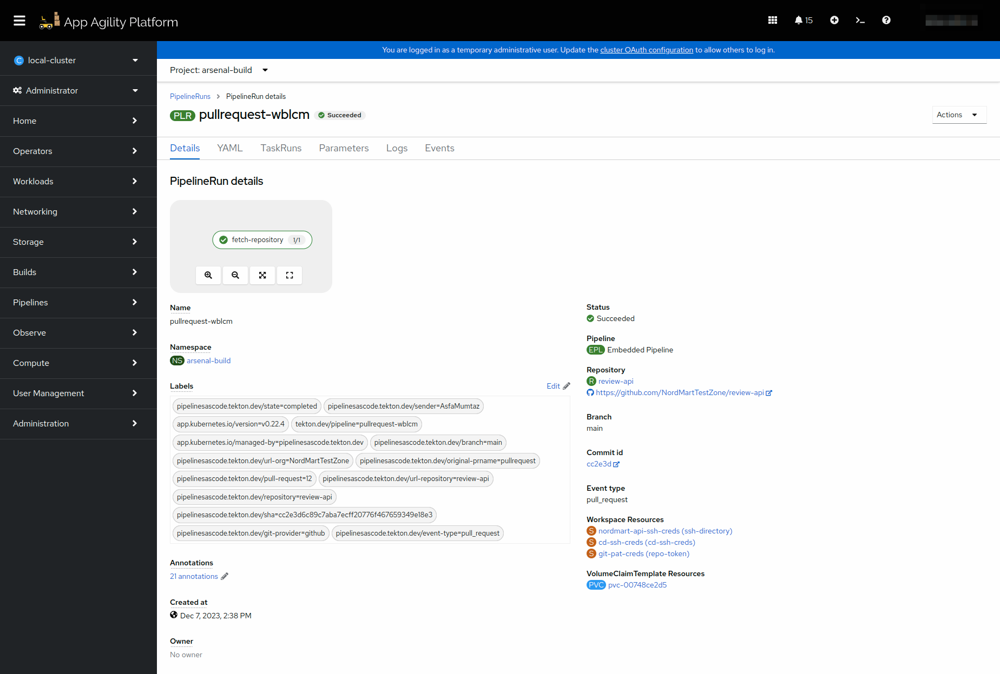
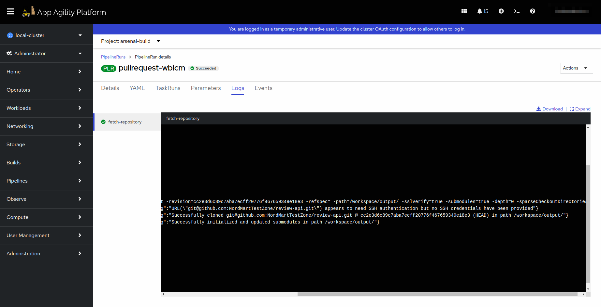

# Creating a Pipeline

We will embark on a comprehensive journey through a complete pipeline, with each individual task covered in its tutorial. This approach aims to provide a detailed understanding of each task and how they collectively contribute to the functionality of pipeline-as-code.

In modern software development practices, pipelines play a crucial role in automating and streamlining the process of building, testing, and deploying applications. This tutorial will guide you through creating a pipeline using pipeline-as-code concepts. We'll focus on GitHub as the provider and assume you have a SAAP set up with pipeline-as-code capabilities.

Now that we have completed all the prerequisites to run this `pipelineRun`, we can continue by adding a pipeline to our application using `pipeline-as-code` approach.

## Objectives

- Create a Tekton PipelineRun using a `.tekton/pullrequest.yaml` file from a code repository.
- Define parameters, workspaces, and tasks within the PipelineRun for building and deploying your application.

## Key Results

- Successfully create and execute the Tekton PipelineRun using the defined `.tekton/pullrequest.yaml` file, enabling automated CI/CD processes for your application.

## Tutorial

### Create PipelineRun with Git Clone Task

Let's walk you through creating a Tekton `PipelineRun` using a `Pipeline-as-Code` approach.

1. Create a `.tekton` folder at the root of your repository.
1. Now add a file named `pullrequest.yaml` in this folder and place the below given content in it. This file will represent a `PipelineRun`.

    ```yaml
    apiVersion: tekton.dev/v1beta1
    kind: PipelineRun
    metadata:
      name: pullrequest # pipelineRun name
      annotations:
        pipelinesascode.tekton.dev/on-event: "[pull_request]" # Trigger the pipelineRun on pullrequest events on branch main
        pipelinesascode.tekton.dev/on-target-branch: "main"
        pipelinesascode.tekton.dev/task: "[git-clone]" # The task will be fetched from Tekton Hub. We can also provide direct links to yaml files
        pipelinesascode.tekton.dev/max-keep-runs: "2" # Only remain 2 latest pipelineRuns on SAAP
    spec:
      params:
        - name: repo_url
          value: "git@github.com:<YOUR-ORG>/<YOUR-REPO-NAME>/" # Place your repo SSH URL
        - name: git_revision
          value: {{revision}} # Dynamic variable to fetch branch name of the push event on your repo
        - name: repo_path
          value: {{repo_name}} # Dynamic variable to fetch repo name
        - name: image_registry
          value: "<docker-registry-url>" # Place image registry URL without https:// succeeded by your application name
        - name: helm_registry
          value: "<https://helm-registry-url>" # Place helm registry URL with https://
      pipelineSpec: # Define what parameters will be used for pipeline
        params:
          - name: repo_url
          - name: git_revision
          - name: repo_path
          - name: image_registry
          - name: helm_registry
        workspaces: # Mention what workspaces will be used by this pipeline to store data and used by data transferring between tasks
          - name: source
          - name: ssh-directory
        tasks: # Mention what tasks will be used by this pipeline
          - name: fetch-repository #Name what you want to call the task
            taskRef:
              name: git-clone # Name of tasks mentioned in tekton-catalog
              kind: Task
            workspaces: # Mention what workspaces will be used by this task
              - name: output
                workspace: source
              - name: ssh-directory
                workspace: ssh-directory
            params: # Parameters will be used by this task
              - name: depth
                value: "0"
              - name: url
                value: $(params.repo_url)
              - name: revision
                value: $(params.git_revision)
      workspaces: # Mention Workspaces configuration
        - name: source
          volumeClaimTemplate:
            spec:
              accessModes:
                - ReadWriteOnce
              resources:
                requests:
                  storage: 1Gi
        - name: ssh-dibrectory # Using ssh-directory workspace for our task to have better security
          secret:
            secretName: [app-name]-ssh-creds # Created this secret earlier
    ```

1. Provide values for `image_registry`, and helm_registry parameters. You can find the urls from [here](../../../../managed-addons/nexus/explanation/routes.md).
   `image_registry` url should be succeeded by your application name. Example: nexus-docker-stakater-nexus.apps.lab.kubeapp.cloud/**review-api**

1. Now create a pull request on the repository with these changes. This should trigger a pipeline on your cluster.

1. You can go to your tenant's build namespace and see the pipeline running.

   

   

### Exploring the Git Clone Task

The Git Clone task serves as the initial step in your pipeline, responsible for fetching the source code repository. Let's break down the key components:

1. `name: fetch-repository`: This names the task, making it identifiable within the pipeline.

1. Task Reference (`taskRef`): The Git Clone task is referred to using the name git-clone, which corresponds to a Task defined in the Tekton Catalog. This task knows how to clone a Git repository.

1. Workspaces (`workspaces`): The task interacts with two workspaces;`output` and `ssh-directory`. The `output` workspace will store the cloned repository, while the `ssh-directory` workspace provides SSH authentication. This means that the private key stored in the secret `nordmart-ssh-creds` will be utilized during the cloning process.

1. Parameters `(params)`:

   `depth`: Specifies the depth of the Git clone. A value of "0" indicates a full clone.

   `url`: The URL of the source code repository. This parameter is dynamically fetched from the repo_url parameter defined in the PipelineRun.

   `revision`: The Git revision to fetch, often corresponding to a specific branch or commit. This parameter is also dynamically fetched from the `gitrevision` parameter in the PipelineRun.

Great! Let's add more tasks in our pipelineRun in coming tutorials.
