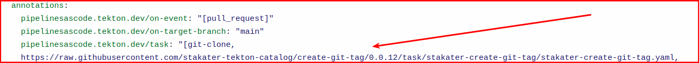
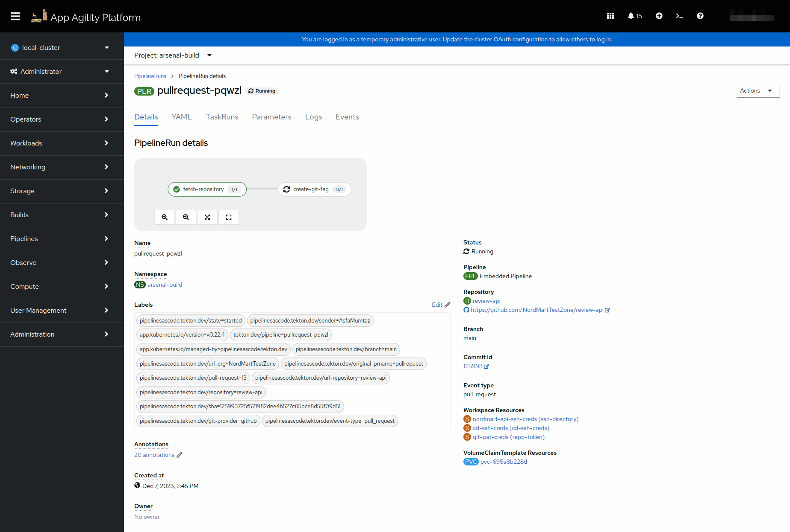
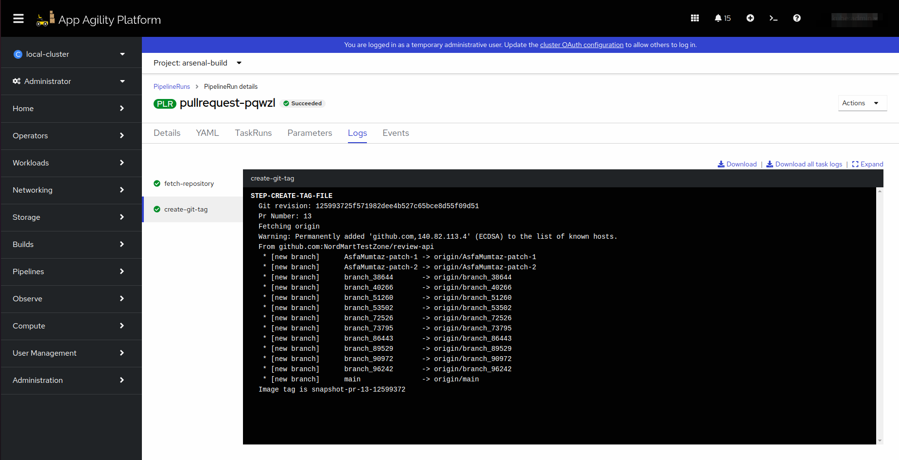

# Create Git Tag

## Objectives

- Add `create-git-tag` task to PipelineRun.
- Define parameters, workspaces, and tasks within the PipelineRun for building and deploying your application.

## Key Results

- Successfully create and execute the Tekton PipelineRun using the defined `.tekton/main.yaml` file, enabling automated CI/CD processes for your application.

## Tutorial

### Create PipelineRun with Create Git Tag Task

You have already created a PipelineRun in the previous tutorial. Let's now add another task ['create-git-tag`](https://github.com/stakater-tekton-catalog/create-git-tag) to it.

1. Open up the PipelineRun file you created in the previous tutorial.
1. Now edit the file, so the YAML becomes like the one given below.

    ```yaml
      
    ```

    **Notice** that we added another value to the **`pipelinesascode.tekton.dev/task`** annotation. The annotation is used by pipeline as code resolver to fetch tasks defined remotely. To explore stakater's Tekton
    catalog, please visit [`stakater-tekton-catalog`](https://github.com/stakater-tekton-catalog).

1. Provide values for `image_registry`, and `helm_registry` parameters. You can find the URLs from [here](../../../../managed-addons/nexus/explanation/routes.md)
   `image_registry` URL should be succeeded by your application name. Example: `nexus-docker-stakater-nexus.apps.lab.kubeapp.cloud/review-api`

    !!! note
        Remember to add the remote task in the annotations
        

1. Create a pull request with you changes. This should trigger the pipeline in the build namespace.

    

    

Great! Let's add more tasks in our `pipelineRun` in coming tutorials.
