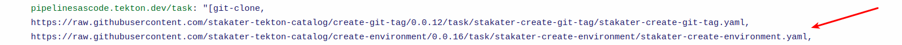
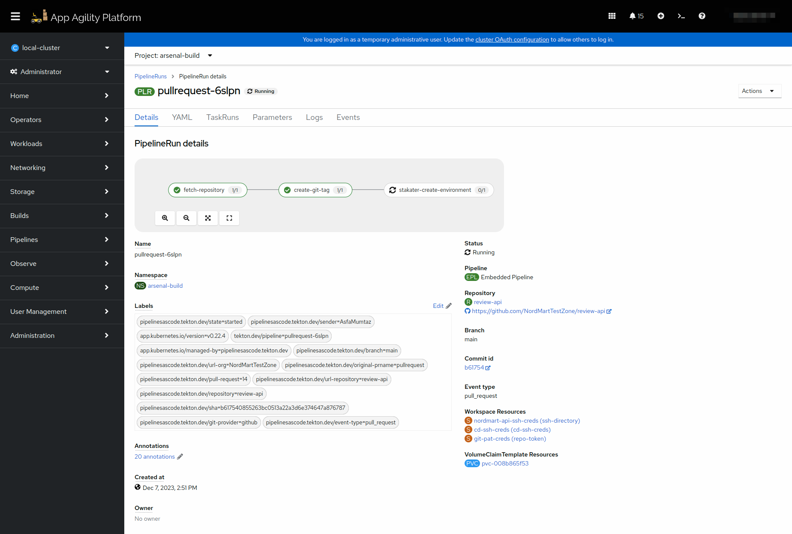
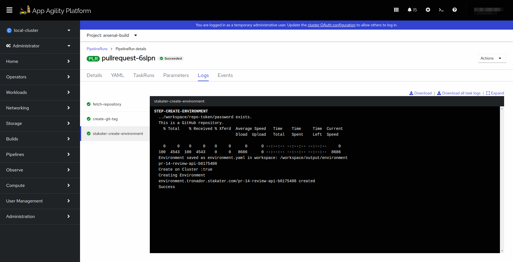
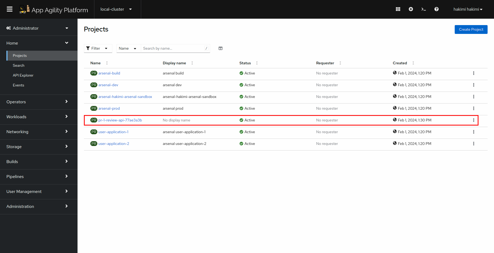
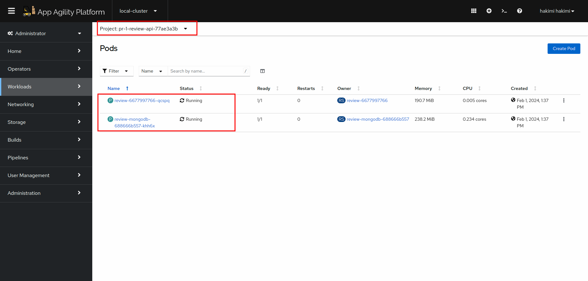

# Create Environment

## Objectives

- Add `create-environment` task to PipelineRun.
- Define parameters, workspaces, and tasks within the PipelineRun for building and deploying your application.

## Key Results

- Successfully create and execute the Tekton PipelineRun using the defined `.tekton/pullrequest.yaml` file, enabling automated CI/CD processes for your application.
- Environment CR is deployed on cluster.

## Tutorial

### Create PipelineRun with Create Environment Task

You have already created a PipelineRun in the previous tutorial. Let's now add another task [`create-environment`](https://github.com/stakater-tekton-catalog/create-environment) to it.
The create environment task utilizes [Tronador](https://docs.stakater.com/tronador/) to create dynamic environments.

1. Open up the PipelineRun file you created in the previous tutorial.
1. Now edit the file so the YAML becomes like the one given below.

    ```yaml
      
    ```
    **Notice** that we added another **workspace, repo-token** to the pipeline run. This workspace utilizes the git-pat-creds secret that we previously created and mounts it to the create-environment task.

    !!! note
        Remember to add the remote task in the annotations
        

1. Create a pull request with your changes. This should trigger the pipeline in the build namespace.

     

     

1. Once the task completes, you should be able to see a new project. The name of this project will contain your pr number, application name, and first commit hash of your pr.

     

1. Open up the project and navigate to pods, you should be able to see your application running.

     

Great! Let's add more tasks in our pipelineRun in coming tutorials.
