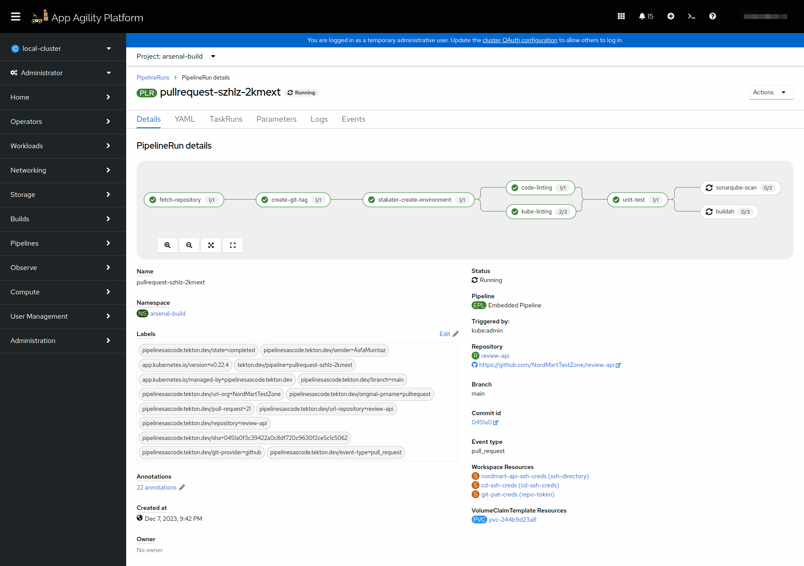
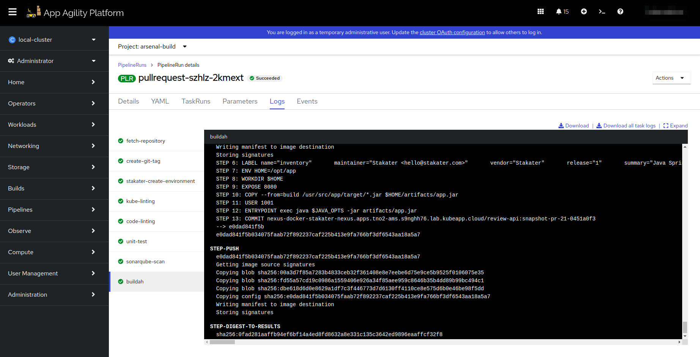

# Buildah Image Build

## Objectives

- Add `buildah-image-build` task to PipelineRun.
- Define parameters, workspaces, and tasks within the PipelineRun for building and deploying your application.

## Key Results

- Successfully create and execute the Tekton PipelineRun using the defined `.tekton/pullrequest.yaml` file, enabling automated CI/CD processes for your application.
- Image is built and ready to be push to the repository.

## Tutorial

### Create PipelineRun with Buildah Image Build Task

You have already created a PipelineRun in the previous tutorial. Let's now add another task [`image-build`](https://github.com/stakater-tekton-catalog/buildah-image-build) to it.

1. Open up the PipelineRun file you created in the previous tutorial.
1. Now edit the file so the YAML becomes like the one given below.

    ```yaml
    apiVersion: tekton.dev/v1beta1
    kind: PipelineRun
    metadata:
      name: pullrequest # pipelineRun name
      annotations:
        pipelinesascode.tekton.dev/on-event: "[pull_request]" # Trigger the pipelineRun on push events on branch main
        pipelinesascode.tekton.dev/on-target-branch: "main"
        pipelinesascode.tekton.dev/task: "[git-clone,
          https://raw.githubusercontent.com/stakater-tekton-catalog/create-git-tag/0.0.12/task/stakater-create-git-tag/stakater-create-git-tag.yaml,
          https://raw.githubusercontent.com/stakater-tekton-catalog/create-environment/0.0.16/task/stakater-create-environment/stakater-create-environment.yaml,
          https://raw.githubusercontent.com/stakater-tekton-catalog/code-linting-mvn/0.0.4/task/stakater-code-linting/stakater-code-linting.yaml,
          https://raw.githubusercontent.com/stakater-tekton-catalog/kube-linting/0.0.7/task/stakater-kube-linting/stakater-kube-linting.yaml,
          https://raw.githubusercontent.com/stakater-tekton-catalog/unit-test/0.0.6/task/stakater-unit-test/stakater-unit-test.yaml,
          https://raw.githubusercontent.com/stakater-tekton-catalog/sonarqube-scan/0.0.13/task/stakater-sonarqube-scan/stakater-sonarqube-scan.yaml,
          https://raw.githubusercontent.com/stakater-tekton-catalog/buildah-image-build/0.0.1/task/stakater-buildah-image-build/stakater-buildah-image-build.yaml]"
        pipelinesascode.tekton.dev/max-keep-runs: "2" # Only remain 2 latest pipelineRuns on SAAP
    spec:
      params:
        - name: repo_url
          value: {{body.repository.ssh_url}} # Place your repo SSH URL
        - name: git_revision
          value: {{revision}} # Dynamic variable to fetch branch name of the push event on your repo
        - name: repo_name
          value: {{repo_name}} # Dynamic varaible to fetch repo name
        - name: repo_path
          value: "<-YOUR_APPLICATION-NAME->" # Dynamic varaible to define application name
        - name: git_branch
          value: {{source_branch}}
        - name: pull_request_number
          value: {{pull_request_number}}
        - name: organization
          value: {{body.organization.login}}
      pipelineSpec: # Define what parameters will be used for pipeline
        params:
          - name: repo_url
          - name: git_revision
          - name: repo_name
          - name: repo_path
          - name: pull_request_number
          - name: organization
          - name: git_branch
        workspaces: # Mention what workspaces will be used by this pipeline to store data and used by data transferring between tasks
          - name: source
          - name: ssh-directory
        tasks: # Mention what tasks will be used by this pipeline
          - name: fetch-repository #Name what you want to call the task
            taskRef:
              name: git-clone # Name of tasks mentioned in tekton-catalog
              kind: ClusterTask
            workspaces: # Mention what workspaces will be used by this task
              - name: output
                workspace: source
              - name: ssh-directory
                workspace: ssh-directory
            params: # Parameters will be used by this task
              - name: depth
                value: "0"
              - name: url
                value: $(params.repo_url)
              - name: revision
                value: $(params.git_revision)
          - name: create-git-tag
            runAfter:
              - fetch-repository
            taskRef:
              name: stakater-create-git-tag
              kind: Task
            params:
              - name: PR_NUMBER
                value: $(params.pull_request_number)
              - name: GIT_REVISION
                value: $(params.git_revision)
            workspaces:
              - name: source
                workspace: source
              - name: ssh-directory
                workspace: ssh-directory
          - name: stakater-create-environment
            runAfter:
            - create-git-tag
            taskRef:
              kind: Task
              name: stakater-create-environment
            params:
            - name: CREATE_ON_CLUSTER
              value: "true"
            - name: REPO_NAME
              value: $(params.repo_path)
            - name: PR_NUMBER
              value: $(params.pull_request_number)
            - name: GIT_URL
              value: "<https://github.com/org/app.git>" #Replace with your application repository Url
            - name: GIT_BRANCH
              value: $(params.git_branch)
            - name: IMAGE_TAG
              value: $(tasks.create-git-tag.results.GIT_TAG)
            - name: PULL_REQUEST_COMMITS_API # Replace when not using Git
              value: https://api.github.com/repos/$(params.organization)/$(params.repo_name)/pulls/$(params.pull_request_number)/commits
            workspaces:
            - name: output
              workspace: source
            - name: repo-token
              workspace: repo-token
          - name: code-linting
            runAfter:
              - stakater-create-environment
            taskRef:
              name: stakater-code-linting
              kind: Task
            workspaces:
              - name: source
                workspace: source
          - name: kube-linting
            runAfter:
              - stakater-create-environment
            taskRef:
              name: stakater-kube-linting
              kind: Task
            params:
              - name: FILE
                value: manifest.yaml
              - name: DEPLOYMENT_FILES_PATH
                value: deploy
              - name: NAMESPACE
                value: arsenal-build
            workspaces:
              - name: source
                workspace: source
          - name: unit-test
            runAfter:
              - code-linting
              - kube-linting
            taskRef:
              name: stakater-unit-test
              kind: Task
            workspaces:
              - name: source
                workspace: source
          - name: sonarqube-scan
            runAfter:
              - stakater-unit-test-dotnet
            taskRef:
              name: stakater-sonarqube-scan
              kind: Task
            params:
              - name: SONAR_PROJECT_KEY
                value: $(params.repo_path)
            workspaces:
              - name: source
                workspace: source
          - name: buildah-image-build
            runAfter:
              - unit-test
            taskRef:
              name: stakater-buildah-image-build
              kind: Task
            params:
              - name: IMAGE_NAME
                value: $(params.repo_path):$(tasks.create-git-tag.results.GIT_TAG)
              - name: TLSVERIFY
                value: "false"
              - name: FORMAT
                value: "docker"
              - name: CURRENT_GIT_TAG
                value: $(tasks.create-git-tag.results.CURRENT_GIT_TAG)
              - name: REPO_NAME
                value: $(params.repo_path)
            workspaces:
              - name: source
                workspace: source
      workspaces: # Mention Workspaces configuration
        - name: source
          volumeClaimTemplate:
            spec:
              accessModes:
                - ReadWriteOnce
              resources:
                requests:
                  storage: 1Gi
        - name: ssh-directory # Using ssh-directory workspace for our task to have better security
          secret:
            secretName: git-ssh-creds # Created this secret earlier
        - name: repo-token
          secret:
            secretName: git-pat-creds
    ```

    !!! note
        Remember to add the remote task in the annotations
        

1. Create a pull request with you changes. This should trigger the pipeline in the build namespace.

   

   

Great! Let's add more tasks in our pipelineRun in coming tutorials.
