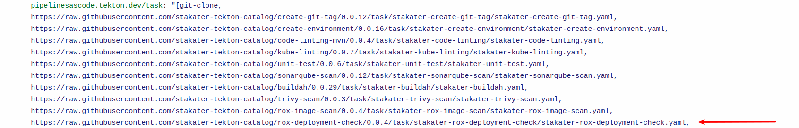

# StackRox Deployment Check

## Objectives

- Add `rox-deployemnt-check` task to PipelineRun.
- Define parameters, workspaces, and tasks within the PipelineRun for building and deploying your application.

## Key Results

- Successfully create and execute the Tekton PipelineRun using the defined `.tekton/pullrequest.yaml` file, enabling automated CI/CD processes for your application.

## Tutorial

### Create PipelineRun with Rox Deployment Check Task

You have already created a PipelineRun in the previous tutorial. Let's now add another task `rox-deployment-check` to it.

1. Open up the PipelineRun file you created in the previous tutorial.
1. Now edit the file so the YAML becomes like the one given below.

    ```yaml
    
    ```

    !!! note
        Remember to add the remote task in the annotations

    

1. Create a pull request with you changes. This should trigger the pipeline in the build namespace.

    

    

Great! Let's add more tasks in our `pipelineRun` in coming tutorials.
