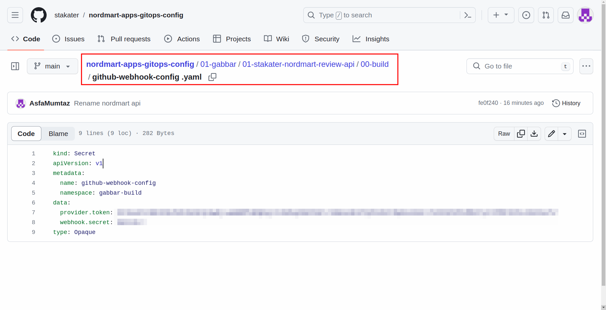
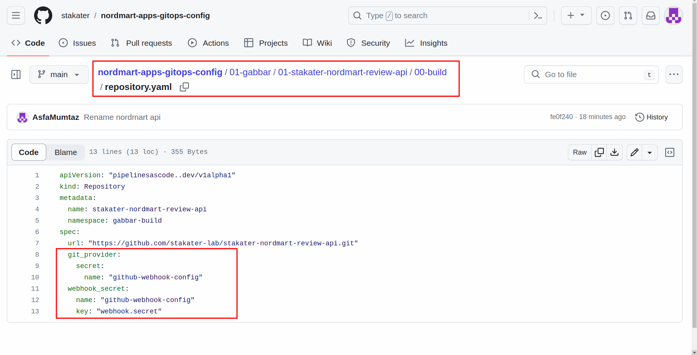
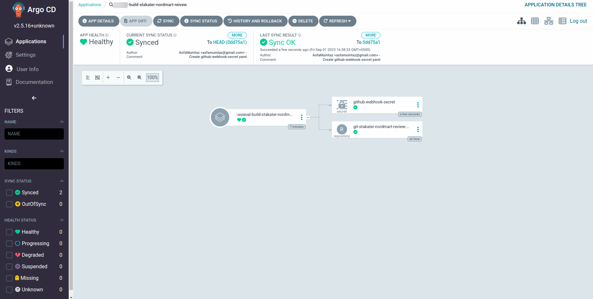

# Create Repository Resource

The `Repository` custom resource helps you connect pipeline-as-code to your SCM. By referencing authentication secrets in the resource, you ensure that your pipeline has the necessary access rights to interact with GitHub.

In this tutorial, you'll create secrets containing your GitHub access credentials and webhook secret. As well as you'll define a Repository CustomResourceDefinition (CRD) to create a PipelineRun using pipeline-as-code.

## Prerequisites

1. You have a pre-configured GitOps repository. If you haven't already configured it, follow [this tutorial](../../../../for-delivery-engineers/tutorials/02-configure-apps-gitops-config/configure-apps-gitops-repo.md)

## Objectives

- Create a Secret to store your GitHub personal token and webhook secret.
- Define a Repository that references the Kubernetes Secret for authentication.
- Establish a secure connection between your code repository and the CI/CD pipeline using a GitHub webhook.

## Key Results

- Created a Kubernetes Secret named `github-webhook-config` containing your GitHub personal token and webhook secret.
- Defined a Repository in your desired namespace, referencing the `github-webhook-config` Secret.
- Enabled a secure connection between your code repository and your CI/CD pipeline through the GitHub webhook.

## Tutorial

### Create a Secret on SAAP

The `Secret` holds sensitive data, such as your GitHub access token and webhook secret. By storing these secrets separately from your source code, you ensure that sensitive information is kept secure and not exposed in your repository.

> Note: We assume that you already have a GitOps repository bootstrapped with ArgoCD. Open up the `apps-gitops-config` repository we created earlier.

1. Navigate to `tenant`>`application`> build path. In our example, it will be `01-gabbar/01-stakater-nordmart-review-api/00-build`

1. Create a file name `github-webhook-secret.yaml` here and add the following content:

   ```yaml
   kind: Secret
   apiVersion: v1
   metadata:
     name: github-webhook-config
     namespace: gabbar-build
   data:
      provider.token: <base64-encoded-personal-access-token>
      webhook.secret: <base64-encoded-webhook secret>
   type: Opaque
   ```

> Note: Replace values with PAT and webhook secret you created in the previous tutorials

   

### Create the Repository

1. To create the `Repository`, navigate to `tenant`>`application`> build path.

1. Create a file named `repository.yaml` and add the following content:

    ```yaml
    apiVersion: "pipelinesascode..dev/v1alpha1"
    kind: Repository
    metadata:
      name: <name-of-repo>
      namespace: <your-namespace>
    spec:
      url: "https://<YOUR_GITHUB_REPO_URL>"
      git_provider:
        secret:
          name: "github-webhook-config"
      webhook_secret:
        name: "github-webhook-config"
    ```

    

Once you add these two files to the repository at the correct path, you can see that ArgoCD has deployed them to the cluster.

  

That's cool! Let's move on to the next tutorial to create a fully functional pipeline with `pipeline-as-code`.
