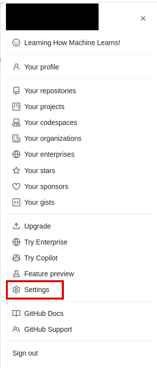
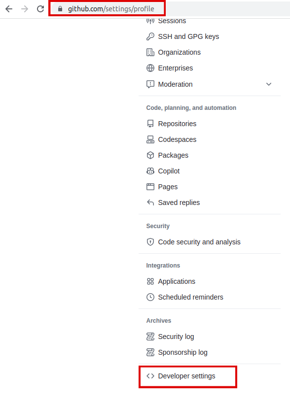
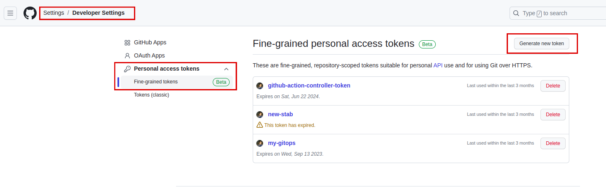
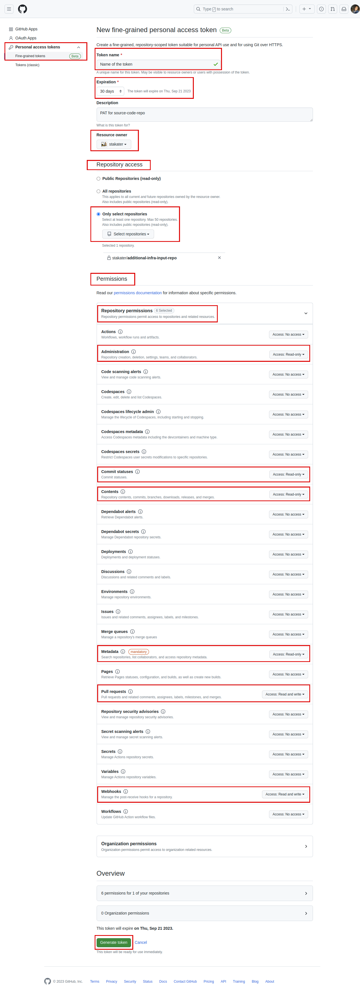

# Configure GitHub Access

In this section, you'll learn how to configure GitHub access by generating a Fine-grained Personal Access Token (PAT) and setting up webhook security. These steps are essential for establishing a secure and automated Continuous Integration/Continuous Deployment (CI/CD) pipeline using pipeline-as-code concepts.

A Fine-grained PAT ensures that your CI/CD pipeline can securely interact with your GitHub repositories. By generating a token with finely controlled permissions, you grant the pipeline only the specific access it requires, reducing potential security risks.

## Objectives

- Generate a Fine-grained PAT with the necessary permissions for pipeline integration.
- Obtain the necessary GitHub access credentials and permissions required for creating and integrating a pipeline-as-code setup.

## Key Results

- Personal Access Token (PAT) with the specified permissions is generated successfully in the GitHub account.

## Tutorial

1. Generate a Fine-grained Token (PAT) on GitHub. PAT (Fine-grained): Allows you to select repositories from your GitHub organization that can use the token.[`Create a fine-grained token`](https://github.blog/2022-10-18-introducing-fine-grained-personal-access-tokens-for-github/) with the below-mentioned permissions for your source code repository:

    - Go to your GitHub account `settings` for the top-right corner on your profile.

    

    - Navigate to `Developer settings`

        

    - Go to `Personal access tokens`.
    - From drop-down select `Fine-grained Tokens`.
    - Click `Generate new token`.

    

    - Provide a name for the token.
    - Select the `Resource owner`(your organization).
    - Provide `Repository access` (source code repository) to this token.
    - Select the following scopes/permissions:

        - Administration (Read only)
        - Commit status (Read only)
        - Contents (Read only)
        - Metadata (Read only)
        - Pull requests (Read and write)
        - Webhook (Read and write)

    

    !!! note
        Save the token cautiously, you will need this to create a secret.

Awesome! Let's move to next tutorial and create a Webhook for our pipeline.
