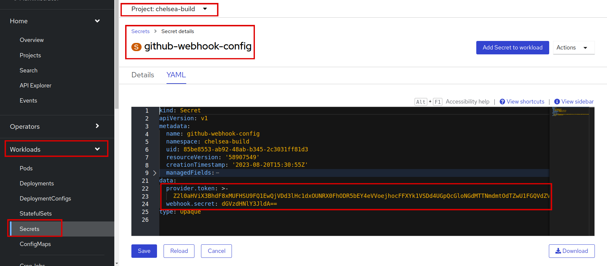
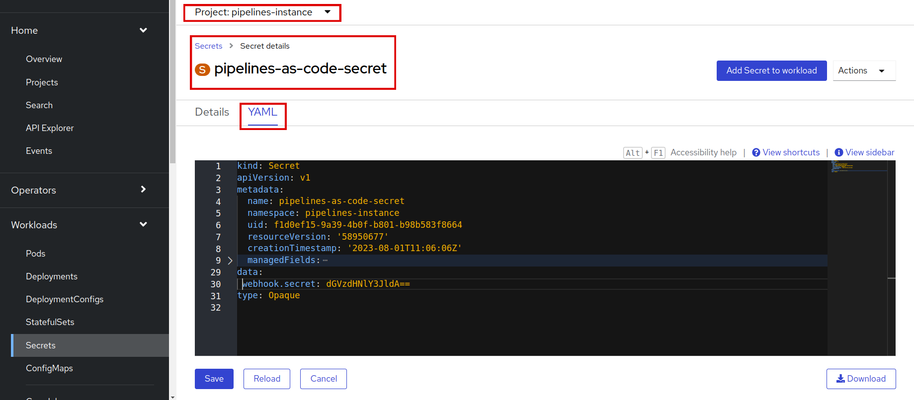
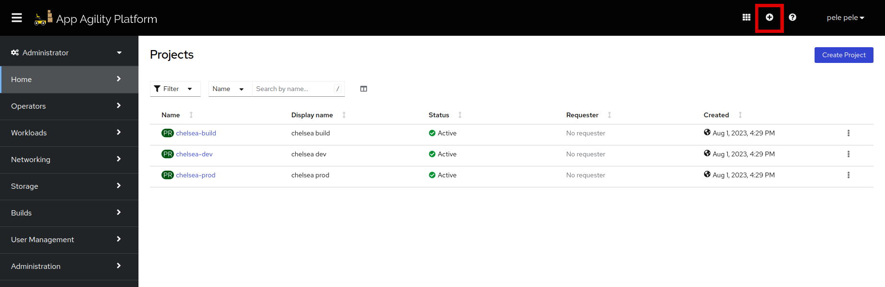
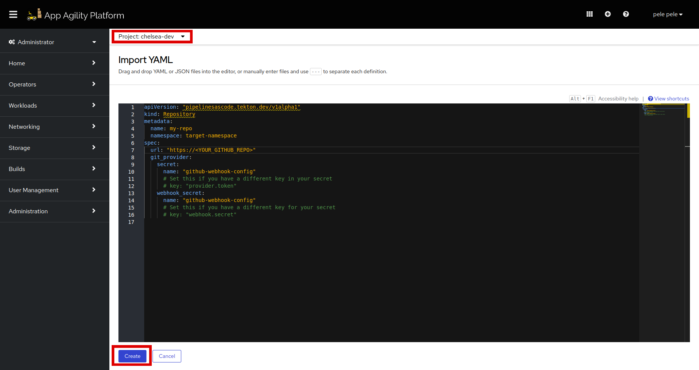

# Secret and Repository CRD Definition

The `Secret` holds sensitive data, such as your GitHub access token and webhook secret. By storing these secrets separately from your source code, you ensure that sensitive information is kept secure and not exposed in your repository.

The `Repository CRD` helps you define the structure of your CI/CD pipeline. By referencing authentication secrets in the CRD, you ensure that your pipeline has the necessary access rights to interact with GitHub.

In this tutorial, you'll create secrets containing your GitHub access credentials and webhook secret. As well as you'll define a Repository CustomResourceDefinition (CRD) to create a PipelineRun using pipeline-as-code.

## Objectives

- Create a Secret to store your GitHub personal token and webhook secret.
- Define a Repository CRD that references the Kubernetes Secret for authentication.
- Establish a secure connection between your code repository and the CI/CD pipeline using a GitHub webhook.

## Key Results

- Created a Kubernetes Secret named `github-webhook-config` containing your GitHub personal token and webhook secret.
- Defined a Repository CRD in your desired namespace, referencing the `github-webhook-config` Secret.
- Enabled a secure connection between your code repository and your CI/CD pipeline through the GitHub webhook.

## Tutorial

### Create a Secret on SAAP

1. To create a secret first log in to SAAP using `oc` CLI.

1. Paste this command and replace `your-namespace` with your namespace, `provider.token` value with your PAT, and `webhook.secret` value with your webhook secret.

    ```sh
    oc -n <your-namespace> create secret generic github-webhook-config --from-literal provider.token="FINE_GRAINED_TOKEN_AS_GENERATED_PREVIOUSLY" --from-literal webhook.secret="SECRET_AS_SET_IN_WEBHOOK_CONFIGURATION"
    ```

1. Log in to SAAP and check if the secret is created in your targeted namespace.

    

    > Note: In older versions of PaC, webhook secret can't be stored, so for older versions, use the below command:

    ```sh
    oc -n <namespace-where-PaC-installed> create secret generic pipelines-as-code-secret --from-literal webhook.secret="$WEBHOOK_SECRET_AS_GENERATED"
    ```

    

### Define the Repository CRD

1. To create the `Repository` CRD, go to SAAP, beside your username you will see the (**+**) sign, click it.

    

1. Now paste the below yaml, with the changes according to your needs.

    ```yaml
    apiVersion: "pipelinesascode..dev/v1alpha1"
    kind: Repository
    metadata:
      name: <name-of-repo>
      namespace: <your-namespace>
    spec:
      url: "https://<YOUR_GITHUB_REPO_URL>"
      git_provider:
        secret:
          name: "github-webhook-config"
       webhook_secret:
        name: "github-webhook-config"
    ```

    

    Recheck the `Project` selected above and hit `Create`.

That's cool! Let's move on to next tutorial to create fully function pipeline with `pipeline-as-code`.
