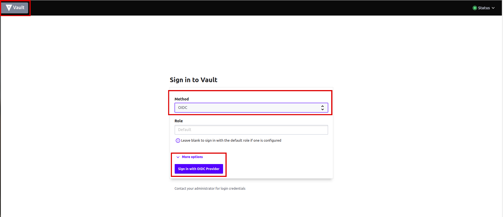
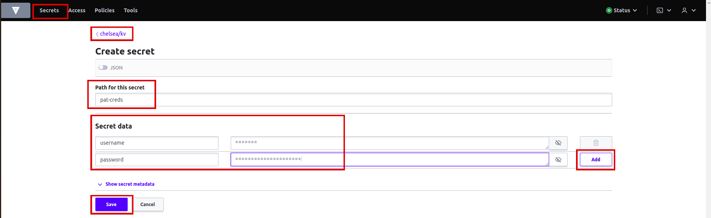
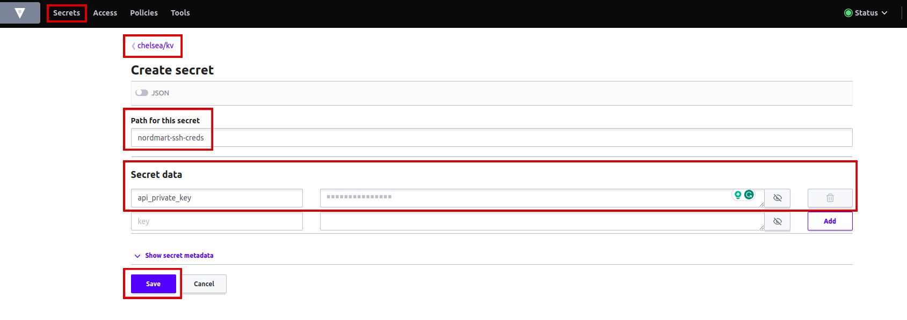
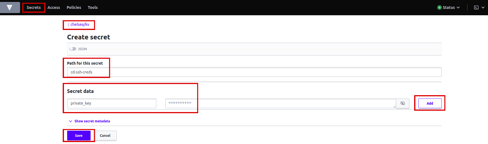

# Storing Credentials Securely in Vault

In this tutorial, you'll learn how to securely store critical credentials in Vault, a robust platform for managing and safeguarding sensitive data. By the end of this guide, you'll have successfully saved a variety of credentials, ensuring their protection and controlled access.

## Objectives

- Create and store a Personal Access Token (PAT) for GitHub in Vault.
- Securely manage SSH keys for GitOps and source code repository access and integration.
- Store GitHub Webhook configurations for your CI/CD pipelines.
- Safeguard Docker Registry credentials to enable secure image handling.
- Manage Helm Registry credentials for Helm chart deployments.
- Store SonarQube credentials for code quality analysis.
- Securely manage MongoDB credentials for database access.
- Store Rox credentials for feature flag management.

## Key Results

- Successfully create and store a PAT credential within the `<your-tenant>/kv` path in Vault.
- Securely manage SSH keys for GitOps and source code repository access within the `<your-tenant>/kv` path in Vault.
- Store GitHub Webhook configurations in the `<your-tenant>/kv` path in Vault.
- Safeguard Docker Registry credentials within the `<your-tenant>/kv` path in Vault for secure image handling.
- Efficiently manage Helm Registry credentials within the `<your-tenant>/kv` and `stakater/` path in Vault for Helm chart deployments.
- Store SonarQube credentials within the `<your-tenant>/kv` path in Vault for code quality analysis.
- Securely manage MongoDB credentials for database access within the `<your-tenant>/kv/review-api/dev/` path in Vault.
- Store Rox credentials within the `<your-tenant>/kv` path in Vault for feature flag management.

## Tutorial

Follow the step-by-step instructions below to store each type of credential securely within Vault:

### Create PAT Secret in Vault

Login to Vault to view <your-tenant> path.

1. Access Vault from `Forecastle` console, search `Vault` and open the `Vault` tile.

    

1. From the drop-down menu under `Method`, select `OIDC` and click on `Sign in with OIDC Provider`.

    

1. You will be brought to the `Vault` console. You should see the key/value path for <your-tenant>.

    

1. Click on `<your-tenant>/kv/`.

1. You will now be brought to the `secrets` and the `configurations` in Vault for <your-tenant>. Click on `create secret`.

    

1. Let's create a `pat-creds` secret for our PAT GitHub token. Write the name of the secret in `path` which is `pat-creds`. Add `secret data`, key: `username`, value: (your github username) and key: `password` , value: (your newly generated PAT). Hit save.

    

### Create SSH Key Secret in Vault for Nordmart API Repo

1. Let's create a `nordmart-ssh-creds` secret for our SSH Key that we created in previous tutorials. Go to <your-tenant> in `Vault`. Click on `Create secret`. Write the name of the secret in `path` which is `nordmart-ssh-creds`. Add `secret data`, key: `api_private_key`, and value: (your newly generated SSH private key). Hit save.

    

### Create SSH Key Secret in Vault for GitOps Repo

1. Let's create a `cd-ssh-creds` secret for our SSH Key that we created in previous tutorials. Go to <your-tenant> in `Vault`. Click on `Create secret`. Write the name of the secret in `path` which is `cd-ssh-creds`. Add `secret data`, key: `private_key`, and value: (your newly generated SSH private key). Hit save.

    

### Create PAC Repository Secret for GitHub

1. Let's create a `github-webhook-config` secret for our `Repository` CR that we created in previous tutorials. Go to <your-tenant> in `Vault`. Click on `Create secret`. Write the name of the secret in `path` which is `github-webhook-config`. Add `secret data`, key: `provider.token`, value: (your GitHub PAT), key: `webhook.secret`, and value: (your webhook secret) Hit save.

    

### Create Docker Registry Credentials Secret

1. Let's create a `docker-reg-creds` secret for our pipeline. Write the name of the secret in `path` which is `docker-reg-creds`. Add `secret data`, key: `.dockerconfigjson`, value: , key: ``, and value: Hit save.
