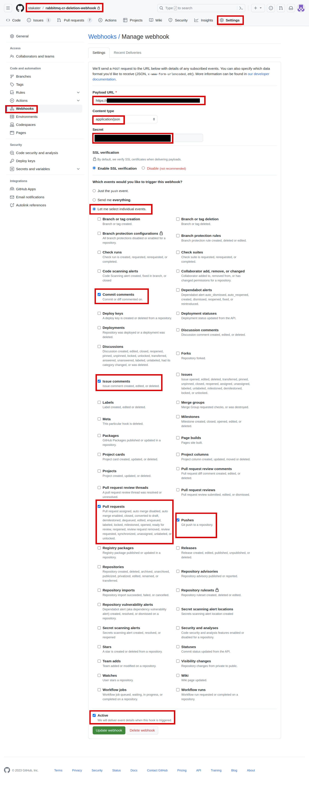

# Setting Up Webhook for Pipeline as Code

The webhook setup acts as a bridge between your code repository and the CI/CD pipeline. It allows your pipeline to be triggered automatically whenever specific events occur in your repository, such as code pushes or pull requests. The webhook secret further ensures that these interactions are secured and authenticated.

## Objectives

- Obtain Interceptor URL from SAAP admin.
- Create Webhook Secret for your webhook security.
- Add webhook in your source code repository.

## Key Results

- Established a webhook connection between GitHub and your pipeline.
- Created a webhook secret for secure communication.

## Tutorial

1. Begin by accessing the repository where you plan to set up the webhook. In your source code GitHub repository, locate and click on the `Settings` tab.

1. Within the repository settings, navigate to the `Webhooks` section. This is where you can manage and configure webhooks for your repository.

1. Click on the option to `Add a new webhook` to initiate the process of creating a new webhook for your repository.

1. To set up the webhook, you'll need the `URL of the Pipeline as Code interceptor`. This URL is used to connect GitHub with your SAAP's pipeline system.

1. Ask the SAAP admin to provide you with the `Interceptor URL` "route" from the project or namespace where the Pipeline as Code is installed.

1. Back in the GitHub repository's webhook settings, enter the `Pipeline as Code interceptor URL` you obtained in the previous step in the `Payload URL`.

1. Choose `Content type` as `application/json`.

1. Let's create a secret for our webhook to make it secure. Generate a random secret with this command.

    ```sh
    openssl rand -hex 20
    ```

    > Note: Save the secret because we will need it later.

    Now copy it and paste it under `Secret` section in Webhook.

1. Choose the specific events that should trigger the webhook. Click “Let me select individual events” and select the following events to trigger the webhook:

      - Commit status
      - Issue comments
      - Pushes
      - pull requests

1. Click on `Add webhook`/`Update webhook`.

    

    Once you've entered the interceptor URL and chosen the triggering events, proceed to add the webhook. This will establish the connection between your GitHub repository and SAAP pipeline.

    > Note: For GitLab Webhook configuration follow [this](https://pipelinesascode.com/docs/install/gitlab/), for Bitbucket webhook configuration follow [this](https://pipelinesascode.com/docs/install/bitbucket_cloud/).

Great! Now that you added a Webhook to your repository, let's move on to create secret for it in the next tutorial.
