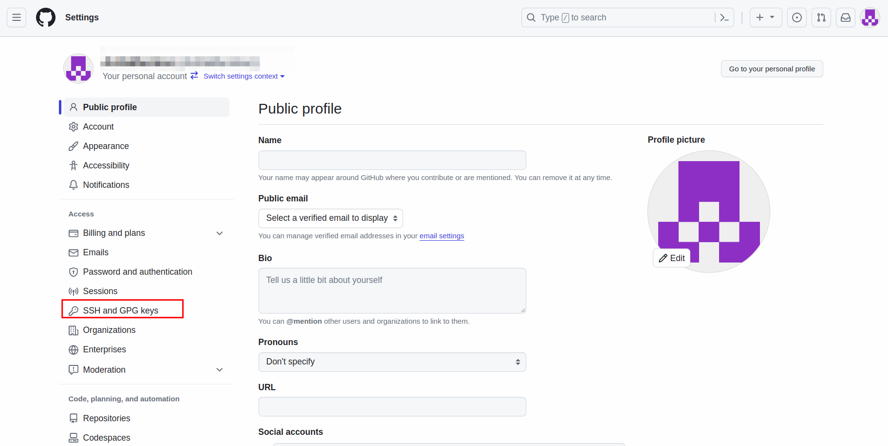
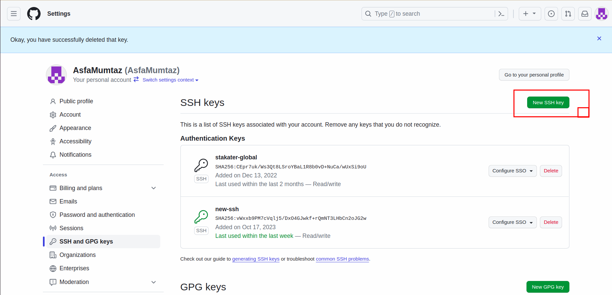
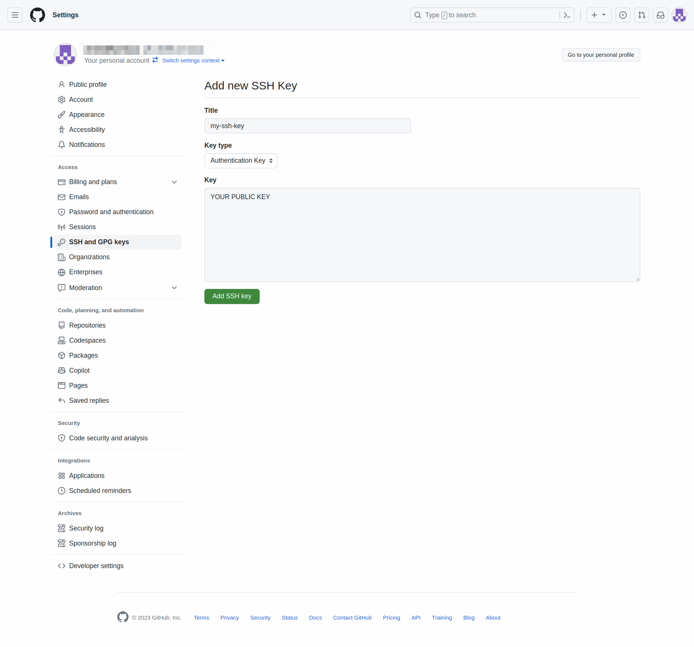
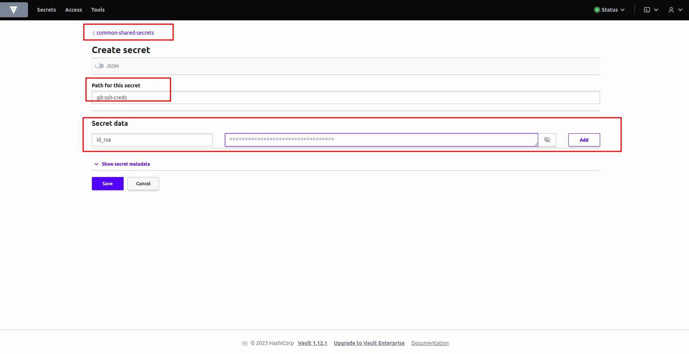

# Configure SSH Key

## Objectives

* Generate a organization level SSH keypair.
* Securely store the keypair in Vault for added protection.

## Key Results

* SSH keypair with read write access is generated.
* Public key is stored in SCM (GitHub)
* SSH key is securely stored in Vault and can be accessed only by authorized entities, enhancing security.

## Prerequisites

* Infra GitOps Repository is configured.
* A User that has access to all the repositories in your SCM organization/group.

## Tutorial

### Creating SSH KeyPair

1. Generate an ssh keypair. You can follow the official GitHub documentation for this.

    !!! note
        Save the keypair cautiously, you'll need to add it to Vault and GitHub.

1. Once you've generated the keypair, go to your GitHub account `settings` for the top-right corner on your profile.

1. Navigate to `SSH and GPG Keys`

    

1. Click `Add New Key` in SSH Key section.

    

1. Now add the public key of the keypair you generated earlier.

    

### Adding Private Key to Vault

Now that we have added the public key to GitHub, let's add the private key to Vault.

1. Access Vault from `Forecastle` console, search `Vault` and open the `Vault` tile.

    

1. From the drop-down menu under `Method`, select `OIDC` and click on `Sign in with OIDC Provider`.

    

1. You will be brought to the `Vault` console. You should see `common-shared-secrets` folder.

    

1. Click on `common-shared-secrets`.

1. You will now be brought to the `secrets` and the `configurations`. Click on `create secret`.

    

1. Let's create a `git-ssh-creds` secret for our webhook secret. Write the name of the secret in `path` which is `git-ssh-creds`. Add `secret data`
    * key: `id_rsa`, value: (The SSH Private Key).
      Hit save.

    

### Adding External Secret

Since we want the `git-ssh-creds` secret to be deployed in all of the tenant namespaces, we will use a multi-tenant-operator template to deploy it.

1. Open up the `infra-gitops-config` repository that we have already bootstrapped.

1. Open the `tenant-operator-config` folder and create a `templates` folder inside it:

    

1. Now create a file named `git-ssh-creds-template.yaml` and add the following content:

    ```yaml
    apiVersion: tenantoperator.stakater.com/v1alpha1
    kind: Template
    metadata:
      name: git-ssh-creds
    resources:
      manifests:
        - apiVersion: external-secrets.io/v1beta1
          kind: ExternalSecret
          metadata:
            name: git-ssh-creds
          spec:
            secretStoreRef:
              name: tenant-vault-secret-store
              kind: SecretStore
            refreshInterval: "1m0s"
            target:
              name: git-ssh-creds
              creationPolicy: 'Owner'
              template:
                data:
                  id_rsa: "{{ .id_rsa  }}"
            data:
            - secretKey: id_rsa
              remoteRef:
                key: git-ssh-creds
                property: api_private_key
    ```

1. Create another file named `git-ssh-creds-tgi.yaml` and add the following content:

    ```yaml
    apiVersion: tenantoperator.stakater.com/v1alpha1
    kind: TemplateGroupInstance
    metadata:
      name: git-ssh-creds
    spec:
      template: git-ssh-creds
      selector:
        matchExpressions:
          - key: stakater.com/kind
            operator: In
            values: [ build, pr ]
      sync: true
    ```
