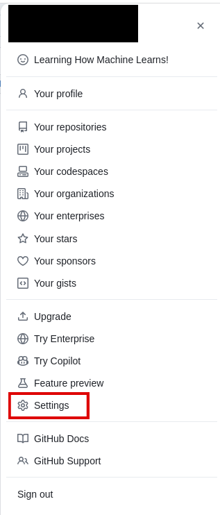
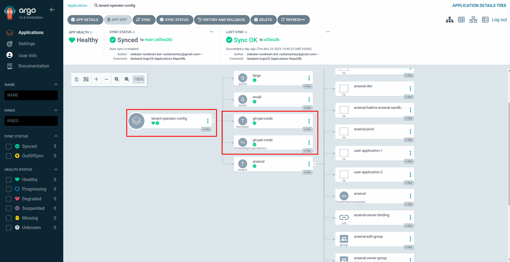

# Configure Personal Access Token

Let's add a few secrets that we will need to get our pipelines running.
You can check secrets documentation to read more on these secrets.

## Objectives

* Generate a organization level PAT with the necessary permissions for pipeline integration.
* Securely store the GitHub PAT in Vault for added protection.

## Key Results

* Personal Access Token (PAT) with the specified permissions is generated successfully in the GitHub account.
* The GitHub PAT is securely stored in Vault and can be accessed only by authorized entities, enhancing security.

## Prerequisites

* Infra GitOps Repository is configured.
* Delivery Engineer added as the owner of root-tenant.
* Delivery Engineer added as a member of customer admin group. The customer admin group provides permission to deploy ArgoCD application in ArgoCD namespace.
* A GitHub user with access over all the repositories on GitHub. You can name this user `saap-bot`.

## Tutorial

### Creating Personal Access Token

1. Generate a Fine-grained Token (PAT) on GitHub.

1. Go to your GitHub account `settings` for the top-right corner on your profile.

    

1. Navigate to `Developer settings`

    

1. Go to `Personal access tokens`.

1. From drop-down select `Fine-grained Tokens`.

1. Click `Generate new token`.

    

1. Provide a name for the token.

1. Select the `Resource owner`(your organization).

1. Set Repository Access to `All Repositories`.

1. Select the following scopes/permissions:

        * Administration (Read only)
        * Commit status (Read only)
        * Contents (Read only)
        * Metadata (Read only)
        * Pull requests (Read and write)
        * Webhook (Read and write)

    

!!! note
    Save the token cautiously, you'll need to save it in `Vault`.

### Adding Token to Vault

Now that we have created the GitHub Token, we will store it in Vault.

!!! note
    The delivery engineer should be part of the root-tenant. The root tenant makes sure that the delivery engineer is able to login to Vault with OIDC and is able to view the ArgoCD application created for bootstrapping Infra repository.
    Please contact SAAP team if you are unable to access Vault using OIDC method

Login to Vault to view <your-tenant> path.

1. Access Vault from `Forecastle` console, search `Vault` and open the `Vault` tile.

    

1. From the drop-down menu under `Method`, select `OIDC` and click on `Sign in with OIDC Provider`.

    

1. You will be brought to the `Vault` console. You should see `common-shared-secrets` folder.

    

1. Click on `common-shared-secrets`.

1. You will now be brought to the `secrets` and the `configurations`. Click on `create secret`.

    

1. Let's create a `git-pat-creds` secret for our webhook secret. Write the name of the secret in `path` which is `git-pat-creds`. Add `secret data`
     * key: `username`, value: (GitHub username).
     * key: `password`, value (Newly created PAT).
   Hit save.

    

### Adding External Secret

Since we want the `git-pat-creds` secret to be deployed in all of the tenant namespaces, we will use a multi-tenant-operator template to deploy it.

1. Open up the `infra-gitops-config` repository that we have already bootstrapped.

1. Open the `tenant-operator-config` folder and create a `templates` folder inside it.

    

1. Now create a file named `git-pat-creds-template.yaml` and add the following content.

    ```yaml
    apiVersion: tenantoperator.stakater.com/v1alpha1
    kind: Template
    metadata:
      name: git-pat-creds
    resources:
      manifests:
        - apiVersion: external-secrets.io/v1beta1
          kind: ExternalSecret
          metadata:
            name: git-pat-creds
          spec:
            dataFrom:
              - extract:
                  conversionStrategy: Default
                  key: git-pat-creds
            refreshInterval: 1m0s
            secretStoreRef:
              kind: SecretStore
              name: tenant-vault-shared-secret-store
            target:
              name: git-pat-creds
    ```

1. Create another file named `git-pat-creds-tgi.yaml` and add the below content.

    ```yaml
    apiVersion: tenantoperator.stakater.com/v1alpha1
    kind: TemplateGroupInstance
    metadata:
      name: git-pat-creds
    spec:
      template: git-pat-creds
      selector:
        matchExpressions:
          - key: stakater.com/kind
            operator: In
            values: [ build, pr ]
      sync: true
    ```

1. Lets see our Template and TGI in ArgoCD. Open up ArgoCD and look for `tenant-operator-config` application. You should be able to see your Template and TGI deployed.

    
