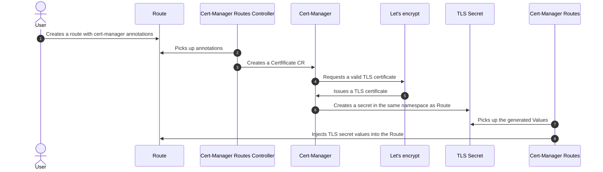

# Cert Manager Operator

SAAP uses [Cert-Manager](https://cert-manager.io/) to provide Automatic rotation of Certificates for application workloads.
It will ensure certificates are valid and up to date, and attempt to renew certificates at a configured time before expiry. It can issue certificates from a variety of supported sources, including `Let's Encrypt`, `Hashicorp Vault`, and `Venafi` as well as `private PKI`.

## Example Certificate Generation using Let's Encrypt

Before you start creating Certificates, you will have to first define a `Issuer`(namespace scoped) or `ClusterIssuer`(cluster scoped).

!!! warning
    Any secret that is referred by ClusterIssuer would have to be present only in the project `stakater-cert-manager-operator`. So create CA,DNS credentials secrets in this project.

    Secret can reside in the same namespace for Issuer

!!! tip
    Consider using the cluster's default domain i.e. `*.kubeapp.cloud` for CI/staging environment which are all secured by SAAP by default

### Defining ClusterIssuer

Two types of acme solvers are supported, The Pros and Cons of both strategies can be seen on the link:

1. [http01 Challenge](https://letsencrypt.org/docs/challenge-types/#http-01-challenge)
1. [DNS01 Challenge](https://letsencrypt.org/docs/challenge-types/#dns-01-challenge)

#### http01 Challenge

For http01 Challenge you just need to specify ingress field:

```yaml
apiVersion: cert-manager.io/v1
kind: ClusterIssuer
metadata:
  name: letsencrypt
spec:
  acme:
    server: https://acme-v02.api.letsencrypt.org/directory
    email: <YOUR_EMAIL_ADDRESS>             # lets encrypt account. WIll create if not already exist
    preferredChain: "ISRG Root X1"
    privateKeySecretRef:
      name: letsencrypt-prod-account-key    # Secret resource that will be used to store the account's private key.
    solvers:
      - http01:
          ingress: {}
```

#### DNS01 Challenge

For DNS01 Challenge you need to first create a secret in `stakater-cert-manager-operator` namespace that should contain the values to alter entries in your DNS provider. Following is an example for configuring AWS's Route53. Check configuration for your provider [here](https://cert-manager.io/docs/configuration/acme/dns01/)

!!! tip
    Use Limited access to the account being used for DNS01 Challenge automation

```yaml
apiVersion: cert-manager.io/v1
kind: ClusterIssuer
metadata:
  name: letsencrypt
spec:
  acme:
    email: <YOUR_EMAIL_ADDRESS>         # lets encrypt account. WIll create if not already exist
    server: https://acme-v02.api.letsencrypt.org/directory
    preferredChain: "ISRG Root X1"
    privateKeySecretRef:
      name: issuer-account-key          # Secret resource that will be used to store the account's private key.
    solvers:
    - dns01:
        route53:
          accessKeyID: <AWS_ACCESS_KEY_ID>
          region: eu-north-1            # default region
          secretAccessKeySecretRef:     # Secret with key "aws_secret_access_key" must exist in `stakater-cert-manager-operator`
            name: aws-creds
            key: aws_secret_access_key
```

!!! warning

    1. Wildcard certificates can only be issued by DNS01 Challenges not with http01 Challenges.
    2. You can only issue 50 certificates per Registered Domain. [See Details here](https://letsencrypt.org/docs/rate-limits/)
    3. If you think you need more certificates for your staging/CI environment consider using a [Staging server](https://letsencrypt.org/docs/staging-environment/). The only downside for this strategy is that browser will not trust the CI/staging environment certificate.

### Generating Certificates directly for Routes

Instead of maintaining lifecycle of Certificate,you can generate and rotate them automatically whenever a Route is created with the following annotation:

```yaml
cert-manager.io/issuer-name: < Issuer's or ClusterIssuer's name>
```

The workflow will look as below:



Following optional annotations can be overridden for the `Route` resource:

```yaml
cert-manager.io/issuer-name: my-issuer # This is the only required annotation
cert-manager.io/issuer-group: cert-manager.io # Optional, defaults to cert-manager.io
cert-manager.io/issuer-kind: Issuer # Optional, defaults to Issuer, could be ClusterIssuer or an External Issuer
cert-manager.io/duration: 1h # Optional, defaults to 90 days
cert-manager.io/renew-before: 30m # Optional, defaults to 1/3 of total certificate duration.
cert-manager.io/common-name: "My Certificate" # Optional, no default.
cert-manager.io/alt-names: "custom.domain.com,*.custom.domain.com" # Optional, no default
cert-manager.io/ip-sans: "10.20.30.40,192.168.192.168" # Optional, no default
cert-manager.io/uri-sans: "spiffe://trustdomain/workload" # Optional, no default
```
