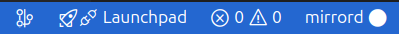

# Setup mirrord for remote debugging

This guide explains how to configure mirrord to enable remote debugging of your application running in a sandbox environment using VSCode. Follow the steps below for a smooth setup and debugging experience.

## Prerequisites

- VSCode: Ensure you have the latest version of Visual Studio Code installed.
- Sandbox Access: Verify you have access to the sandbox environment where your application is deployed.
- Application Pod: Confirm that the target application pod is running in the cluster.
- Local Build: Build your application locally with debug points set.
- Service Account Details: Confirm the service account details with your cluster administrator if needed.


## Step 1: Install mirrord extension in VSCode

1. Open VSCode and navigate to the Extensions view.
1. Search for mirrord and install the extension.
1. Verify that a mirrord.json file exists in your project at <project-path>/.mirrord/mirrord.json.

For additional guidance, refer to the [mirrord VSCode extension quick start guide](https://mirrord.dev/docs/overview/quick-start/#vs-code-extension).

## Step 2: Application Setup

1. **Deploy or Verify Application Pod**:
Ensure your application pod is running in your sandbox environment.
    - You may deploy the latest version using an [inner loop approach](https://docs.stakater.com/saap/for-developers/tutorials/inner-loop/prepare-environment/prepare-env.html), or use a previously stable version already deployed in cluster.
1. **Record Pod Details**:
Copy the exact name of the pod you plan to debug. This name will be used in the mirrord configuration.

## Step 3: Configure mirrord and VSCode debugger

Edit your `<project-path>/.mirrord/mirrord.json` file with the following configuration:

```JSON
{
  "target": {
    "path": "pod/<pod name>",
    "namespace": "<sandbox namespace>"
  },
    "feature": {
        "network": {
            "incoming": "mirror",
            "outgoing": true
        },
        "fs": "read",
        "env": true
    },
    "agent":{
        "resources":
        {
            "requests":
            {
              "cpu": "20m",
              "memory": "20Mi"
            },
            "limits":
            {
              "cpu": "100m",
                "memory": "100Mi"
            }
          },
        "service_account": "<service account name>"
    }
}
```

### Key Fields

- **`target.path`**: Should contain the name of the target pod prefixed with `pod/`.
- **`target.namespace`**: Specify the namespace where the target pod resides.
- **`agent.resources`**: Define both resource requests and limits to ensure the mirrord agent runs efficiently.
- **`agent.service_account`**: Provide the service account that the mirrord agent will use. Confirm this value with your cluster administrator if necessary.

For a complete configuration reference, see the [mirrord configuration documentation](https://mirrord.dev/docs/reference/configuration/#root-complete).

## Step 4: Configure VSCode Debugger

1. In your project, create or open the `<project-path>/.vscode/launch.json` file.
1. Add the following configuration to launch your application for debugging:

```JSON
{
    "version": "0.2.0",
    "configurations": [
      {
        "name": "debug",
        "type": "coreclr",
        "request": "launch",
        "program": "${workspaceFolder}/<path to dll or exe file for your application>",
        "args": [],
        "cwd": "${workspaceFolder}/<Application folder>",
        "stopAtEntry": false,
        "env": {
          "ASPNETCORE_ENVIRONMENT": "Development"
        }
      }
    ]
}
```

## Step 5: Debugging with mirrord

Now since that all the configuration is in place, the next step is to start the mirrord and debug application.

At the bottom pane of vscode, there is toggle button for mirrord. Make sure it is switched on as shown below:


Now click on `Run and Debug` on left pane and click on play button as show below:


You will see a message pop up in bottom right corner saying that `waiting for pod to be ready` as shown below:


Wait for few seconds. You'll see some logs in debug console related to mirrord setup. After a while try to interact with you application API to trigger breakpoint in your application.

When finished, click the stop button in the top toolbar to end the debugging session.